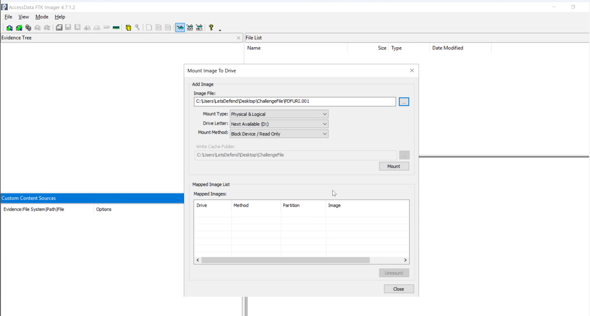
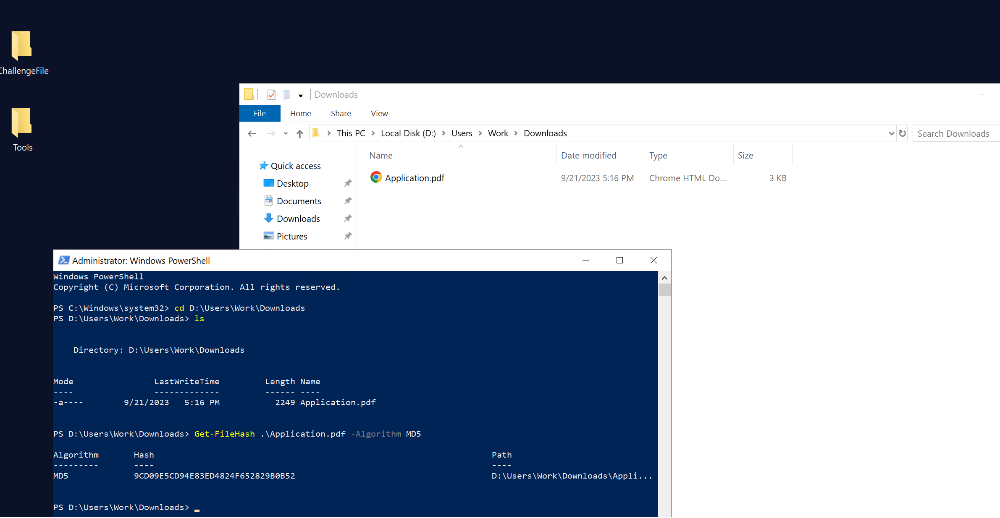
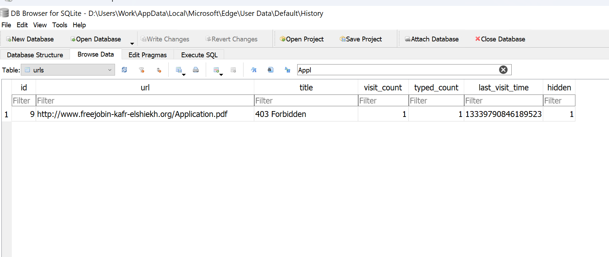
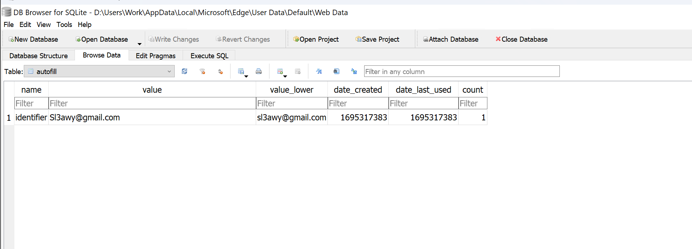
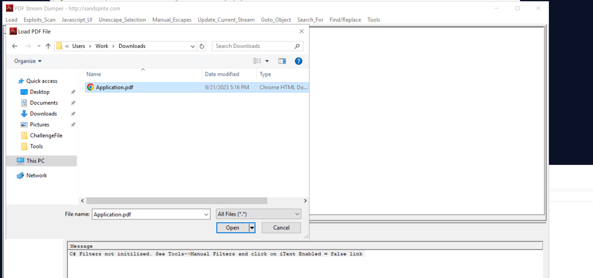
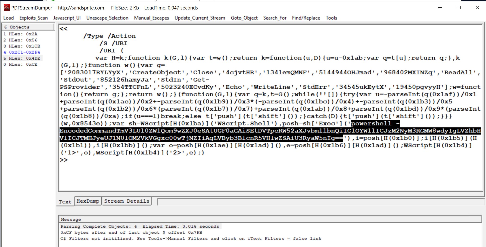
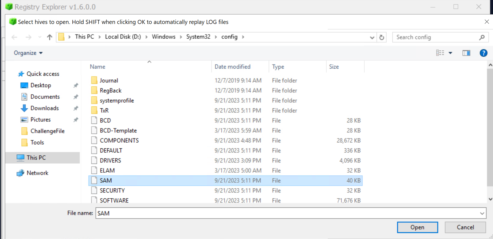
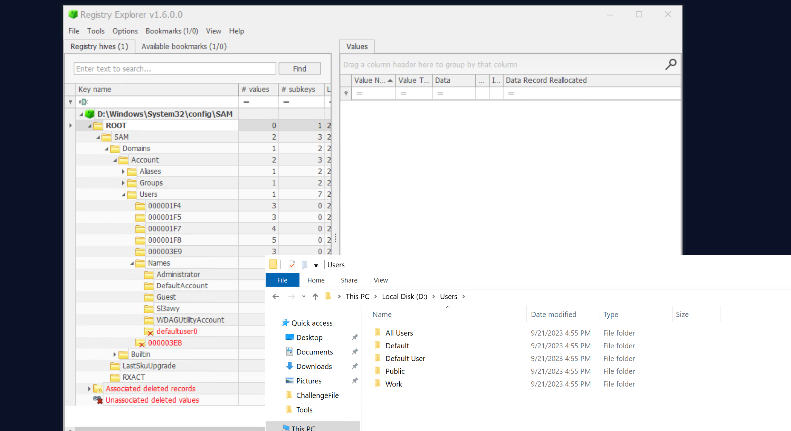

# PDFURI - LetsDefend Challenge

Analyzing a disk image and malicous PDF file

## Scenario
Our friend "Dee" was looking for a job in Tanta, but it seems she was hacked by one of the malicious websites, so can you examine her hard drive and find some evidence?

## Methodology

Given the scenario we're dealing with, I'm pretty sure this challenge would bbe closer to performing browser forensics and malicious document analysis. But let's see..

### 1. What is the MD5 hash of the malicious document?
In digital forensics, one of the first steps an investigator takes is to acquire a forensic image of the device or storage media. This helps preserve the integrity of the original evidence and supports a proper chain of custody. Analysis should generally be performed on a verified forensic copy rather than the original or live evidence, as interacting directly with the original can alter or contaminate the evidence.

For this reason, we realise LetsDefend already provided us with an image of the Dee's device. So basically.. we gon rely on that for investigation.

After extracting the challenge file was the image file `DPFURI.001`. Using FTK Imager, I mounted the image file onto the disk for analysis as seen in the screenshot below..



Within the mounted image, I browsed to the Work user's download folder which contained the malicious pdf file: `Application.pdf`.

Although there is the hashmyfiles tool to hash the file, I prefer using thhe `Get-Filehash` command in powershell. That gave me the md5 hash of the pdf file.


### 2. What is the domain from which the document was downloaded?
This question now pushes me to perform some browser artifact forensics.. just as I predicted. Here, I will be using the DB Browser for SQL lite to analyze the browser data.

I have [this documentation](https://github.com/codelassey/cybersecurity-labs/blob/main/LetsDefend/Incident_Responder/notes/09-Browser-Forensics.md#3-browser-artifacts) which I use from time to time when looking for browser artifacts.

Also, these are some storage locations for browser files:
- Firefox: %USERPROFILE%\AppData\Roaming\Mozilla\Firefox\Profiles\
- Chrome: %USERPROFILE%\AppData\Local\Google\Chrome\User Data\
- Edge: %USERPROFILE%\AppData\Local\Microsoft\Edge\User Data\
- Opera: %USERPROFILE%\AppData\Roaming\Opera Software\Opera Stable

In order to identify the domain where the document was downloaded, I will go in for the open database option withinin DB Browwser then filter .sql to all files so I can see the database files.

From there, I select the history database which contains Search History and open the url table. That showed many urls.. literally noise. Hence, i filtered for `Application`.. which returned just one url showing the domain where `Application.pdf` was downloaded.



### 3. What is the email address of the victim?
Here, I will just open a new database and select the `Web Data` database which contains form history.. specifically looking at the autofills table which contains email addresses, credit cards, etc.

As seen below, there was just one email associated which iis that of the victim.


### 4. What is the command that is executed by the malicious document?

I usually refer to the [SANS Cheatsheet](https://www.sans.org/posters/cheat-sheet-for-analyzing-malicious-documents) on malicious document analysis for stuff like this. However, the python scripts the cheetsheet mentioned for pdf analysis was not available within the platform.

However, `PDFStreamDumper` was available and definately.. that's the tool closest to analyzing the pdf for suspicious commands within it.

Hence, I loaded the pdf from within the PDFStreamDumper tool which returned 6 objects. A standard, legitimate PDF (like an invoice or a multi-page report) usually contains dozens, hundreds, or even thousands of objects. 



In PDF structure, almost everything (pages, fonts, images, text blocks, and metadata) is broken down into individual numbered objects.

I checked the objects one after the other until the 5th showed encoded powershell command:


Above is the command executed by the malicious document. But to really understand what was happening, I copied it over to cyberchef and decoded it:
```
New-ItemProperty -Path "HKCU:\Environment" -Name "s3cr3tF1o0w" -Value "S0rryBu7IN3edTh1sM0N3Y"  -PropertyType "String"
```
Malicious Command Summary
- Action: Executes a PowerShell command (New-ItemProperty) to establish a stealthy foothold in the system.
- Target Location: Modifies the Windows Registry under HKCU:\Environment (Current User Environment variables). This location is chosen because it requires no Administrator privileges to alter.
- Key Created: Generates a custom registry entry named s3cr3tF1o0w.
- Data Stored: Injects the string value S0rryBu7IN3edTh1sM0N3Y.
- Purpose: Serves as a malware flag, configuration setting, or probably decryption key. 

In a typical multi-stage attack, a follow-up malicious script will read this specific registry value to unlock a payload, verify a successful exploit, or establish a connection with a command server.

Mmm, that was just btw.. let's continue with what we are being asked of

### 5. Seems the PC username changed to another one. Can you identify the new Username?

Yes of course.. let's get this done. So basically I will rely on the SAM database for this part. The SAM database contains user related information and is the best place to investigate for username changes.

The SAM file is located at `D:\Windows\System32\config`

And note that t is from the image mounted to drive D and not the main drive C


After it has loaded, I'll expand `ROOT>SAM>Domains>Account>Users>Names` 

Remember we started this analysis within the user account named `Work`? But at this point, we can see that, that user account is no more available wiithin the SAM hive. This could possibly mean that was the user account that had been changed.



Inspecting the various accounts, you could see, in the screenshot above, that the user `Sl3awy`is the only user account among the builtin users.

## My take
This challenge was super cool, it was a reinforcement of what I know and also created the opportunity to use PDFStreamDumper for the first time. I have used OLE tools to analyze suspicious word documents and so having used PDFStreamDumper today has created a good experience for myself.

Thanks for being here! Catch you in my next one..

Peace.


