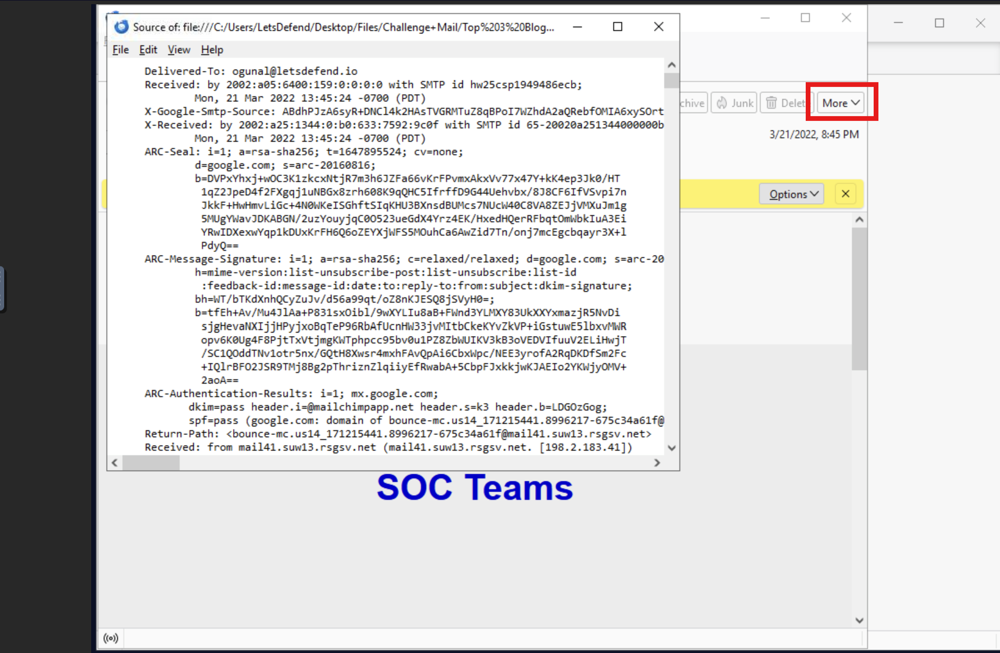
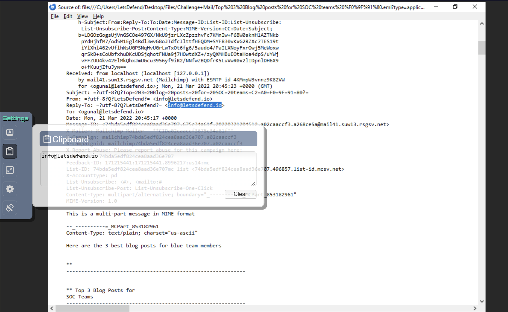
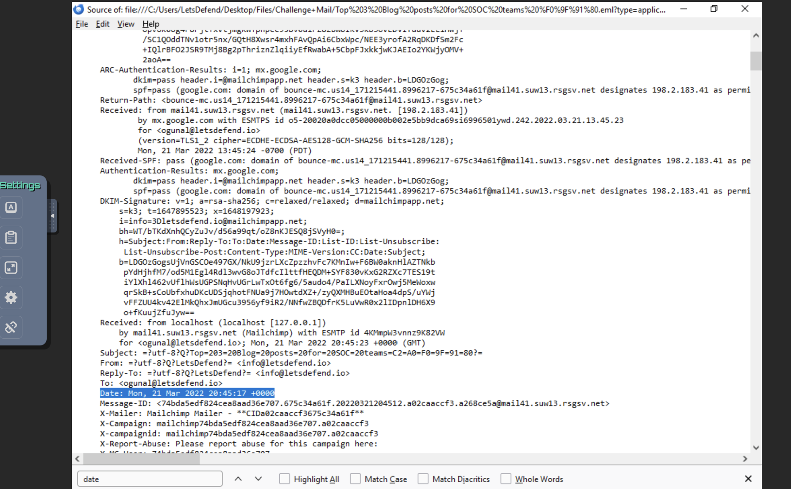
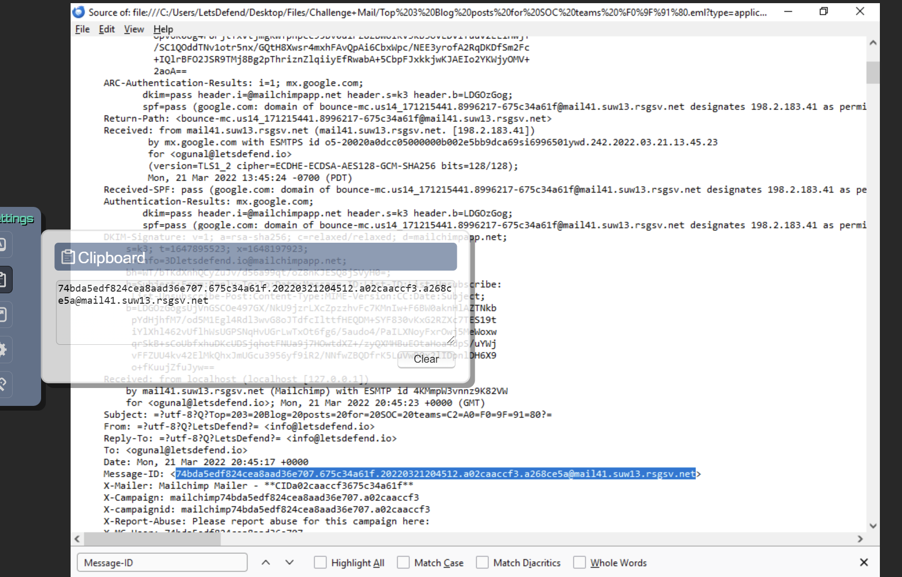

# Challenge Mail: Top 3 Blog Posts for SOC teams
I opened the .eml file via Thunderbird which displayed the email in its original HTML.
Hence, I clicked **more** at the top right corner to **view source**

**If we wanted to respond to this email, what would be the recipient's address?**

The Reply-To field answers this question..

**What year was the email sent?**

I searched (ctrl+f) for **date** which showed that the email was sent in 2022.

**What is the Message-ID? (without > < )**

To get this done with, I searched for the Message-ID field using **ctrl+f**

