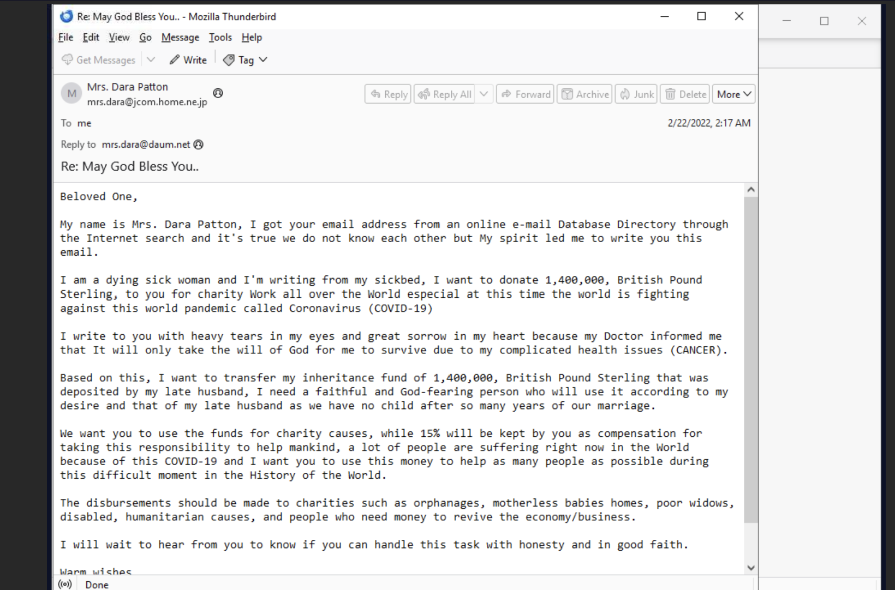
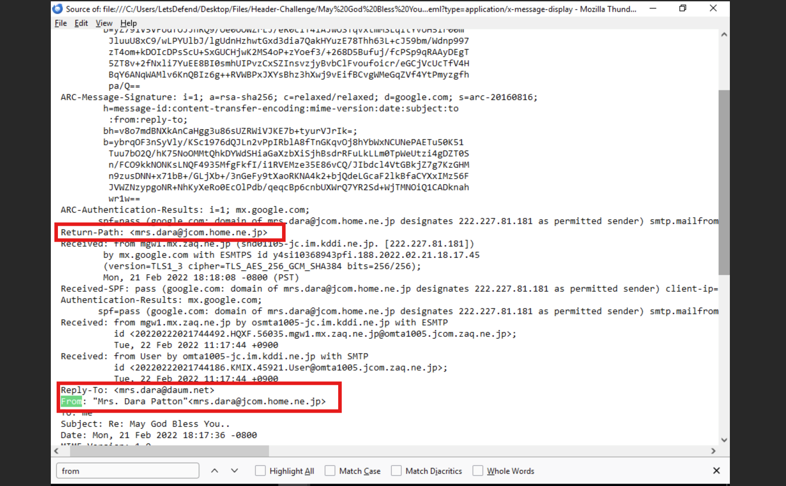
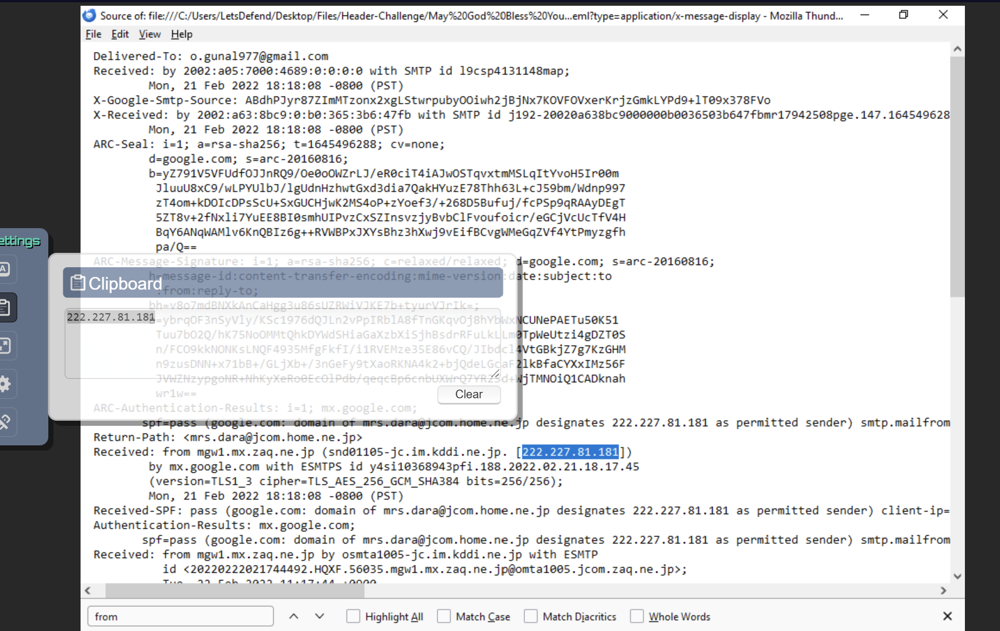
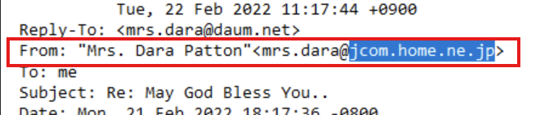
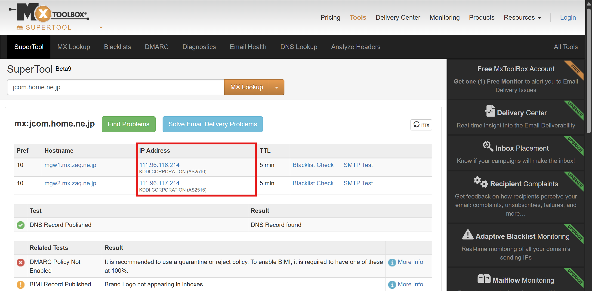
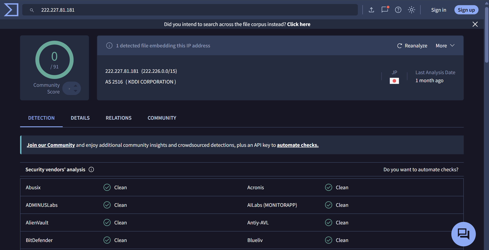

# Header Challenge: Investigating the "May God Bless You" Phishing email via Header Analysis
This email appeared to be a classic social engineering attack. Just read it below..

## Tools Used
- Thunderbird
- mxtoolbox.com

## Investigation

I opened the eml file with Thunderbird and then clicked on **more** in the top right 
corner to view the page source

To start the analysis, I checked if the sender's address and the address in the Reply-To
field were different. In most cases, we expect the sender of the email and the recipient 
of the replies to be the same. The screenshot below shows they weren't the same. Hence, if I
was to reply to this email, it won't be sent to **mrs.dara@jcom.home.ne.jp** but rather **mrs.dara@daum.net**

To investigate further, I checked the "Received" field to see the path the email took. 
As you can see in the image below, the email came from the server with the 
IP address "222.227.81.181"

Now, let's confirm if it really came from the correct SMTP server. Looking at who is sending 
the mail ("sender"), I saw that it was coming from the domain **jcom.hone.ne.jp**.

So, under normal circumstances, "jcom.hone.ne.jp" should be using "222.227.81.181" to send mail. 
To confirm this, I queried the MX servers that "jcom.hone.ne.jp" was actively using via mxtoolbox.com.

Looking at the image above, the domain **jcom.hone.ne.jp** uses KDDI CORPORATION addresses as 
its email server. Specifically 	**111.96.116.214** and **111.96.117.214**.

I have low confidence on saying that the email did not come from the original address, 
but was spoofed. This is because looking up the domain via VirusTotal associated it with KIDDI CORPERATION.
Screenshot is below..

