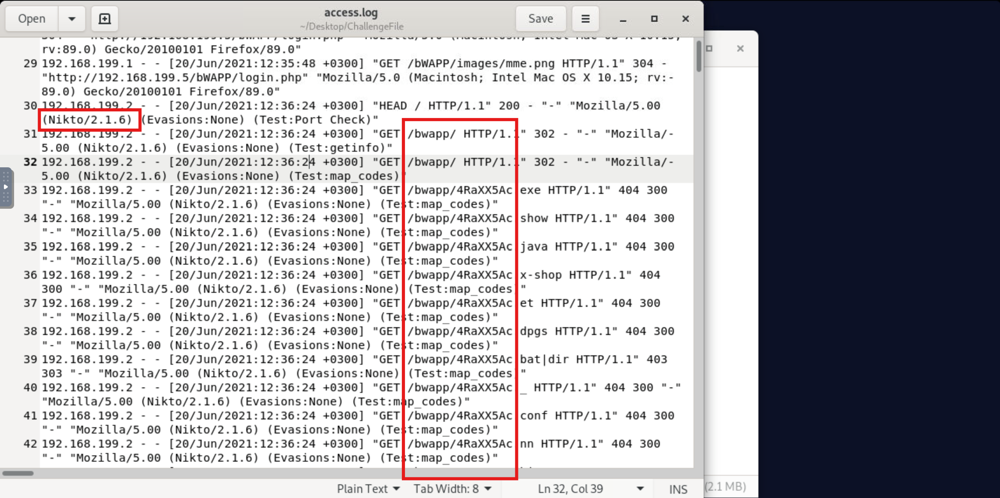
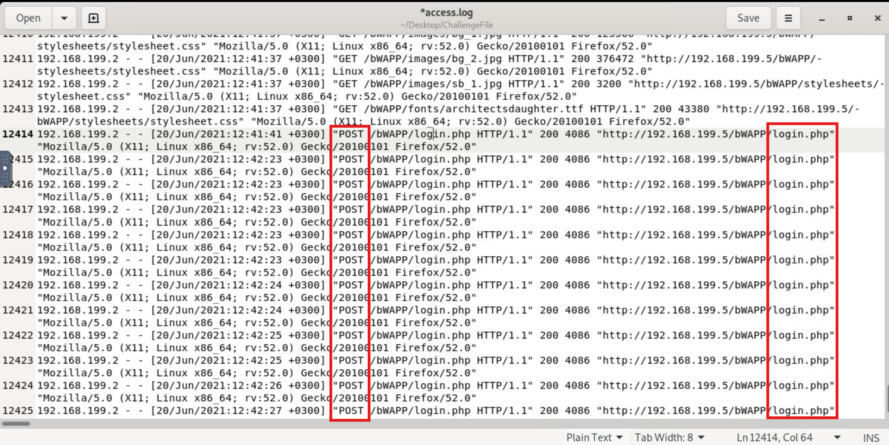
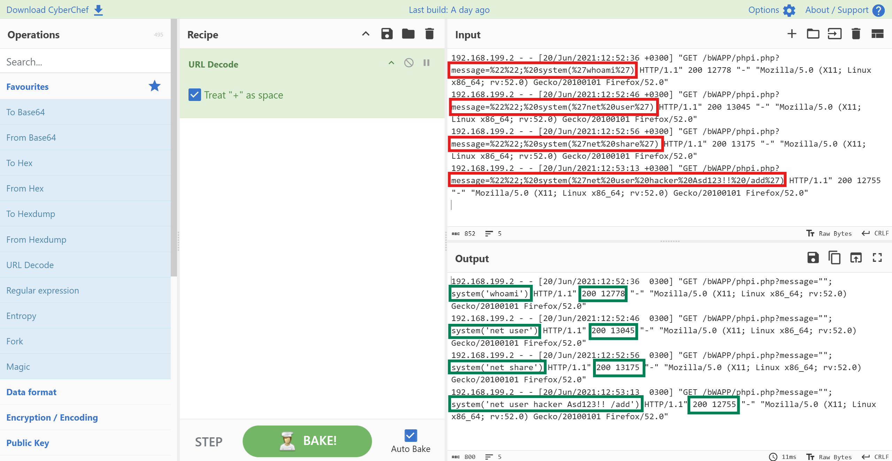

# Challenge: Investigating Web Attacks

## Investigation Summary

I began the investigation by opening the provided **Apache access log** to reconstruct the attack timeline and identify the techniques 
used by the attacker.

Initially, I attempted to copy the log file to my local machine for easier analysis, as the lab environment was relatively slow. 
Since that wasn't possible, I performed the investigation directly within the lab, carefully reviewing the logs and extracting the 
relevant entries as evidence.

The log entries covered activity between:

```text
20/Jun/2021:12:35:40 - 20/Jun/2021:12:53:23
```

The earliest events appeared to be completely legitimate.

A client at **192.168.199.1** was browsing the web server normally, requesting the homepage and loading static resources such as images.

```text
192.168.199.1 - - [20/Jun/2021:12:35:40 +0300] "GET / HTTP/1.1" 200 2506 "-" "Mozilla/5.0 (Macintosh; Intel Mac OS X 10.15; rv:89.0) Gecko/20100101 Firefox/89.0"
192.168.199.1 - - [20/Jun/2021:12:35:40 +0300] "GET /icons/unknown.gif HTTP/1.1" 200 245 "http://192.168.199.5/" "Mozilla/5.0 (Macintosh; Intel Mac OS X 10.15; rv:89.0) Gecko/20100101 Firefox/89.0"
192.168.199.1 - - [20/Jun/2021:12:35:40 +0300] "GET /icons/layout.gif HTTP/1.1" 200 276 "http://192.168.199.5/" "Mozilla/5.0 (Macintosh; Intel Mac OS X 10.15; rv:89.0) Gecko/20100101 Firefox/89.0"
```

At this stage there were no obvious indicators of malicious activity.

Shortly afterwards, however, activity originating from **192.168.199.2** marked the beginning of a multi-stage web attack.

---

# Which automated scan tool did attacker use for web reconnaissance?

Rather than focusing on the requested URLs, I examined the **User-Agent** strings where one request immediately stood out to me.

```text
192.168.199.2 - - [20/Jun/2021:12:36:24 +0300] "HEAD / HTTP/1.1" 200 - "-" "Mozilla/5.00 (Nikto/2.1.6) (Evasions:None) (Test:Port Check)"
```



The User-Agent clearly identified **Nikto 2.1.6**, a well-known web vulnerability scanner commonly used during reconnaissance.

Reviewing the subsequent requests confirmed this assessment.

```text
GET /bwapp/4RaXX5Ac.x-shop
GET /bwapp/4RaXX5Ac.et
```

These requests matched Nikto's typical behavior of probing the web server for known files, misconfigurations, and vulnerabilities.

### Finding

**Reconnaissance Tool:** **Nikto**

---

# After web reconnaissance activity, which technique did attacker use for directory listing discovery?

After completing the reconnaissance phase, the attacker's behavior changed noticeably.

Instead of probing for generic vulnerabilities, the requests focused on discovering accessible directories and application resources.

The attacker systematically requested numerous application paths in an attempt to identify valid directories within the web application.

This behavior is characteristic of **directory enumeration** (but letsdefend actually needed the name **directory brute force**), 
where attackers search for hidden or unlinked resources that may expose administrative interfaces or vulnerable functionality.

Eventually, this process revealed the application's login page:

```text
/bWAPP/login.php
```

which became the target of the next phase of the attack.

### Finding

**Technique:** Directory Brute Force

---

# What is the third attack type after directory listing discovery?

Once the attacker discovered **login.php**, the logs showed a large number of consecutive **POST** requests being sent to the authentication page.

This activity began around **12:41 PM**.

```text
192.168.199.2 - - [20/Jun/2021:12:41:41 +0300] "POST /bWAPP/login.php HTTP/1.1" 200 4086
```



Initially, nearly every authentication attempt returned:

- HTTP Status: **200**
- Response Size: **4086 Bytes**

The consistent response size suggested that each login attempt resulted in the same failed login page being returned.

As I continued reviewing the timeline, something changed.

```text
12:49:35 POST /login.php 302
12:50:10 POST /login.php 302
12:50:10 GET /portal.php 200 23369
```

The HTTP **302 Redirect** immediately caught my attention since successful web authentication commonly results in a redirect to an authenticated page.

Immediately afterwards, the attacker accessed:

```text
/bWAPP/portal.php
```

which returned a significantly larger response.

```text
200 23369
```

This confirmed that the attacker had successfully authenticated.

The subsequent requests further reinforced this conclusion.

```text
GET /bWAPP/phpi.php
GET /bWAPP/phpi.php?message=test
```

Rather than continuing to attack the login page, the attacker began exploring authenticated application functionality.

### Finding

**Attack Type:** Brute Force

---

# Was the attack successful?

**Yes**

The transition from repeated identical login responses to an HTTP 302 redirect followed by successful access to 
**portal.php** demonstrated successful authentication.

---

# What is the name of fourth attack?

After gaining access to the application, the attacker moved to another page:

```text
/bWAPP/phpi.php
```

Initially, harmless requests were sent.

```text
GET /bWAPP/phpi.php?message=test
```

These appeared to verify the application's behavior before attempting exploitation.

A few moments later, the requests became far more suspicious.

```text
GET /bWAPP/phpi.php?message=%22%22;%20system(%27whoami%27)
GET /bWAPP/phpi.php?message=%22%22;%20system(%27net%20user%27)
GET /bWAPP/phpi.php?message=%22%22;%20system(%27net%20share%27)
```



The payloads were URL-encoded, so I decoded them using **CyberChef**.

The decoded payloads were:

```text
""; system('whoami')
```

```text
""; system('net user')
```

```text
""; system('net share')
```

These payloads attempted to invoke the PHP **system()** function to execute operating system commands. This confirmed that the attacker was 
exploiting a **Command Injection** vulnerability.

Unlike earlier requests, these payloads produced varying response sizes while consistently returning **HTTP 200**, indicating 
that the server was likely executing the supplied commands and returning their output.

### Finding

**Fourth Attack:** Code Injection 
> Yeah.. that's what LetsDefecd wants and not command injection lol

---

# What is the first payload for 4th attack?

The first command executed by the attacker was:

```text
whoami
```

This is a common reconnaissance command used to identify the account under which the web application is running.

---

# Is there any persistency clue for the victim machine in the log file ? If yes, what is the related payload?

The final stage of the attack revealed evidence that the attacker attempted to establish persistence on the compromised host.

One request contained the following payload:

```text
system('net user hacker Asd123!! /add')
```

Encoded within the log as:

```text
%27net%20user%20hacker%20Asd123!!%20/add%27
```

This Windows command attempts to create a new local user account named **hacker**.

Creating a new account is a well-known persistence technique, allowing attackers to regain access even if the original vulnerability 
is later remediated.

### Finding
**Persistance:** %27net%20user%20hacker%20Asd123!!%20/add%27

---

# Attack Timeline

| Time | Attack Stage | Evidence |
|------|--------------|----------|
| 12:35 | Normal User Activity | Legitimate browsing |
| 12:36 | Web Reconnaissance | Nikto vulnerability scan |
| Shortly After | Directory Enumeration | Discovery of application directories |
| 12:41–12:50 | Login Brute Force | Repeated POST requests to `login.php` |
| 12:50 | Successful Authentication | HTTP 302 redirect to `portal.php` |
| 12:50–12:53 | Command Injection | Execution of operating system commands |
| 12:53 | Persistence Attempt | Creation of local user account |

---

# Conclusion

The Apache access logs revealed a complete attack chain carried out by a single attacker (**192.168.199.2**) over approximately seventeen minutes.

The attack began with **Nikto** performing automated reconnaissance, followed by **directory enumeration** to discover accessible application resources. After identifying the application's login page, the attacker launched a **brute-force attack** against the authentication mechanism, eventually obtaining valid credentials as evidenced by the HTTP **302 redirects** and subsequent access to the authenticated **portal.php** page.

Once authenticated, the attacker exploited a **Command Injection** vulnerability in **phpi.php**, executing several operating system commands including **whoami**, **net user**, and **net share**. Finally, the attacker attempted to establish persistence by creating a new local user account using the **net user hacker Asd123!! /add** command.

The log analysis demonstrates a complete intrusion lifecycle, progressing from reconnaissance and discovery through credential compromise, remote command execution, and persistence, highlighting the importance of monitoring web server logs for correlated attack patterns rather than isolated events.