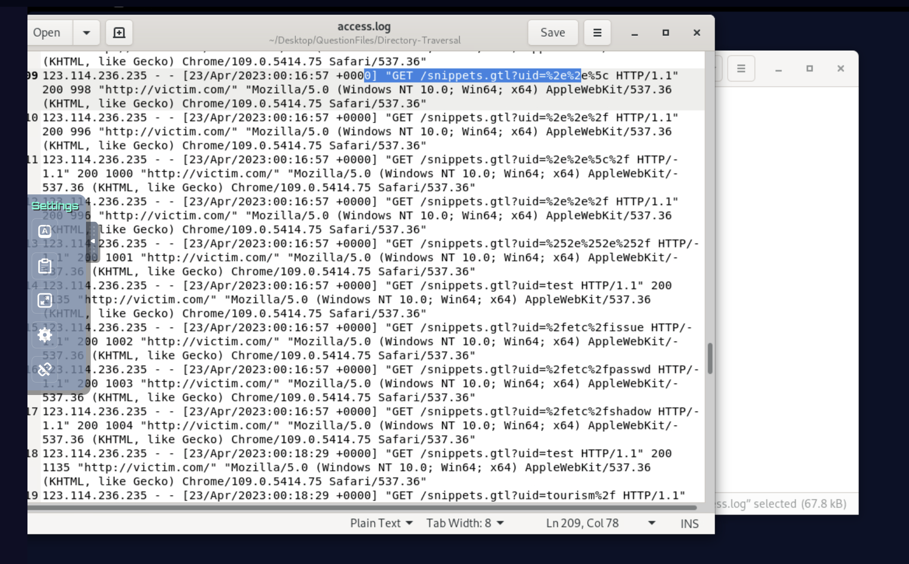
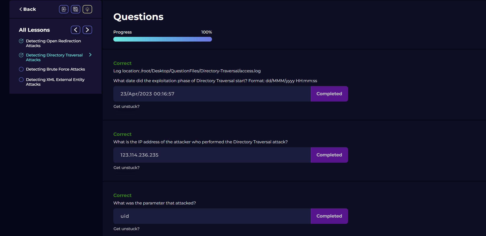

# Analysis of Web Server Access Log - Directory Traversal Attack Investigation

I opened the [access log](logs/directory-traversal-access.log) with a text editor and began analyzing the HTTP requests to 
identify the directory traversal attack timeline and attacker details. 

---

## Key Findings

### Attack Timeline
**Exploitation Date:** 23/Apr/2023 00:16:57

The directory traversal exploitation phase began on April 23, 2023 at 00:16:57 when the attacker started sending encoded path traversal 
payloads to the `uid` parameter of the `/snippets.gtl` endpoint.

### Attacker Identification
**Attacker IP Address:** 123.114.236.235

The attacker used Chrome 109.0.5414.75 on Windows NT 10.0.

### Attack Classification
**Type of Attack:** Directory Traversal / Path Traversal

The attacker attempted to access sensitive system files by using encoded path traversal sequences (`../`, `..\`) and absolute 
paths (`/etc/passwd`, `/etc/shadow`, `/etc/issue`) through the `uid` parameter.

---

## Attack Pattern Analysis

The attacker followed a methodical approach:

1. **Reconnaissance (23/Apr/2023 00:15:43 - 00:16:57):** Tested legitimate `uid` values to establish baseline behavior
2. **Path Traversal Attempts (23/Apr/2023 00:16:57):** Launched encoded traversal payloads
3. **System File Access Attempts (23/Apr/2023 00:16:57):** Attempted to read sensitive system files
4. **Dictionary Attack (23/Apr/2023 00:18:29 - 00:19:45):** Multiple attackers attempted common directory names

---

## Detailed Attack Timeline

### Pre-Attack Activity (23/Apr/2023)

| Time | IP Address | Activity | Response Size |
|------|------------|----------|---------------|
| 00:15:43 | 123.114.236.235 | Legitimate: `uid=test` | 1135 bytes |
| 00:15:51 | 123.114.236.235 | Legitimate: `uid=test` | 1135 bytes |
| 00:16:04 | 123.114.236.235 | Homepage access | 1255 bytes |
| 00:16:14 | 123.114.236.235 | Legitimate: `uid=test` | 1135 bytes |

### Attack Phase (23/Apr/2023 00:16:57)

| Time | Payload | Decoded Value | Response Size |
|------|---------|---------------|---------------|
| 00:16:57 | `%2e%2e%5c` | `..\` | 998 bytes |
| 00:16:57 | `%2e%2e%2f` | `../` | 996 bytes |
| 00:16:57 | `%2e%2e%5c%2f` | `..\/` | 1000 bytes |
| 00:16:57 | `%252e%252e%252f` | `%2e%2e%2f` (double encoded) | 1001 bytes |
| 00:16:57 | `%2fetc%2fissue` | `/etc/issue` | 1002 bytes |
| 00:16:57 | `%2fetc%2fpasswd` | `/etc/passwd` | 1003 bytes |
| 00:16:57 | `%2fetc%2fshadow` | `/etc/shadow` | 1004 bytes |

### Dictionary Attack Phase (23/Apr/2023 00:18:29 - 00:19:45)

Multiple attackers attempted to enumerate common directories and paths:

| Time | IP Address | Example Payloads |
|------|------------|------------------|
| 00:18:29 | 123.114.236.235 | `tourism/`, `sed/`, `blog/`, `nova/`, `subway/` |
| 00:18:30 | 162.13.108.54 | `lancaster/`, `MI3KE3SS/`, `manage/`, `hidden/` |
| 00:18:34 | 177.98.110.246 | `administration/`, `marykayintouch/`, `Sheahan3/` |
| 00:18:42 | 156.139.188.182 | `ccp14admin/`, `spc/`, `cet/`, `columbia/` |
| 00:18:58 | 170.201.117.32 | `dbase/`, `valuedopinions/`, `skyscanner/` |
| 00:19:17 | 149.114.9.99 | `cm/`, `_vti_pvt/`, `upd/`, `bb-admin/` |

---

## Evidence of Attack Failure

### Key Indicators

1. **Reduced Response Size:** Legitimate requests returned ~1135 bytes, while all traversal attempts returned ~1000 bytes, indicating error handling rather than file content

2. **Consistent Response:** All traversal attempts returned similar-sized responses regardless of the target file

3. **No Sensitive Data:** System files like `/etc/passwd` would return thousands of bytes if successful, but only ~1003 bytes were returned

4. **Error Indication:** The reduced response size suggests the application returned an error message instead of the requested file

### Why the Attack Failed

The application likely had proper security controls:
1. **Path Sanitization:** Removal or filtering of `../` sequences
2. **Input Validation:** Validation of the `uid` parameter format
3. **Error Handling:** Graceful error handling without file disclosure
4. **File System Permissions:** Proper permissions preventing unauthorized access
5. **PHP Configuration:** `open_basedir` restrictions

---

## Attackers Involved

| IP Address | Attack Type | Activity |
|------------|-------------|----------|
| 123.114.236.235 | Path Traversal | Initial encoded payloads |
| 162.13.108.54 | Dictionary Attack | Common directory enumeration |
| 177.98.110.246 | Dictionary Attack | Common directory enumeration |
| 156.139.188.182 | Dictionary Attack | Common directory enumeration |
| 170.201.117.32 | Dictionary Attack | Common directory enumeration |
| 149.114.9.99 | Dictionary Attack | Common directory enumeration |

---

## Conclusion

The investigation identifies an **attempted Directory Traversal attack** on 23/Apr/2023 00:16:57 from IP address **123.114.236.235**. The attacker 
attempted to exploit the `uid` parameter of the `/snippets.gtl` endpoint using various encoded path traversal payloads including:
- URL-encoded `../` and `..\` sequences
- Double URL encoding
- Absolute paths to sensitive system files (`/etc/passwd`, `/etc/shadow`, `/etc/issue`)

**The attack was unsuccessful** as evidenced by the consistent response sizes (~1000 bytes) versus legitimate responses (~1135 bytes). The application properly handled the traversal attempts, returning error messages instead of sensitive file contents.

The attacker was later joined by multiple other IP addresses conducting a dictionary attack to enumerate common directory names, suggesting a 
coordinated or automated effort.

### Recommendations

1. **Input Validation:** Strictly validate the `uid` parameter format
2. **Path Sanitization:** Remove or reject `../`, `..\`, and similar sequences
3. **Whitelist Approach:** Restrict values to a whitelist of allowed UIDs
4. **Error Handling:** Implement proper error handling without information disclosure
5. **File Permissions:** Apply least privilege principles to file system
6. **PHP Configuration:** Set `open_basedir` to restrict file access
7. **Logging:** Monitor for repeated traversal attempts
8. **WAF Rules:** Implement rules to block directory traversal patterns