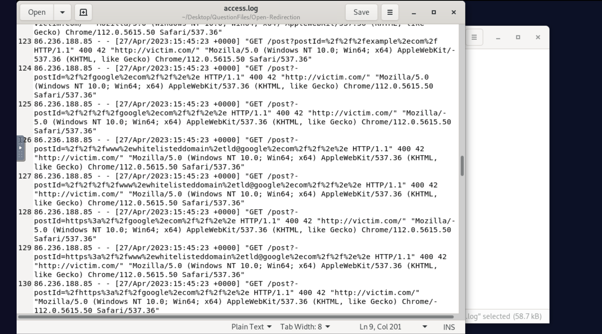
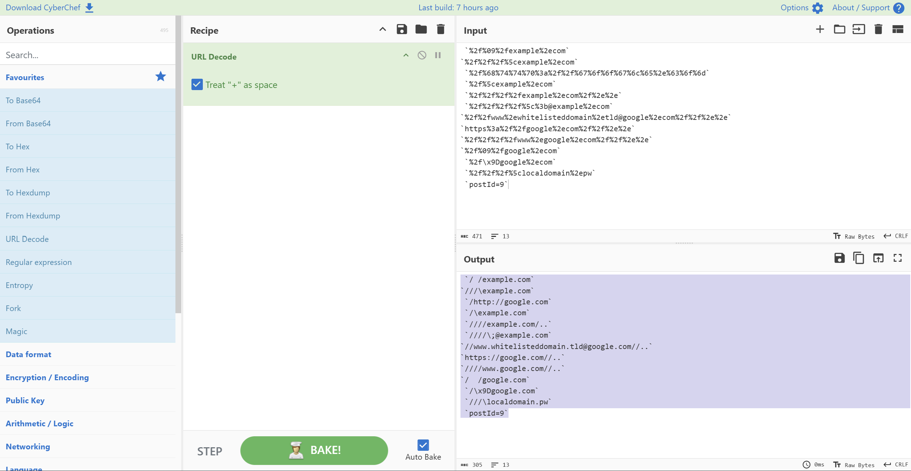

# Analysis of Web Server Access Log - Open Redirect Attack Investigation

---

## Key Findings

[LOG FILE HERE](logs/open-redirect-access.log)

### Attack Timeline
**Exploitation Date:** 27/Apr/2023 15:45:22

The exploitation phase began on April 27, 2023 at 15:45:22 when the attacker started sending a series of encoded payloads to the `postId` parameter 
in an attempt to bypass input validation and achieve an open redirect.

### Attacker Identification
**Attacker IP Address:** 86.236.188.85

The attacker used Chrome 112.0.5615.50 on Windows NT 10.0.

### Attack Classification
**Type of Attack:** Open Redirect (Attempted)

The attacker attempted to exploit an open redirect vulnerability by injecting 
various URL-encoded payloads into the `postId` parameter, attempting to redirect 
users to external domains such as google.com, example.com, and other potential 
malicious domains.

---

## Attack Pattern Analysis

The attacker followed a methodical approach:

1. **Reconnaissance (18-26/Apr/2023):** Multiple attackers (178.78.113.5, 206.52.45.12, 254.198.150.19) probed the application, enumerating posts and submitting comments
2. **Initial Probing (26/Apr/2023):** Attacker 254.198.150.19 performed extensive IDOR-style enumeration of post IDs (0-16, 2010-2023)
3. **Open Redirect Attempts (27/Apr/2023 15:45:22):** Attacker 86.236.188.85 launched a series of 100+ encoded redirect payloads
4. **Parameter Testing:** Tested the `postId` parameter with various encoding and bypass techniques

---

### Attack Timeline (27/Apr/2023)

| Time | Payload Type | Sample Payload | Response |
|------|--------------|----------------|----------|
| 15:45:22 | Double slash bypass | `%2f%09%2fexample%2ecom` | 400 |
| 15:45:22 | Multiple slash variants | `%2f%2f%2f%5cexample%2ecom` | 400 |
| 15:45:22 | Encoded HTTP URLs | `%2f%68%74%74%70%3a%2f%2f%67%6f%6f%67%6c%65%2e%63%6f%6d` | 400 |
| 15:45:22 | Backslash variants | `%2f%5cexample%2ecom` | 400 |
| 15:45:22-23 | Path traversal combinations | `%2f%2f%2f%2fexample%2ecom%2f%2e%2e` | 400 |
| 15:45:23 | `@` username injection | `%2f%2f%2f%2f%5c%3b@example%2ecom` | 400 |
| 15:45:23 | Whitelist bypass attempts | `%2f%2fwww%2ewhitelisteddomain%2etld@google%2ecom%2f%2f%2e%2e` | 400 |
| 15:45:23-25 | HTTPS variants | `https%3a%2f%2fgoogle%2ecom%2f%2f%2e%2e` | 400 |
| 15:45:23-25 | Multiple forward slashes | `%2f%2f%2f%2fwww%2egoogle%2ecom%2f%2f%2e%2e` | 400 |
| 15:45:24-26 | Tab character injection | `%2f%09%2fgoogle%2ecom` | 400 |
| 15:45:26 | Non-ASCII characters | `%2f\x9Dgoogle%2ecom` | 400 |
| 15:45:35 | Local domain attempts | `%2f%2f%2f%5clocaldomain%2epw` | 400 |
| 15:45:23 | **Legitimate request** | `postId=9` | 200 (2984 bytes) |

URL DECODED: 

 `/	/example.com` 
`///\example.com` 
 `/http://google.com` 
 `/\example.com` 
 `////example.com/..` 
 `////\;@example.com` 
`//www.whitelisteddomain.tld@google.com//..` 
`https://google.com//..` 
`////www.google.com//..` 
`/	/google.com` 
 `/\x9Dgoogle.com`
 `///\localdomain.pw` 
 `postId=9`
 
 
 
---

### Why the Attack Failed

All malicious requests returned HTTP 400 (Bad Request) status codes with 42-byte responses, while legitimate requests returned HTTP
200 with responses of 2500-3200 bytes. This indicates:

1. **Input Validation:** The application properly validated the `postId` parameter
2. **Type Enforcement:** The parameter was enforced as a numeric ID
3. **Rejection of Invalid Input:** Non-numeric values were rejected with 400 errors
4. **No Redirect Function:** The `postId` parameter likely wasn't used in a redirect context

---

## Evidence of Attack Failure

| Metric | Malicious Requests | Legitimate Requests |
|--------|-------------------|---------------------|
| HTTP Status | 400 | 200 |
| Response Size | 42 bytes | 2500-3200 bytes |
| Content | Error message | Post content |
| Success Rate | 0% | 100% |

---

## Conclusion

The investigation identifies an **attempted Open Redirect attack** on 27/Apr/2023 15:45:22 from IP address **86.236.188.85**. The attacker 
attempted to exploit the `postId` parameter with over 100 encoded payloads using various bypass techniques including:
- Double and triple slash injection
- Backslash variants
- Username (`@`) injection
- HTTPS protocol injection
- Tab and non-ASCII character injection
- Path traversal with external domains

**The attack was unsuccessful** as the application properly validated the `postId` parameter as a numeric ID, rejecting all non-numeric values with HTTP 
400 errors. The application's input validation prevented the attacker from using the parameter in a redirect context.

