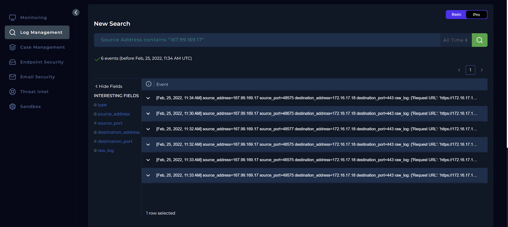
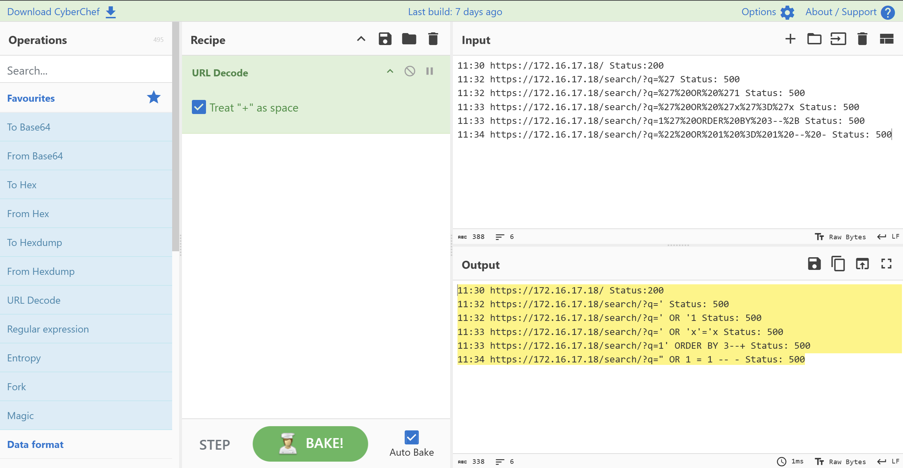
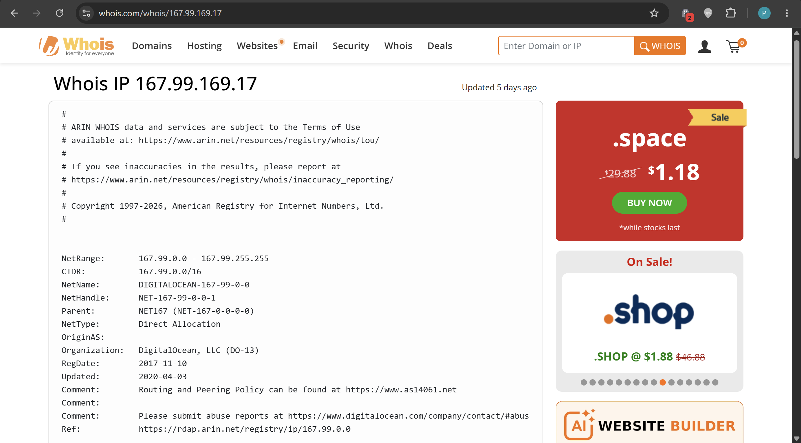
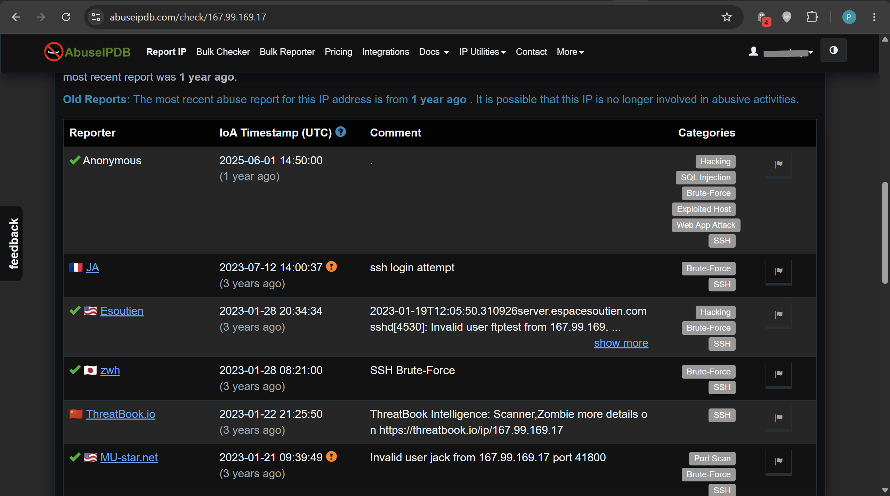
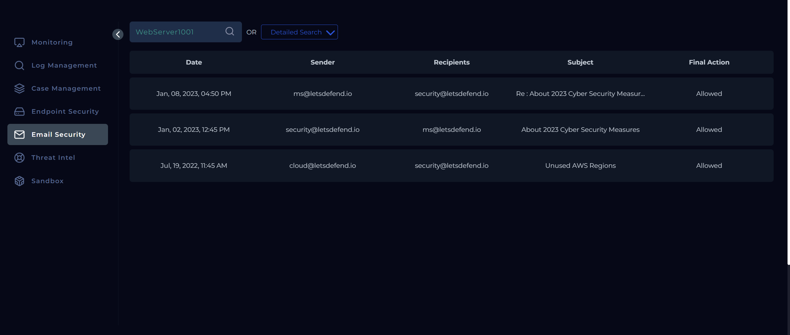
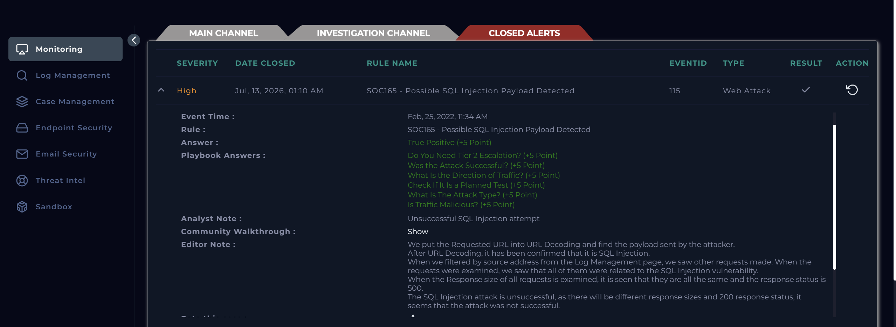

# SOC165 Analysis: Possible SQL Injection Payload Detected

## Alert Overview

| Field | Value |
|-------|-------|
| **Alert Name** | SOC165 - Possible SQL Injection Payload Detected |
| **Event ID** | 115 |
| **Event Time** | February 25, 2022, 11:34 AM |
| **Severity/Level** | Security Analyst |
| **Hostname** | WebServer1001 |
| **Source IP** | 167.99.169.17 |
| **Destination IP** | 172.16.17.18 |
| **Protocol** | HTTP |
| **Method** | GET |
| **Requested URL** | `https://172.16.17.18/search/?q=%22%20OR%201%20%3D%201%20--%20-` |
| **Alert Trigger** | Requested URL Contains `OR 1 = 1` |
| **Device Action** | Allowed |

---

# Investigation Summary

Upon receiving the alert, I documented the alert details and created an investigation case.

The alert was straightforward and indicated a possible **SQL Injection** attempt against the internal web server **WebServer1001 (172.16.17.18)** originating from the public IP address **167.99.169.17**.

The requested URL contained URL-encoded characters, so the first step was to decode the payload using **CyberChef**.

**Encoded Request**

```text
https://172.16.17.18/search/?q=%22%20OR%201%20%3D%201%20--%20-
```

**Decoded Request**

```text
https://172.16.17.18/search/?q=" OR 1 = 1 -- -
```

The decoded payload confirmed that the requester was attempting to test for a SQL injection vulnerability by using the classic `OR 1 = 1` authentication bypass technique.

---

# Log Analysis

To determine whether this was an isolated request or part of a larger attack, I searched the log management platform for all events associated with the source IP address **167.99.169.17**.



The search returned **six HTTP requests** occurring over approximately **four minutes**, suggesting manual interaction rather than a high-speed automated scan.

| Time | Request | HTTP Status |
|------|----------|------------|
| 11:30 | `/` | 200 |
| 11:32 | `/search/?q='` | 500 |
| 11:32 | `/search/?q=' OR '1` | 500 |
| 11:33 | `/search/?q=' OR 'x'='x` | 500 |
| 11:33 | `/search/?q=1' ORDER BY 3--+` | 500 |
| 11:34 | `/search/?q=" OR 1 = 1 -- -` | 500 |

Not that the above, was decoded with Cyberchef.



The progression of payloads shows that the attacker was actively testing different SQL injection techniques, including:

- Single quote (`'`) testing
- Boolean-based injection (`OR '1'`)
- Authentication bypass (`OR 'x'='x`)
- Column enumeration (`ORDER BY`)
- Universal true condition (`OR 1 = 1`)

Each payload generated an **HTTP 500 (Internal Server Error)** response.

Although the firewall allowed the requests to reach the application, the payloads did not execute successfully.

---

# Threat Intelligence

To gather additional information about the attacking host, I performed reputation checks using **WHOIS** and **AbuseIPDB**.

### WHOIS


The source IP address **167.99.169.17** is a publicly routable address owned by:

- **DigitalOcean, LLC**
- Cloud infrastructure provider

### AbuseIPDB


The IP address has been reported **over 14,000 times** for malicious activity.

Common reports include:

- SSH brute-force attacks
- SQL injection attempts
- Port scanning
- General malicious activity

The reputation data strongly supports the conclusion that the source IP has a history of malicious behavior.

---

# Examination of HTTP Traffic

The requests contained multiple SQL injection payloads targeting the `q` parameter of the `/search/` endpoint.

Observed payloads included:

```text
'
' OR '1
' OR 'x'='x
1' ORDER BY 3--+
" OR 1 = 1 -- -
```

These payloads are commonly used during the reconnaissance phase of SQL injection attacks to determine:

- Whether user input is reflected into SQL queries
- The number of columns in the SQL statement
- Whether boolean conditions can manipulate query logic
- Whether further exploitation is possible

The alert was therefore correctly classified as a **SQL Injection attempt**.

---

# Verification of Planned Testing

To rule out the possibility of a scheduled penetration test, I searched the organization's email records.

### Search 1

Search criteria:

- Keyword: **WebServer1001**
- Time range:
  - February 2021
  - February 2023

Results:

- July 2022
- January 2023 (2 emails)

No emails were found before the incident date indicating a planned security assessment.



### Search 2

I then searched using the keyword:

```text
test
```

Although emails referencing penetration testing existed, they related to different systems and different timeframes.

The documented penetration tests occurred:

- 2020
- 2023

None matched the affected server or the event date.

Therefore, there was no evidence that this activity was part of an approved penetration test.


---

# Traffic Direction

```text
Internet -> Company Network
```

The attack originated from a public IP address targeting the internal web server.

---

# Attack Success Assessment

The web server responded with **HTTP 500 (Internal Server Error)** to every SQL injection payload.

No evidence indicated successful exploitation.

Specifically:

- No successful HTTP responses (200) for malicious payloads
- No indication of SQL query execution
- No evidence of data extraction
- No evidence of command execution
- No signs of database compromise

While the firewall did not block the malicious requests, the application did not process the payloads successfully.

Therefore, the attack is assessed as **unsuccessful**.

---

# Tier 2 Escalation Assessment

Tier 2 escalation was **not required**.

Although this was a genuine SQL injection attempt, there was no evidence of:

- Successful exploitation
- Database compromise
- Remote command execution
- Data exfiltration
- Persistence

The incident could therefore be handled and closed at the Tier 1 level.

---

# Findings

| Investigation Item | Result |
|--------------------|--------|
| Was the alert legitimate? | Yes |
| Attack Type | SQL Injection |
| Traffic Direction | Internet -> Company Network |
| Was it a planned test? | No |
| Was the attack successful? | No |
| Firewall Action | Allowed |
| Web Server Response | HTTP 500 |
| Tier 2 Escalation Required | No |
| Case Classification | True Positive |

c

---

# Conclusion

The internal web server **WebServer1001 (172.16.17.18)** received a series of SQL injection attempts from the public IP address **167.99.169.17**. The attacker tested multiple SQL injection payloads against the `/search/` endpoint, including boolean-based injection, authentication bypass, and column enumeration techniques.

All malicious requests resulted in **HTTP 500 (Internal Server Error)** responses, indicating that the payloads were not successfully executed. Although the firewall permitted the requests, there was no evidence of successful exploitation, database access, or data exfiltration.

Threat intelligence further showed that the source IP has an extensive history of malicious activity, with numerous reports involving SQL injection and brute-force attacks.

Email searches confirmed that the activity was **not associated with an authorized penetration test**.

The incident was therefore classified as a **True Positive** SQL injection attempt that was **unsuccessful**, requiring **no Tier 2 escalation**.

---




# Playbook Execution Checklist

| Step | Status |
|------|--------|
| Understand why the alert triggered | Completed |
| Collect relevant investigation data | Completed |
| Examine HTTP traffic | Completed |
| Determine whether traffic is malicious | Malicious |
| Identify attack type | SQL Injection |
| Verify whether activity was a planned test | Completed |
| Determine traffic direction | Internet -> Company Network |
| Assess attack success | Unsuccessful |
| Determine Tier 2 escalation requirement | Not Required |
| Close investigation | True Positive |