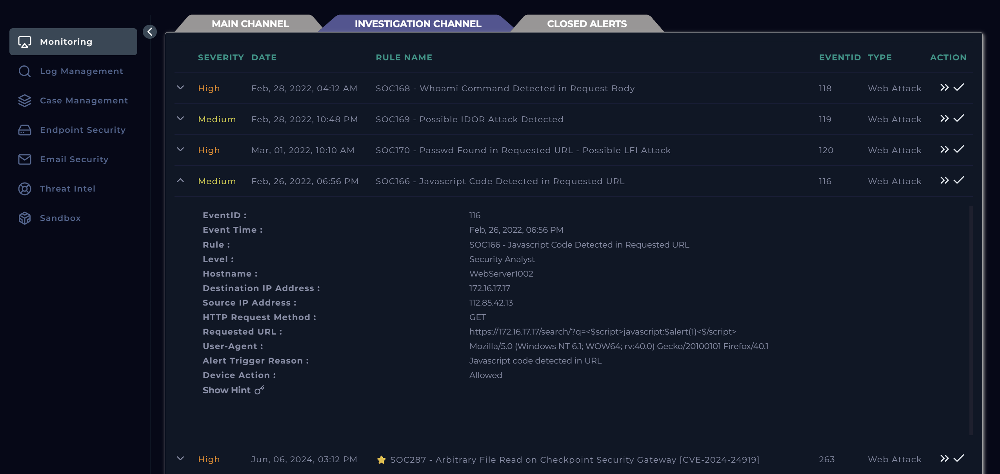
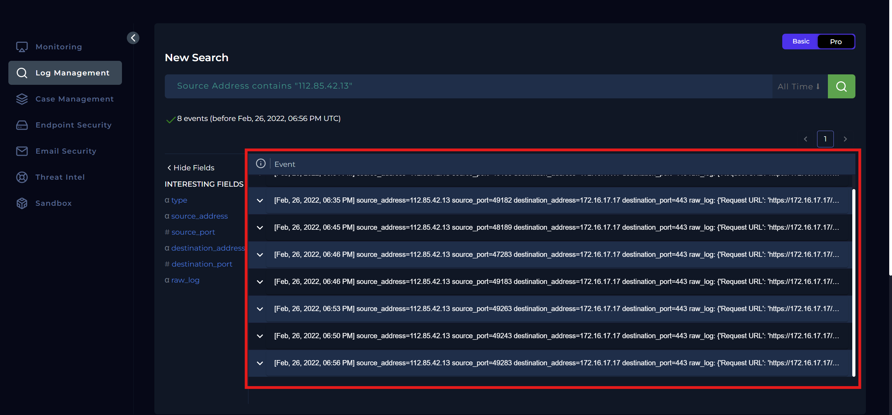
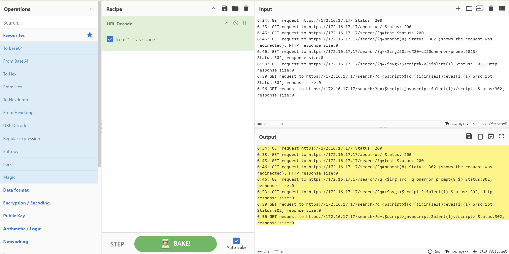
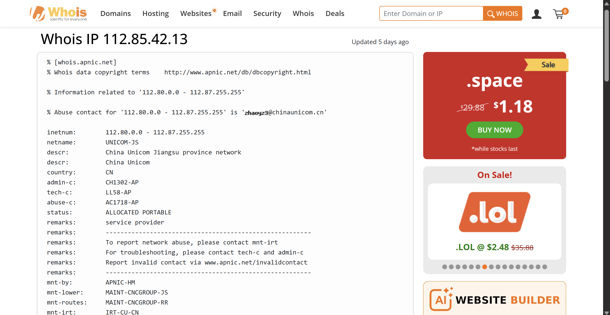
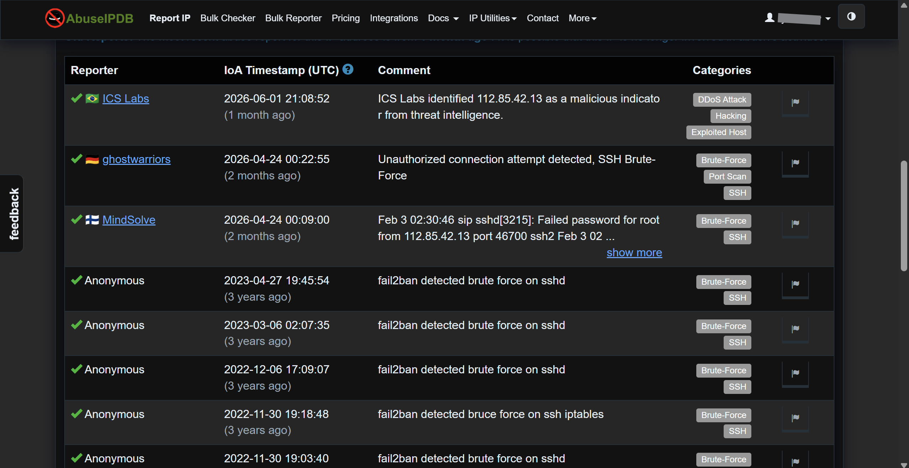
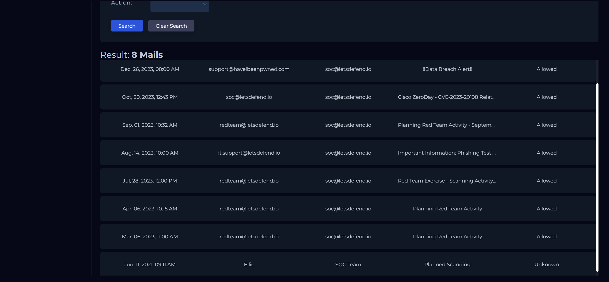
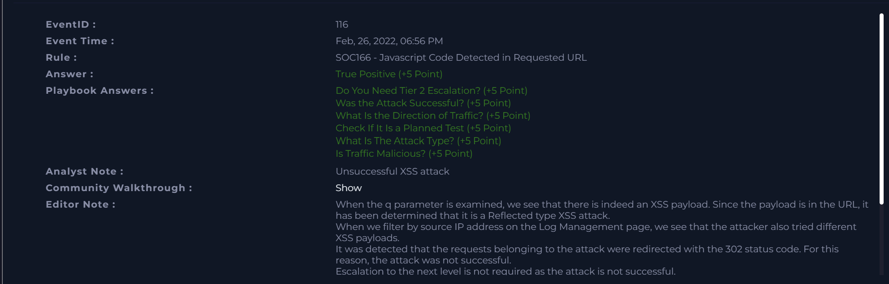

# SOC166 Analysis: JavaScript Code Detected in Requested URL

## Alert Overview

| Field | Value |
|-------|-------|
| **Alert Name** | SOC166 - JavaScript Code Detected in Requested URL |
| **Event ID** | 116 |
| **Event Time** | February 26, 2022, 06:56 PM |
| **Severity/Level** | Security Analyst |
| **Hostname** | WebServer1002 |
| **Source IP** | 112.85.42.13 |
| **Destination IP** | 172.16.17.17 |
| **Protocol** | HTTP |
| **Method** | GET |
| **Requested URL** | `https://172.16.17.17/search/?q=<$script>javascript:$alert(1)<$/script>` |
| **Alert Trigger** | JavaScript code detected in URL |
| **Device Action** | Allowed |



---

# Investigation Summary

The first thing I did was create a case from the alert so I could begin the investigation properly.

The alert itself immediately gave a strong indication of what I was dealing with. The trigger reason stated that **JavaScript code had been detected in the requested URL**, which is commonly associated with **Cross-Site Scripting (XSS)** attempts.

Looking at the requested URL made that suspicion even stronger.

```text
https://172.16.17.17/search/?q=<$script>javascript:$alert(1)<$/script>
```

It was clear that someone was attempting to inject JavaScript into the application's search functionality to determine whether user input would be executed by the browser.

The request originated from the public IP **112.85.42.13** and targeted **WebServer1002 (172.16.17.17)**.

Before jumping to conclusions, I wanted to understand whether this was a single probe or part of a larger attack, so I moved into the log management platform to review all activity associated with the source IP.

---

# Log Analysis

Filtering on the source IP returned **eight related events**. I expanded each event and reconstructed the timeline of the attack.

One thing I always like to look at first is the timestamps because they often tell whether I'm looking at an automated scanner 
or someone manually interacting with the application.



The requests occurred over roughly **twenty-two minutes**, from **6:34 PM to 6:56 PM**, which suggested someone was manually testing the application rather than launching a rapid automated scan.

The activity looked like this:

| Time | Request | Status |
|------|----------|-------|
| 6:34 PM | `/` | 200 |
| 6:35 PM | `/about-us/` | 200 |
| 6:45 PM | `/search/?q=test` | 200 |
| 6:46 PM | `/search/?q=prompt(8)` | 302 |
| 6:46 PM | `/search/?q=` | 302 |
| 6:50 PM | `/search/?q=<script>for((i)in(self))eval(i)(1)</script>` | 302 |
| 6:53 PM | `/search/?q=<svg><script>alert(1)` | 302 |
| 6:56 PM | `/search/?q=<script>javascript:alert(1)</script>` | 302 |

Since several requests contained encoded characters, I decoded the payloads with **CyberChef** to make them easier to read and interpret.



After decoding, it became obvious that the attacker was cycling through multiple well-known XSS payloads.

Some of the payloads included:

```text
prompt(8)


<svg><script>alert(1)

<script>for((i)in(self))eval(i)(1)</script>

<script>javascript:alert(1)</script>
```

At this point, the pattern became very clear.

The attacker wasn't simply sending random JavaScript; they were deliberately trying different XSS techniques to see which, if any, 
the application would execute.

What stood out to me, however, was the application's response.

The first three legitimate requests all returned **HTTP 200**, establishing a normal baseline.

Every XSS payload after that returned **HTTP 302 (Redirect)** with a **0-byte response**.

This told me something important.

The firewall never blocked the malicious requests—they were all allowed to reach the web server. Instead, the application itself 
consistently handled the malicious input by redirecting the request rather than reflecting the payload back to the user.

To me, this suggests that while the perimeter security didn't stop the attack, the web application's own input validation or 
request handling prevented the payloads from executing.

---

# Threat Intelligence

Once I understood the attack itself, I wanted to gather context about the attacking host.

I performed both **WHOIS** and **AbuseIPDB** lookups on the source IP address.

## WHOIS

The IP address was identified as a public address belonging to **China Unicom**, a major telecommunications provider in China.

## AbuseIPDB

AbuseIPDB provided even more context.

The IP belongs to:

- China Unicom Jiangsu Province Network
- Country: China
- Domain: `chinaunicom.cn`

More importantly, the address had been reported **over 45,000 times** for malicious activity.

Common reports included:

- DDoS attacks
- SSH brute-force attacks
- Exploited hosts
- General malicious activity

Combined with the observed HTTP payloads, this significantly increased my confidence that the activity was malicious rather than 
accidental.




---

# Examination of HTTP Traffic

By this stage, I had already examined the HTTP requests in detail.

Every suspicious request contained JavaScript designed to test whether the application reflected user input back into the page without proper sanitization.

The attacker attempted several common XSS techniques, including:

- JavaScript execution using `alert()` and `prompt()`
- Image tag event handlers (`onerror`)
- SVG-based script execution
- Script tags
- JavaScript protocol payloads
- Obfuscated JavaScript using `eval()`

The requests clearly aligned with an **XSS vulnerability assessment**.

---

# Determining Whether the Traffic Was Malicious

At this point, I had enough evidence to confidently classify the traffic as malicious.

The indicators included:

- Multiple known XSS payloads
- Sequential testing of different injection techniques
- A source IP with an extensive malicious reputation
- Continued probing over several minutes

There was no indication that this was normal user behavior.

---

# Verification of Planned Testing



Even when an alert appears obviously malicious, I still like to verify whether it could have been generated during an authorized penetration test.

To do that, I searched the organization's email records for notifications relating to planned security assessments.

I searched emails covering **2021 through 2022**, paying particular attention to anything close to **February 2022**, when this alert occurred.

The search returned eight emails.

Interestingly, only one email appeared before the incident, dated **June 11, 2021**.

The email stated:

> Hi all, I will scan the LetsDefend network after 12:00 13.06.2021. Please ignore SIEM alerts for "PentestMachine". Hostname: PentestMachine. IP Address: 172.16.20.5.

Although this was indeed a planned security scan, it clearly referred to an entirely different host and subnet.

The planned scan involved:

- Hostname: **PentestMachine**
- IP: **172.16.20.5**

This incident involved:

- Hostname: **WebServer1002**
- IP: **172.16.17.17**

Since neither the systems nor the timeline matched, I concluded that this activity was **not part of an authorized penetration test**.

---

# Traffic Direction

```text
Internet -> Company Network
```

The attack originated from an external public IP address targeting an internal web server.

---

# Attack Success Assessment

Earlier in the investigation, I had already observed that every malicious payload resulted in:

- HTTP Status **302**
- Response size **0 bytes**

These responses indicate that the application redirected the requests instead of reflecting the supplied JavaScript back to the browser.

I found no evidence that any payload was executed.

There was also no indication of:

- Successful JavaScript execution
- Reflected XSS
- Stored XSS
- Session hijacking
- User compromise

Although the firewall allowed the traffic through, the application itself successfully prevented the attack from succeeding.

I therefore concluded that the attack was **unsuccessful**.

---

# Indicators of Compromise (IOCs)

| Type | Value |
|------|-------|
| Source IP | 112.85.42.13 |
| Destination IP | 172.16.17.17 |
| Hostname | WebServer1002 |
| Attack Type | Cross-Site Scripting (XSS) |
| Target Endpoint | `/search/` |

---

# Tier 2 Escalation Assessment

I did not escalate the incident to Tier 2.

Although the alert was a **True Positive**, there was no evidence that the attacker successfully exploited the application or compromised any systems.

The attack remained limited to unsuccessful probing attempts and was therefore appropriate to close at the Tier 1 level.

---

# Playbook Execution Findings

| Investigation Item | Result |
|--------------------|--------|
| Was the alert legitimate? | Yes |
| Attack Type | Cross-Site Scripting (XSS) |
| Traffic Direction | Internet -> Company Network |
| Was it a planned test? | No |
| Was the attack successful? | No |
| Firewall Action | Allowed |
| Application Response | HTTP 302 Redirect |
| Tier 2 Escalation Required | No |
| Case Classification | True Positive |

---

# Conclusion

WebServer1002 received a sequence of HTTP GET requests from the public IP address **112.85.42.13** targeting the application's 
search functionality with multiple Cross-Site Scripting payloads.

Reviewing the request timeline showed that the attacker systematically tested several common XSS techniques, including JavaScript 
execution, event-handler injection, SVG payloads, and obfuscated script execution. The activity appeared to be a deliberate 
manual assessment rather than an automated scan due to the spacing between requests and the progression of payloads.

Although the firewall permitted every request to reach the server, the web application consistently responded with **HTTP 302 
redirects** and **0-byte responses**, indicating that the malicious input was not reflected or executed. No evidence of successful 
exploitation, user impact, or compromise was observed.

Threat intelligence further confirmed that the source IP has an extensive history of malicious activity, including reports of DDoS 
attacks, SSH brute-force attempts, and compromised hosts. Additionally, email records confirmed that no authorized 
penetration testing involving WebServer1002 was scheduled during the timeframe of this incident.

Based on the investigation, I classified the alert as a **True Positive** for an attempted Cross-Site Scripting attack. 
The attack was **unsuccessful**, no further escalation was required, and the case was closed.



---

