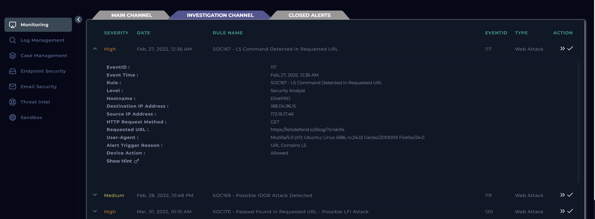
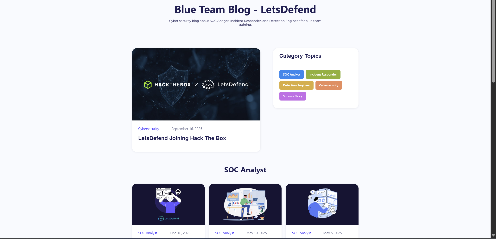
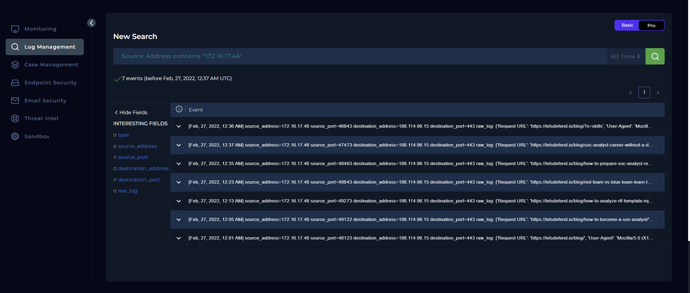
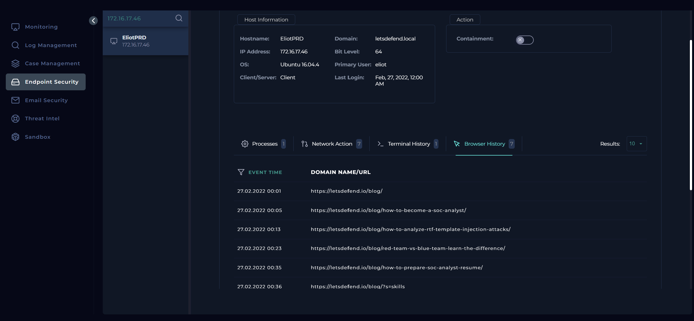
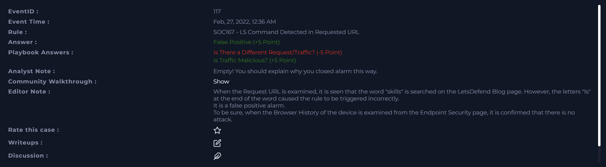
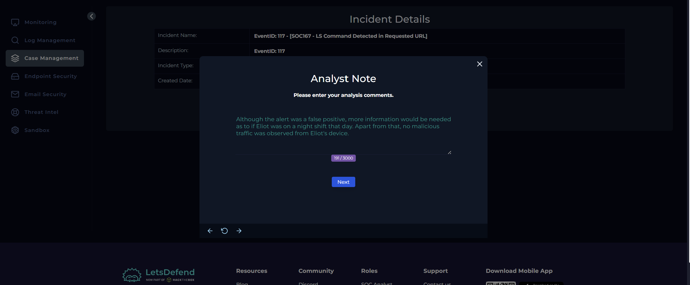

# SOC167 Analysis: LS Command Detected in Requested URL

## Alert Overview

| Field | Value |
|-------|-------|
| **Alert Name** | SOC167 - LS Command Detected in Requested URL |
| **Event ID** | 117 |
| **Event Time** | February 27, 2022, 12:36 AM |
| **Severity/Level** | Security Analyst |
| **Hostname** | EliotPRD |
| **Source IP** | 172.16.17.46 |
| **Destination IP** | 188.114.96.15 |
| **Protocol** | HTTP |
| **Method** | GET |
| **Requested URL** | `https://letsdefend.io/blog/?s=skills` |
| **Alert Trigger** | URL Contains `ls` |
| **Device Action** | Allowed |



---

# Investigation Summary

The first thing I did was review the alert details before creating a case. Almost immediately, I had a suspicion that this might be a **False Positive** rather than an actual command injection attempt.

The detection rule was **"LS Command Detected in Requested URL."** While `ls` is indeed a common Linux command frequently seen in command injection attacks, it's also just a normal combination of letters that can legitimately appear inside words.

The requested URL immediately caught my attention:

```text
https://letsdefend.io/blog/?s=skills
```

My first thought was that the alert may simply have triggered because the word **"skills"** contains the letters **"ls"**.

To verify that assumption, I manually visited the URL and confirmed that it was simply the LetsDefend blog search page displaying results for the keyword **skills**.



At that point, I already suspected that the detection rule was overly broad and could benefit from tuning, but I still wanted to complete the investigation before reaching that conclusion.

The communication involved:

- **Source:** EliotPRD (172.16.17.46)
- **Destination:** 188.114.96.15 (LetsDefend)

Since an internal workstation was connecting to a public website, I identified the traffic direction as:

```text
Company Network → Internet
```

I then created a case and continued with the investigation.

---

# Log Analysis

To understand whether this request was isolated or part of something larger, I searched the log management platform for all events associated with the source IP address **172.16.17.46**.

The search returned **seven HTTP events**.



As I reviewed them chronologically, it became obvious that the user was simply browsing the LetsDefend blog over approximately thirty-six minutes.

The pages visited included:

- `/blog/how-to-become-a-soc-analyst/`
- `/blog/how-to-analyze-rtf-template-injection-attacks/`
- `/blog/red-team-vs-blue-team-learn-the-difference/`
- `/blog/how-to-prepare-soc-analyst-resume/`
- `/blog/soc-analyst-career-without-a-degree/`
- `/blog/?s=skills`

The final search request containing **"skills"** was the event that triggered the alert.

Looking at the browsing history as a whole, there wasn't any indication of malicious activity. The user appeared to be reading cybersecurity-related articles, particularly content focused on SOC analyst careers and technical learning.

One thing that did catch my attention, however, was the timestamp.

The browsing occurred between **12:00 AM and 12:36 AM**.

That made me pause for a moment.

It wasn't suspicious enough to classify as malicious, but it did make me wonder whether the user was working a night shift or simply accessing learning resources outside normal working hours.

Rather than making assumptions, I decided to investigate further.

---

# Endpoint Investigation

I switched to the **Endpoint Security** dashboard and reviewed the activity on **EliotPRD**.

Specifically, I examined:

- Browser history
- Running processes
- Terminal history

The browser history matched exactly what I had already observed in the HTTP logs.



The user was simply navigating through LetsDefend's blog and reading educational articles.

I found no evidence of:

- Command execution
- Suspicious PowerShell activity
- Bash commands
- Malicious processes
- Browser exploitation

The endpoint activity supported my initial assessment that this was normal browsing behavior.

---

# Verification of User Activity

Although I was already leaning toward a False Positive, I still wanted to understand why the browsing occurred around midnight.

One possible explanation was that the user had been assigned a night shift.

To investigate that possibility, I checked the **Email Security** platform for communications relating to Eliot that might indicate an overnight assignment or after-hours work.

No emails suggested that Eliot had been scheduled for a night shift.

That said, the absence of such an email wasn't enough to classify the activity as suspicious.

Users may legitimately work outside standard business hours for many reasons, and there was no technical evidence indicating malicious intent.

I therefore chose to base my conclusion on the observed activity rather than the time it occurred.

---

# Examination of HTTP Traffic

The HTTP traffic itself was completely benign.

The requests consisted solely of visits to publicly accessible pages on **LetsDefend's website**.

No indicators of common web attacks were observed.

Specifically, I found no evidence of:

- SQL Injection
- Cross-Site Scripting (XSS)
- Command Injection
- Remote File Inclusion (RFI)
- Local File Inclusion (LFI)
- Directory Traversal

The only reason the alert fired was because the substring **"ls"** appeared inside the legitimate search term **"skills."**

---

# Determining Whether the Traffic Was Malicious

After reviewing the logs, endpoint activity, and browsing history, I concluded that the traffic was **not malicious**.

The alert was triggered solely because of a keyword match rather than any genuine attack pattern.

This is a classic example of a **signature-based False Positive**, where a detection rule matches legitimate text without considering the surrounding context.

---

# Traffic Direction

```text
Company Network -> Internet
```

The internal workstation accessed a public website.

---

# Was There Different or Related Suspicious Traffic?

One of the playbook questions asks whether there was any additional suspicious traffic associated with the device.

I initially answered **No**, but the platform marked that response as incorrect.



Looking back, I think the intention of the question was different.

Although every request was directed to the same destination (LetsDefend), there **was** additional related traffic because the user accessed several different pages before triggering the alert.

None of that traffic was malicious, but it was still part of the same browsing session.

So, while there wasn't different *malicious* traffic, there certainly was **related traffic** that helped provide context for the investigation.

---

# Tier 2 Escalation Assessment

Tier 2 escalation was **not required**.

There was:

- No evidence of exploitation
- No suspicious endpoint activity
- No command execution
- No malicious payloads
- No signs of compromise

The investigation determined that the alert resulted from an overly broad detection rule rather than an actual security incident.

---

# Findings

| Investigation Item | Result |
|--------------------|--------|
| Was the alert legitimate? | No |
| Classification | False Positive |
| Traffic Direction | Company Network -> Internet |
| Malicious Activity Observed | No |
| Endpoint Compromise | No |
| Additional Related Traffic | Yes (Normal browsing activity) |
| Tier 2 Escalation Required | No |

---

# Conclusion

The investigation determined that the alert was a **False Positive**.

The detection rule generated an alert because it identified the substring **"ls"** within the search term **"skills"** in the URL:

```text
https://letsdefend.io/blog/?s=skills
```

Reviewing the surrounding HTTP activity showed that the user was simply browsing educational content on the LetsDefend website, including articles related to SOC analyst careers, resume preparation, and cybersecurity topics. Endpoint investigation further confirmed normal browser activity, with no evidence of command execution, suspicious processes, or malicious behavior.

Although the browsing occurred shortly after midnight, no technical indicators suggested malicious intent. The activity appeared to be legitimate user browsing, and the alert was triggered solely because the detection rule matched the letters **"ls"** without considering the surrounding context.

Based on the investigation, the incident was classified as a **False Positive**. No containment or escalation was required. This alert would also be a good candidate for **rule tuning** to reduce similar false positives in the future by detecting standalone command patterns rather than simple substring matches.



---
