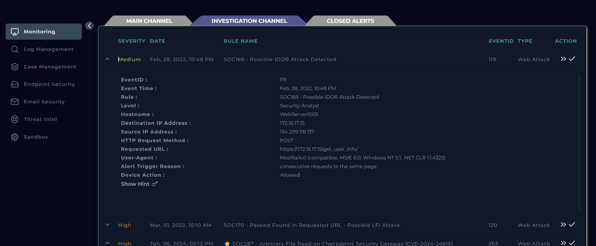
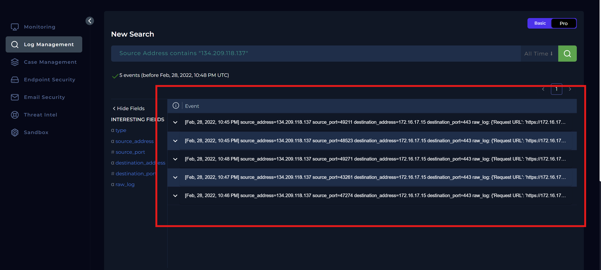
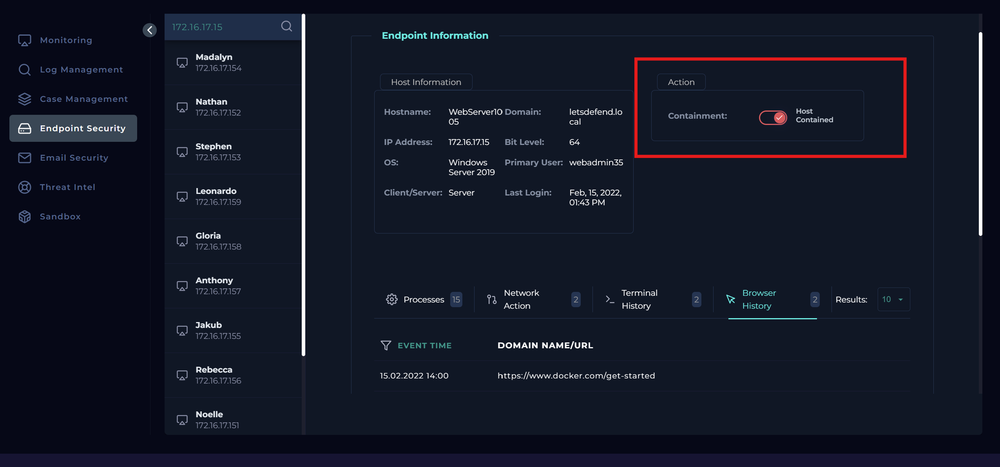
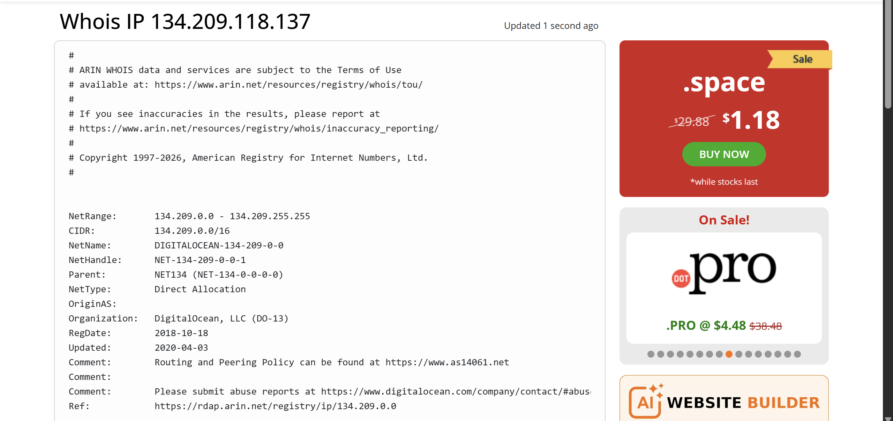
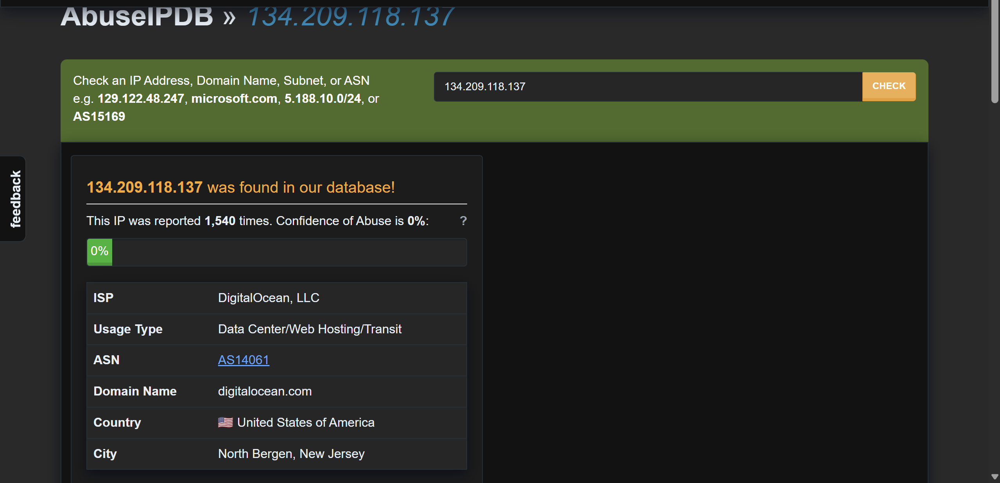
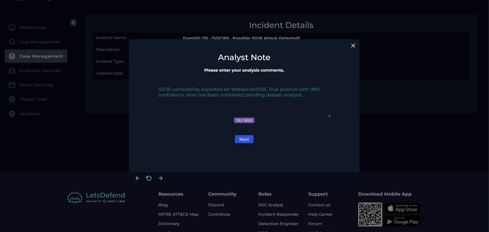
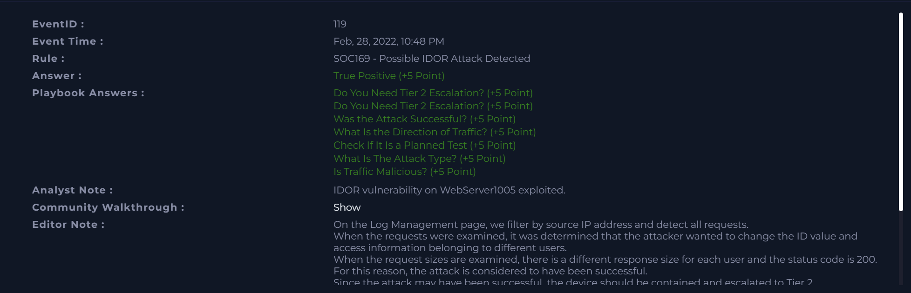

# SOC169 Analysis: Possible IDOR Attack Detected

## Alert Overview

| Field | Value |
|-------|-------|
| **Alert Name** | SOC169 - Possible IDOR Attack Detected |
| **Event ID** | 119 |
| **Event Time** | February 28, 2022, 10:48 PM |
| **Severity/Level** | Security Analyst |
| **Hostname** | WebServer1005 |
| **Source IP** | 134.209.118.137 |
| **Destination IP** | 172.16.17.15 |
| **Protocol** | HTTP |
| **Method** | POST |
| **Requested URL** | `https://172.16.17.15/get_user_info/` |
| **Alert Trigger** | Consecutive requests to the same page |
| **Device Action** | Allowed |



---

# Investigation Summary

I began by reviewing the alert details before opening a case.

The alert indicated a **Possible IDOR (Insecure Direct Object Reference) Attack** targeting **WebServer1005 (172.16.17.15)** from the external IP address **134.209.118.137**.

The detection rule was triggered because multiple consecutive **POST** requests were sent to the same endpoint:

```text
https://172.16.17.15/get_user_info/
```

At first glance, repeated requests to the same URL are not necessarily malicious. However, endpoints responsible for retrieving user information are common targets 
for attackers attempting to enumerate object identifiers in search of authorization flaws.

To determine whether this represented normal application behavior or an actual attack, I proceeded to review the HTTP logs.

---

# Log Analysis

I opened the **Log Management** platform and filtered events using the source IP address **134.209.118.137**.

The search returned **five HTTP POST requests** directed at **WebServer1005** between **10:45 PM** and **10:48 PM** on **February 28, 2022**.

Expanding each event immediately revealed a clear enumeration pattern.

| Time | POST Parameter | Response Size |
|------|----------------|--------------:|
| 10:45 PM | `user_id=1` | 188 Bytes |
| 10:45 PM | `user_id=2` | 253 Bytes |
| 10:46 PM | `user_id=3` | 351 Bytes |
| 10:47 PM | `user_id=4` | 158 Bytes |
| 10:48 PM | `user_id=5` | 267 Bytes |



Every request targeted the same endpoint while only changing the value of the **user_id** parameter.

What stood out was that every request received an **HTTP 200 OK** response from the server. In addition, the response sizes differed for each request, 
indicating that the application returned different content for each user ID rather than rejecting unauthorized access.

This behavior is consistent with an attacker manually or automatically enumerating user identifiers to determine whether records belonging to other users can be accessed.

Unlike a false positive where requests would fail with authorization errors, these requests appeared to retrieve valid application data successfully.

At this point, I suspected that the application was vulnerable to an **Insecure Direct Object Reference (IDOR)** vulnerability.

---

# Endpoint Investigation

Although the HTTP traffic strongly suggested successful IDOR exploitation, I continued the investigation by examining the endpoint itself.



Using the **Endpoint Security** dashboard, I reviewed activity on **WebServer1005**, including:

- Running processes
- Terminal history
- Network activity

I found no evidence of:

- Suspicious command execution
- Malware execution
- Privilege escalation
- Unauthorized processes
- Persistence mechanisms

The absence of suspicious endpoint activity suggested that the attacker had not gained shell access or executed commands on the server.

Instead, the attack appeared to be limited to exploiting an application-layer authorization weakness to access data.

---

# Threat Intelligence Investigation

To gather additional context on the attacker, I investigated the source IP address **134.209.118.137** using external threat intelligence sources.

A **WHOIS** lookup confirmed that the address belongs to **DigitalOcean**, indicating that the requests originated from a publicly hosted cloud server.



I then searched the IP address using **AbuseIPDB**.

The address had been reported **1,540 times**, with community reports primarily associating it with:

- SSH brute-force attacks
- Port scanning
- Malicious network activity



While threat intelligence alone does not prove malicious activity, it provided additional context supporting the observations made during the investigation.

---

# Examination of HTTP Traffic

The HTTP traffic demonstrated characteristics commonly associated with IDOR exploitation.

Indicators observed included:

- Sequential enumeration of user identifiers
- Multiple requests to the same endpoint
- Successful HTTP 200 responses
- Different response sizes for each request

The varying response sizes suggested that the server returned different user records instead of denying access.

Based on the evidence collected, the attacker was able to retrieve information belonging to multiple user accounts simply by modifying the **user_id** parameter.

This indicates that the application failed to properly validate user authorization before returning sensitive information.

---

# Determining Whether the Traffic Was Malicious

After reviewing the logs and endpoint activity, I concluded that the traffic was **malicious**.

The repeated enumeration of sequential user identifiers, combined with successful responses from the server, strongly indicated exploitation of an authorization vulnerability 
rather than normal user activity.

Unlike legitimate browsing behavior, the requests demonstrated a deliberate attempt to access resources belonging to multiple users.

The evidence supports a successful **Insecure Direct Object Reference (IDOR)** attack.

---

# Traffic Direction

```text
Internet -> Company Network
```

The attacker originated from an external public IP address and targeted an internally hosted web application.

---

# Was the Attack Successful?

Every request received an **HTTP 200 OK** response, and the differing response sizes indicated that the application returned valid information for each requested user ID.

This suggests that unauthorized access to user records was successfully achieved through manipulation of the **user_id** parameter.

Although there was no evidence of operating system compromise or command execution, the application itself was vulnerable and sensitive information was exposed.


---

# Containment

Since the investigation confirmed successful exploitation of an application vulnerability, I immediately contained **WebServer1005** to prevent any 
further communication with external hosts while the incident could be investigated further.

Containment was appropriate because unauthorized access to sensitive application data had already occurred.



---

# Tier 2 Escalation Assessment

Tier 2 escalation was **required**.

The investigation confirmed:

- Successful exploitation of an application vulnerability
- Unauthorized access to multiple user records
- Exposure of sensitive data
- A vulnerable production web application requiring remediation

The incident should be escalated for:

- Application owner notification
- Vulnerability remediation
- Impact assessment
- Forensic review of accessed records
- Development of a permanent fix for the authorization flaw

---

# Findings

| Investigation Item | Result |
|--------------------|--------|
| Was the alert legitimate? | Yes |
| Classification | True Positive |
| Attack Type | Insecure Direct Object Reference (IDOR) |
| Traffic Direction | Internet -> Company Network |
| Was the attack successful? | Yes |
| Unauthorized Data Access | Confirmed |
| Endpoint Compromise | No evidence observed |
| Additional Related Traffic | Yes |
| Host Contained | Yes |
| Tier 2 Escalation Required | Yes |

---

# Conclusion

The investigation confirmed that the alert was a **True Positive**. Reviewing the HTTP logs revealed that the attacker repeatedly submitted POST 
requests to the **/get_user_info/** endpoint while incrementing the **user_id** parameter. Every request received an **HTTP 200 OK** response, 
and the varying response sizes indicated that different user records were successfully returned.

This behavior is consistent with an **Insecure Direct Object Reference (IDOR)** vulnerability, where the application fails to verify whether a user 
is authorized to access the requested resource.

Although the endpoint investigation found no evidence of malware execution or operating system compromise, the application itself had been 
successfully exploited to access unauthorized information. Threat intelligence further supported the malicious nature of the activity, with 
the source IP address having an established history of malicious behavior.

Given the confirmed unauthorized access to application data, the affected server was contained to prevent further external communication, and the incident 
was escalated to Tier 2 for remediation of the authorization vulnerability and assessment of the overall impact.

