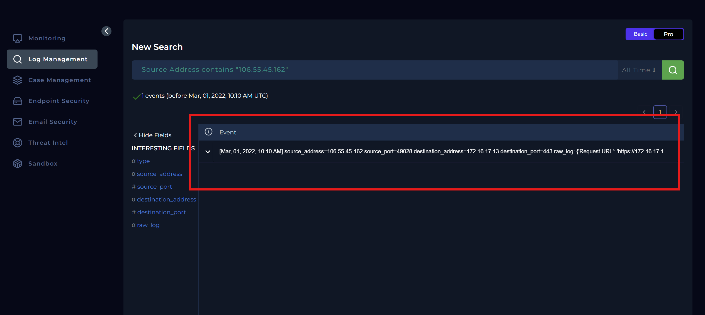
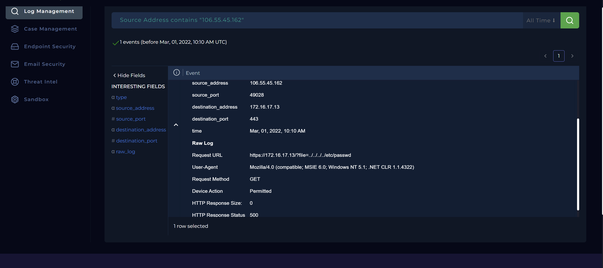
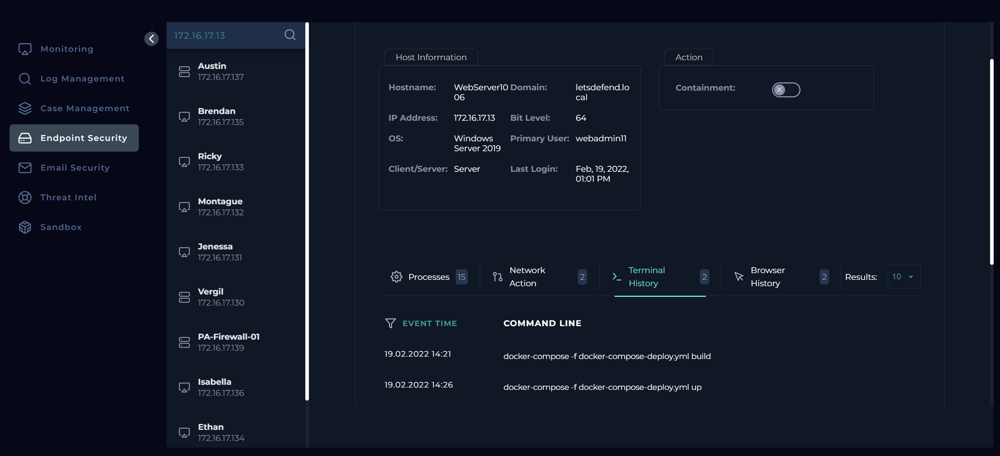
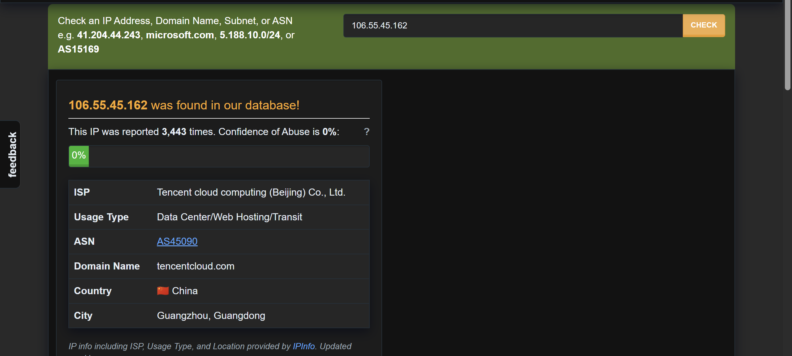
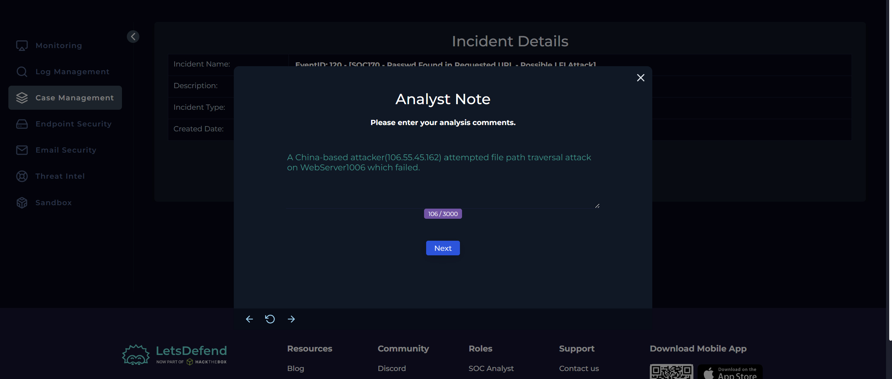
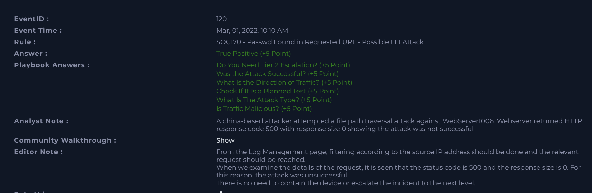

# SOC170 Analysis: Passwd Found in Requested URL – Possible LFI Attack

## Alert Overview

| Field | Value |
|-------|-------|
| **Alert Name** | SOC170 - Passwd Found in Requested URL - Possible LFI Attack |
| **Event ID** | 120 |
| **Event Time** | March 1, 2022, 10:10 AM |
| **Severity/Level** | Security Analyst |
| **Hostname** | WebServer1006 |
| **Source IP** | 106.55.45.162 |
| **Destination IP** | 172.16.17.13 |
| **Protocol** | HTTP |
| **Method** | GET |
| **Requested URL** | `https://172.16.17.13/?file=../../../../etc/passwd` |
| **Alert Trigger** | URL Contains `passwd` |
| **Device Action** | Allowed |


---

# Investigation Summary

I began by assigning the alert to myself and creating a case before reviewing the alert details for context. The alert indicated a 
**Possible Local File Inclusion (LFI)** attack against **WebServer1006 (172.16.17.13)** originating from the external IP address **106.55.45.162**.

The suspicious request was:

```text
https://172.16.17.13/?file=../../../../etc/passwd
```

Immediately, the request stood out because it contained multiple directory traversal sequences (`../../../../`) followed by **`/etc/passwd`**, one of the
most commonly targeted files during Local File Inclusion attacks on Linux systems. Attackers frequently request this file to determine whether a web 
application is vulnerable to path traversal or file inclusion vulnerabilities, as successfully reading it confirms unauthorized access to files outside 
the application's intended directory. Although the payload clearly indicated malicious intent, the alert alone could not determine whether 
the attack had been successful. To answer that, I proceeded to examine the HTTP logs.

---

# Log Analysis

I switched to the **Log Management** platform and filtered events using the source IP address **106.55.45.162**. The search returned only 
**one HTTP request**, indicating that the attacker made a single attempt against the web server.

The event details were as follows:

| Field | Value |
|-------|-------|
| **Event Type** | Firewall |
| **Source Address** | 106.55.45.162 |
| **Source Port** | 49028 |
| **Destination Address** | 172.16.17.13 |
| **Destination Port** | 443 |
| **Time** | March 1, 2022, 10:10 AM |
| **Request Method** | GET |
| **Device Action** | Permitted |
| **HTTP Response Status** | 500 Internal Server Error |
| **HTTP Response Size** | 0 Bytes |

The raw HTTP request contained the following URL:

```text
https://172.16.17.13/?file=../../../../etc/passwd
```




Although the firewall allowed the request to reach the web server, the server returned an **HTTP 500 Internal Server Error** with a response 
size of **0 bytes**. This suggested that the request was not processed successfully. If the attack had succeeded, I would typically expect 
to see an **HTTP 200 OK** response accompanied by returned file contents or a non-zero response size.

Instead, the server encountered an internal error while processing the request, indicating that the attempted directory traversal failed.

Based on the available evidence, there was no indication that the contents of **`/etc/passwd`** were disclosed.

---

# Endpoint Investigation

Although the HTTP logs suggested the attack had failed, I continued the investigation by examining **WebServer1006** through the **Endpoint Security** dashboard.

I reviewed:

- Running processes
- Terminal history
- Network activity
- Browser history

The investigation revealed no evidence of:

- Suspicious command execution
- Malicious processes
- File modification
- Persistence mechanisms
- Additional attacker activity

The endpoint appeared to be operating normally, and there were no indicators that the attacker had successfully compromised the server.

Since there was no evidence of successful exploitation or post-exploitation activity, containment was not required.



---

# Threat Intelligence Investigation

To gather additional context on the attacker, I investigated the source IP address **106.55.45.162** using external threat intelligence.

A search on **AbuseIPDB** showed that the address had been reported **3,433 times** for malicious activity.

The IP address belongs to **Tencent Cloud Computing (Beijing) Co., Ltd.**, a public cloud hosting provider located in China.

Community reports associated the address primarily with:

- SSH brute-force attacks
- Network scanning
- Malicious probing activity

While reputation alone does not prove malicious intent, it supported the findings from the HTTP logs that the request originated from an 
infrastructure commonly abused by attackers.



---

# Examination of HTTP Traffic

The HTTP request contained a well-known Local File Inclusion payload.

Indicators observed included:

- Directory traversal sequences (`../../../../`)
- Attempt to access the Linux **`/etc/passwd`** file
- Request targeting a file parameter
- External source targeting an internal web application

However, the server's response indicated that the attack was unsuccessful.

Evidence supporting this conclusion included:

- HTTP **500 Internal Server Error**
- Response size of **0 bytes**
- No evidence that file contents were returned

Although the request itself was malicious, there was no indication that the attacker succeeded in reading sensitive files from the server.

---

# Determining Whether the Traffic Was Malicious

After reviewing the HTTP logs and endpoint activity, I concluded that the traffic was **malicious**.

The attacker intentionally attempted to exploit a Local File Inclusion vulnerability by requesting the **`/etc/passwd`** file through a 
directory traversal payload.

Although the attack failed, the request clearly demonstrated malicious intent and should not be considered legitimate application traffic.

---

# Traffic Direction

```text
Internet -> Company Network
```

The request originated from an external public IP address targeting an internally hosted web server.

---

# Was the Attack Successful?

Although the malicious request reached the server, the application returned an **HTTP 500 Internal Server Error** with no response body.

There was no evidence that the attacker successfully accessed the requested file or obtained unauthorized information from the server.

The endpoint investigation also revealed no signs of compromise or post-exploitation activity.

---

# Was There Different or Related Suspicious Traffic?

The investigation identified only a single malicious HTTP request originating from the source IP address.

No additional attacks or related suspicious traffic targeting the environment were observed during the investigation.

---

# Tier 2 Escalation Assessment

Tier 2 escalation was **not required**.

Although the attack was a legitimate exploitation attempt, there was no evidence that it succeeded.

The investigation found:

- No file disclosure
- No endpoint compromise
- No malicious processes
- No persistence
- No evidence of lateral movement

The incident was therefore limited to an unsuccessful exploitation attempt.



---

# Findings

| Investigation Item | Result |
|--------------------|--------|
| Was the alert legitimate? | Yes |
| Classification | True Positive |
| Attack Type | Local File Inclusion (LFI) |
| Traffic Direction | Internet -> Company Network |
| Was the attack successful? | No |
| Unauthorized File Access | Not Observed |
| Endpoint Compromise | No evidence observed |
| Additional Related Traffic | No |
| Host Contained | No |
| Tier 2 Escalation Required | No |

---

# Conclusion

The investigation confirmed that the alert was a **True Positive**.

An external attacker attempted to exploit a **Local File Inclusion (LFI)** vulnerability by sending a directory traversal payload targeting the 
Linux **`/etc/passwd`** file. Although the firewall permitted the request, the web application returned an **HTTP 500 Internal Server Error** with no 
response body, indicating that the attack was unsuccessful. Endpoint investigation further confirmed that the server showed no evidence of compromise, 
malicious processes, or post-exploitation activity.

Threat intelligence identified the source IP address as a publicly hosted cloud server with an established history of malicious activity, further supporting 
the malicious nature of the request. Based on the available evidence, this incident was classified as a **True Positive** involving an unsuccessful 
LFI exploitation attempt. Since no compromise occurred, containment and Tier 2 escalation were not required.

