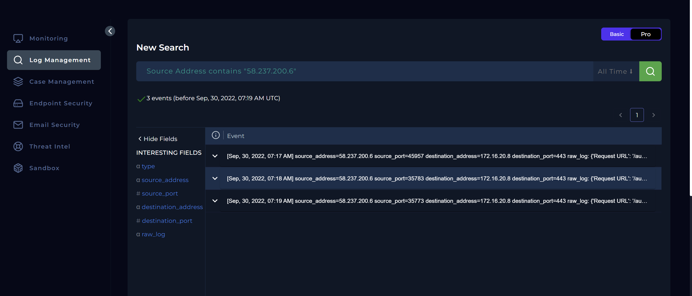
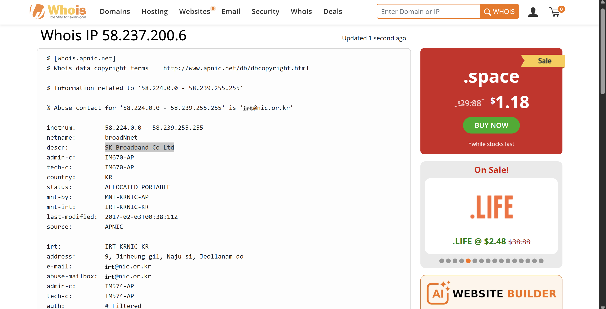
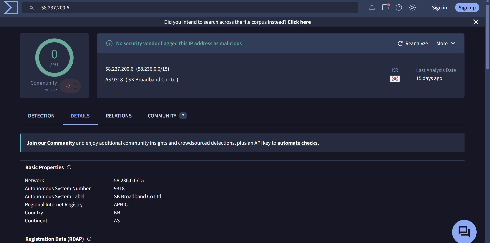
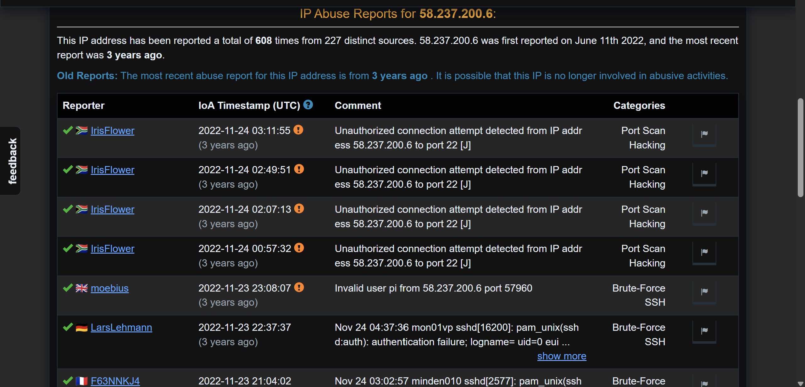
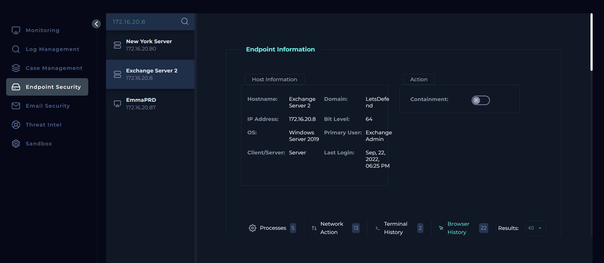
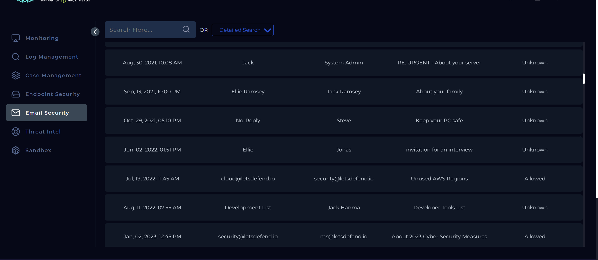
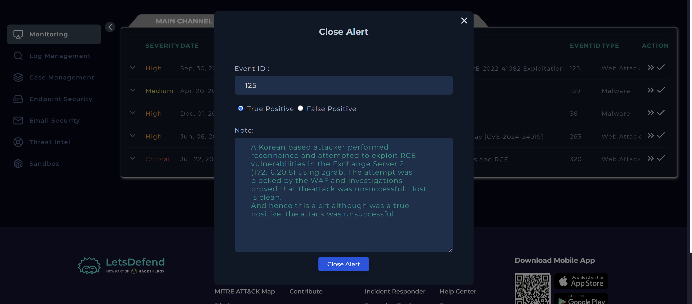

# SOC175 Analysis: PowerShell Found in Requested URL

## Alert Overview

| Field | Value |
|-------|-------|
| **Alert Name** | SOC175 - PowerShell Found in Requested URL - Possible CVE-2022-41082 Exploitation |
| **Event ID** | 125 |
| **Event Time** | September 30, 2022, 07:19 AM |
| **Severity/Level** | Security Analyst |
| **Hostname** | Exchange Server 2 |
| **Destination IP** | 172.16.20.8 |
| **Source IP** | 58.237.200.6 |
| **Log Source** | IIS |
| **HTTP Method** | GET |
| **Requested URL** | `/autodiscover/autodiscover.json?@evil.com/owa/&Email=autodiscover/autodiscover.json%3f@evil.com&Protocol=XYZ&FooProtocol=Powershell` |
| **User-Agent** | Mozilla/5.0 zgrab/0.x |
| **Device Action** | Blocked |
| **Alert Trigger** | Request URL Contains `PowerShell` |

---

# Investigation Summary

I assigned the alert to myself and created a case before reviewing the alert details.

From the rule name alone, I could already tell this was looking for an attempt to exploit **CVE-2022-41082**, one of the Microsoft Exchange ProxyNotShell vulnerabilities. The request targeted the **Autodiscover** endpoint and included the string **PowerShell**, which is commonly associated with attempts to access the Exchange PowerShell backend during exploitation.

The request had already been **blocked**, but I still needed to determine whether this was simply a probe or whether the attacker had managed to interact with the Exchange server in any meaningful way.

---

# Log Analysis

I switched over to the Log Management platform and filtered on the source IP address **58.237.200.6**.

The search returned **three IIS events** between **07:17 AM** and **07:19 AM**, all targeting the same Exchange server.

The requests showed what looked like a progression of reconnaissance and exploitation attempts:

- **07:17 AM** — `/autodiscover/autodiscover.json`
- **07:18 AM** — `/autodiscover/autodiscover.json?@evil.com/ews/exchange.asmx?...`
- **07:19 AM** — `/autodiscover/autodiscover.json?@evil.com/owa/...&FooProtocol=Powershell`

The final request matched the known exploitation pattern for **ProxyNotShell**, attempting to reach the PowerShell endpoint through the Autodiscover functionality.

Fortunately, every request was blocked by the Web Application Firewall (WAF), preventing the attacker from progressing any further.

---

# Threat Intelligence

Next, I gathered intelligence on the attacking IP address.

A WHOIS lookup identified **58.237.200.6** as a public IP belonging to **SK Broadband Co. Ltd.** in South Korea.

VirusTotal did not flag the IP as malicious, although a few community comments mentioned previous SSH brute-force activity originating from the same address.

AbuseIPDB provided much stronger context. The IP had been reported **more than 600 times**, primarily for:

- SSH brute-force attempts
- Port scanning
- General malicious reconnaissance activity

This supported the conclusion that the source had a history of hostile behavior.

---

# Endpoint Investigation

Since the requests were blocked, I wanted to verify that nothing had reached the Exchange server itself.

I reviewed the available endpoint telemetry, including:

- Terminal history
- Running processes
- Network activity
- Browser history

None of the telemetry showed suspicious activity around the alert timeframe. There were no unexpected PowerShell executions, no suspicious processes, and no outbound connections suggesting a successful compromise.

Based on the available evidence, the attack never progressed beyond the perimeter defenses.

---

# Email Investigation

One of the playbook steps was to determine whether this activity could have been part of an authorized penetration test.

I checked the organization's email platform for any communications regarding scheduled security testing or maintenance involving the Exchange server.

I found no evidence of a planned penetration test, confirming that this was unsolicited external activity.

---

# Attack Assessment

This investigation showed that the attacker performed reconnaissance before attempting to exploit **CVE-2022-41082 (ProxyNotShell)** against the Exchange server.

The requests closely matched publicly known exploitation patterns, making this a **genuine attack attempt** rather than a false positive.

However, the Web Application Firewall successfully blocked every request before the exploit could reach the Exchange server. Endpoint telemetry also showed no evidence of compromise or post-exploitation activity.

---

# Findings

| Investigation Item | Result |
|--------------------|--------|
| Alert Classification | True Positive |
| Attack Type | Remote Code Execution (ProxyNotShell - CVE-2022-41082) |
| Traffic Direction | Internet → Company Network |
| WAF Protection | Successfully Blocked |
| Endpoint Compromise | No |
| Planned Test | No |
| Tier 2 Escalation Required | No |

---

# Conclusion

The investigation confirmed a **True Positive** alert involving an attempted exploitation of **CVE-2022-41082 (ProxyNotShell)** against **Exchange Server 2**.

The attacker conducted reconnaissance before sending crafted requests targeting the Exchange Autodiscover endpoint and attempting to access the PowerShell backend. Although the requests matched known exploitation techniques, every request was successfully blocked by the Web Application Firewall.

Further investigation of endpoint telemetry showed no signs of PowerShell execution, suspicious processes, or malicious network activity, confirming that the attack was unsuccessful and the Exchange server remained uncompromised.

---

# Playbook Execution

- Understand Why the Alert Was Triggered
- Collect Data (WHOIS, VirusTotal, AbuseIPDB)
- Examine HTTP Traffic
- Is Traffic Malicious? **Yes**
- Attack Type: **Remote Code Execution (CVE-2022-41082 / ProxyNotShell)**
- Check If It Is a Planned Test: **No**
- Traffic Direction: **Internet -> Company Network**
- Was the Attack Successful? **No**
- Tier 2 Escalation Required: **No**