# SOC282 Analysis: Phishing Alert – Deceptive Mail Detected

> Note that this investigation is in two parts.. after I had investigated the alert and scored everything, the Network and Log
> log analysis section of thhe SIEM ALERT INVESTIGATION proved that I hadn't finished. Well although my mode of thinking was
> in the right direction. I forgot to actually check Felix's endpoint for signs of malware execution and C2 address communication
> Hence that forms part 2 of this investigation

## TABLE OF CONTENTS
- [PART ONE](#part-one)

- [PART TWO](#part-two)

---

# PART ONE

## Alert Overview

| Field | Value |
|-------|-------|
| **Alert Name** | SOC282 - Phishing Alert - Deceptive Mail Detected |
| **Event ID** | 257 |
| **Event Time** | May 13, 2024, 09:22 AM |
| **Severity/Level** | Security Analyst |
| **Event Type** | Exchange |
| **SMTP Address** | 103.80.134.63 |
| **Sender** | `free@coffeeshooop.com` |
| **Recipient** | `Felix@letsdefend.io` |
| **Email Subject** | Free Coffee Voucher |
| **Device Action** | Allowed |

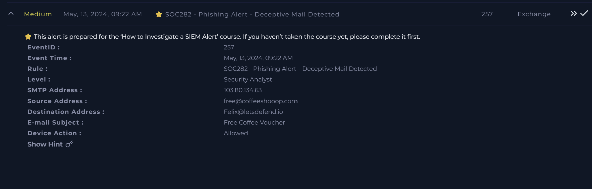

---

# Investigation Summary

I began by assigning the alert to myself and creating an investigation case before reviewing the alert details.

The alert indicated that the organization's email gateway had detected a **potential phishing email** originating from **free@coffeeshooop.com** and 
delivered to **Felix@letsdefend.io**.

The email had the subject:

```text
Free Coffee Voucher
```

Since phishing attacks frequently rely on social engineering rather than technical exploits, my first objective was to determine whether the 
email exhibited characteristics commonly associated with phishing campaigns and whether any user interaction had already occurred.

---

# Email Investigation

I navigated to the **Email Security** dashboard and searched for messages originating from:

```text
free@coffeeshooop.com
```

The search returned a single email addressed to **Felix@letsdefend.io**.

Reviewing the email content immediately revealed several classic phishing indicators.

The attacker attempted to lure the recipient by offering a **free coffee voucher**, a common social engineering technique that exploits 
curiosity and the appeal of free rewards.

Additionally, the message included language similar to:

> **"Hurry, this offer expires soon!"**

This creates a false sense of urgency, encouraging recipients to act quickly before taking time to verify the legitimacy of the message.

Another suspicious finding was the embedded hyperlink advertised as the voucher redemption link. Instead of directing the user to a 
legitimate webpage, the link initiated the download of a ZIP archive.

This significantly increased the likelihood that the email was attempting to deliver malware rather than a legitimate reward.

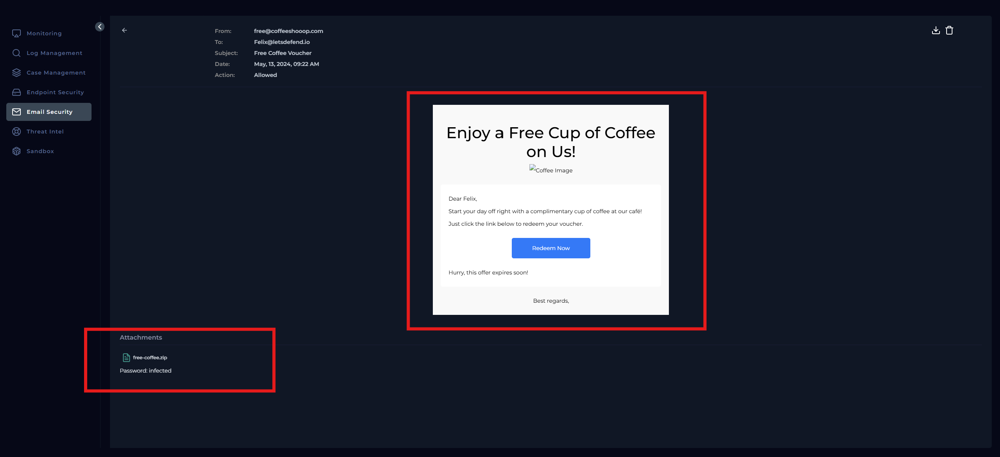

---

# Attachment Analysis

To determine whether the attachment was malicious, I downloaded the ZIP archive through the LetsDefend sandbox environment.

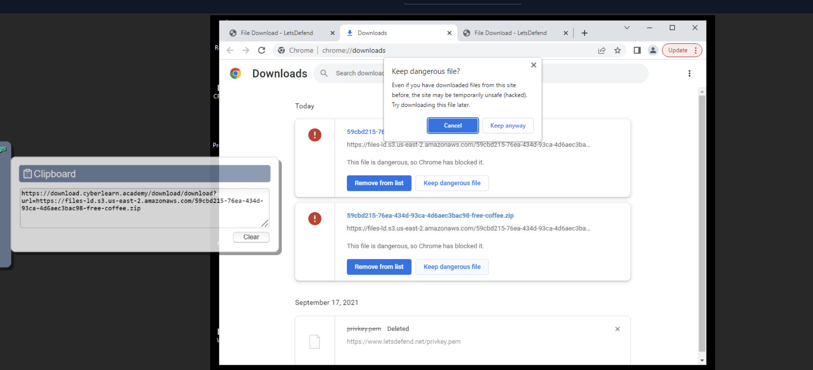

Interestingly, **Google Chrome immediately blocked the download**, warning that the file was potentially dangerous. Since the investigation 
was being conducted within an isolated analysis environment, I chose to keep the file for further analysis.

Before extracting the archive, I generated its SHA-256 hash using PowerShell via the `Get-FileHash` command.

The resulting hash was:

```text
6F33AE4BF134C49FAA14517A275C039CA1818B24FC2304649869E399AB2FB389
```
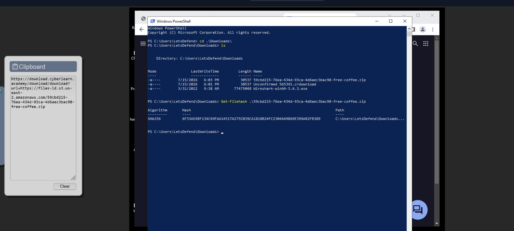

I then submitted the file to **VirusTotal** for reputation analysis.

The results confirmed my suspicions lol.

The file was detected by **16 of 62 security vendors**, with classifications including:

- Trojan
- Worm

Common family names included:

- Znyonm
- ABTrojan
- AsyncRAT

The overall threat label identified the attachment as:

```text
trojan.znyonm/abtrojan
```

Given the number of detections and the malware families identified, there was no need to extract or execute the archive during the investigation.

The attachment was confirmed to be malicious.

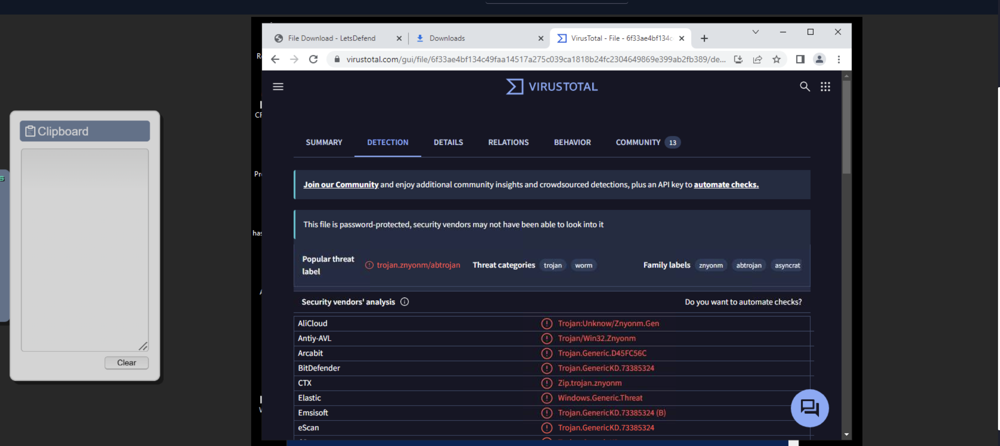

---

# Delivery Verification

The alert indicated that the device action was **Allowed**, meaning the email had successfully passed through the email gateway 
and was delivered to the recipient's mailbox.

Since the attachment had been confirmed as malicious, I immediately deleted the email from **Felix's inbox** to prevent 
accidental execution by the user. This ensured that the phishing email could no longer be accessed by the intended recipient.

---

# Endpoint and Network Investigation

After confirming the attachment was malicious, the next objective was determining whether it had already been executed within the environment.

VirusTotal identified several Command-and-Control (C2) servers associated with the malware.

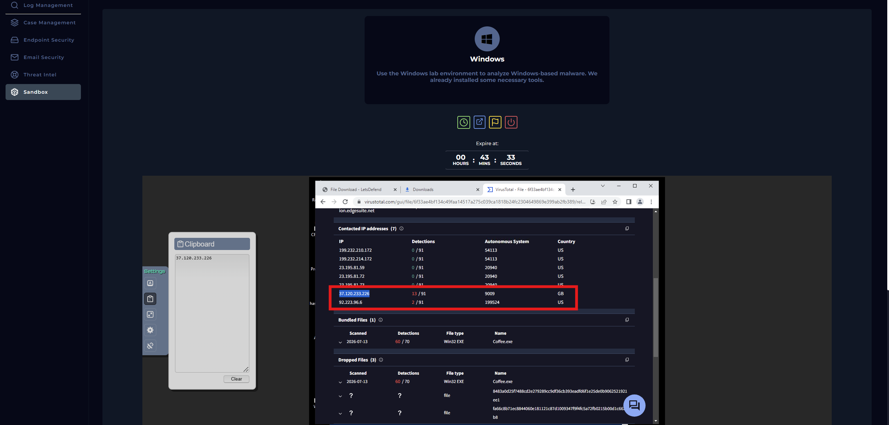

Among them, two IP addresses had strong malicious reputations:

```text
37[.]120[.]233[.]226
```

```text
92[.]223[.]96[.]6
```

I searched the **Log Management** platform for network communications involving both IP addresses which returned **no matching events**.

This indicated that no internal systems had established outbound communication with the malware infrastructure.

The absence of network traffic strongly suggested that the attachment had **not been executed** within the organization.

---

# Threat Intelligence Investigation

To gather additional context, I investigated the SMTP server address: `103[.]80[.]134[.]63` using the **Threat Intelligence** panel within LetsDefend.

The IP address had already been associated with phishing activity, further supporting the assessment that this email formed part of a malicious phishing campaign.

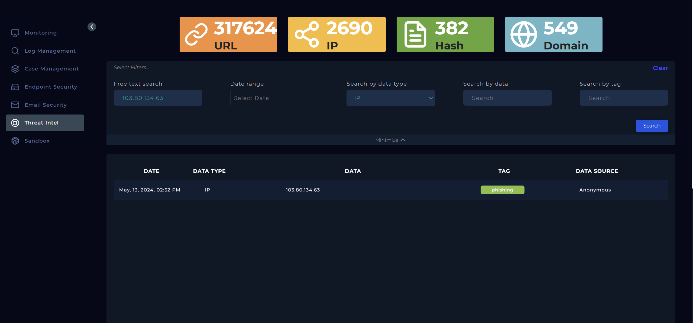

Combined with the VirusTotal results, this confirmed both the sender infrastructure and attachment were malicious.

---

# Determining Whether the Email Was Malicious

Based on the evidence collected throughout the investigation, I concluded that the email was **malicious**.

Indicators supporting this assessment included:

- Suspicious sender address
- Social engineering using a free reward
- Urgency designed to pressure the recipient
- ZIP archive masquerading as a voucher
- Attachment identified as malware by multiple security vendors
- Sender infrastructure associated with phishing campaigns

The investigation also confirmed that although the email reached the recipient's mailbox, the attachment had **not been executed**.

---

# Was the Email Delivered?

Yes since the email gateway allowed the message to reach the recipient's mailbox.

---

# Was the Attachment Executed?

No..

Reviewing network activity for known malware Command-and-Control infrastructure returned no matching events.

There was no evidence that the malicious attachment had been opened or executed on any system within the environment.

---

# Containment

After confirming the email was malicious, I deleted it from the recipient's mailbox to eliminate the risk of accidental execution.

Since no endpoint compromise or Command-and-Control communication was observed, no additional containment actions were required.

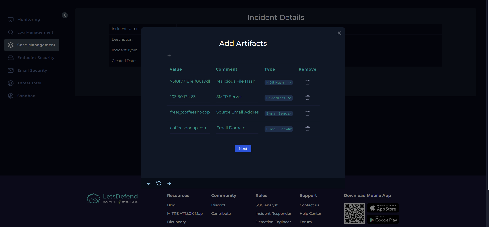

---

# Tier 2 Escalation Assessment

Tier 2 escalation was **not required**.

Although the phishing email successfully reached the recipient, the attachment was removed before execution, and there was no evidence of malware 
infection or post-compromise activity. The incident was successfully contained during the investigation.

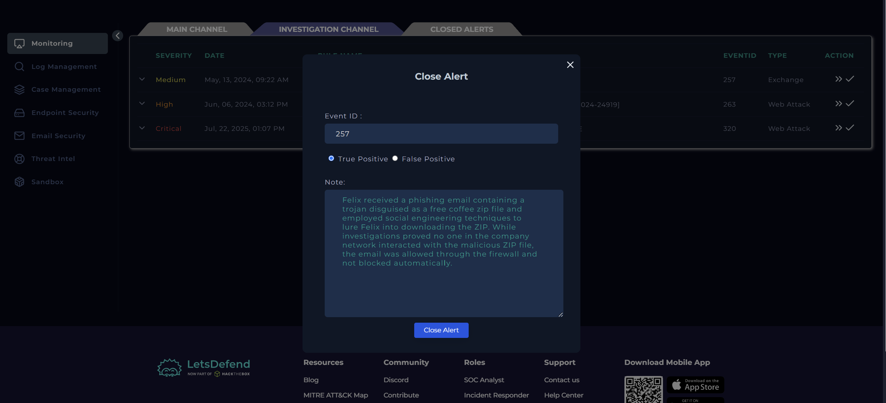

---

# Conclusion

The investigation confirmed that the alert was a **True Positive**.

A phishing email masquerading as a **Free Coffee Voucher** was successfully delivered to **Felix@letsdefend.io**. The message used common 
social engineering techniques, including the promise of a free reward and a sense of urgency, to persuade the recipient to 
download a malicious ZIP archive.

Analysis of the attachment using VirusTotal confirmed that it contained malware, with multiple security vendors identifying it as a **Trojan** 
associated with the **Znyonm**, **ABTrojan**, and **AsyncRAT** families. Threat intelligence further identified the SMTP server as being associated 
with phishing activity.

Although the email reached the recipient's mailbox, there was no evidence that the attachment had been executed.. at least that was what I thought until **PART TWO**. Searches for known 
Command-and-Control infrastructure returned no results, indicating that no internal systems communicated with the malware servers.

The malicious email was deleted from the recipient's inbox to eliminate the risk of accidental execution. Since there was no evidence of compromise or 
malware execution, no additional containment actions or Tier 2 escalation were required.

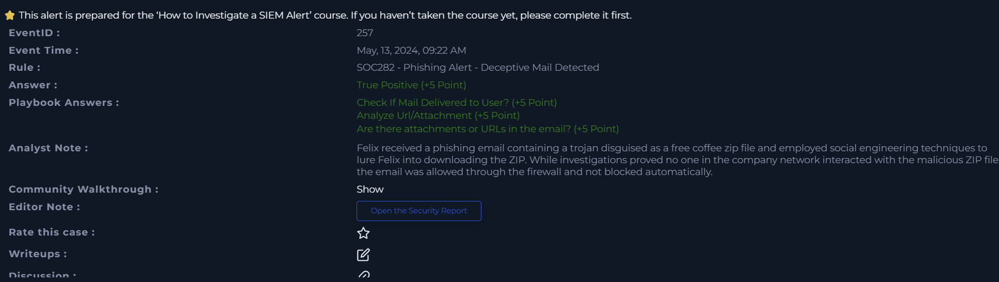


---

# Part Two
## Additional Endpoint Investigation

While working through the LetsDefend module, I came across a few questions that made me realize something important.

Although my original investigation correctly identified the attachment as malicious and I had searched for its associated C2 infrastructure 
in the network logs, I never actually confirmed malware execution from the **endpoint itself**.

Using known C2 addresses from VirusTotal is a perfectly valid investigative technique, but the strongest evidence comes from 
correlating **endpoint telemetry** with **network activity**. I therefore went back to the investigation to validate whether 
Felix had actually executed the malware.

---

# Endpoint Investigation

I started by locating Felix's workstation within the **Endpoint Security** panel.

The host IP address was: `172.16.20.151`

Rather than immediately looking for network connections, I first wanted to determine whether the malicious attachment had actually 
been downloaded and executed.

## Browser History

Reviewing the browser history revealed that Felix had downloaded the attachment on May, 13, 2024, 12:59 PM

The downloaded file originated from: files-ld.s3.us-east-2.amazonaws.com/.../free-coffee.zip


This changed the direction of my investigation fr. Earlier, I had only confirmed that the phishing email reached Felix's mailbox. 
Now I had evidence that he had actually clicked the link and downloaded the malicious ZIP archive approximately 
**three hours after receiving the email**.

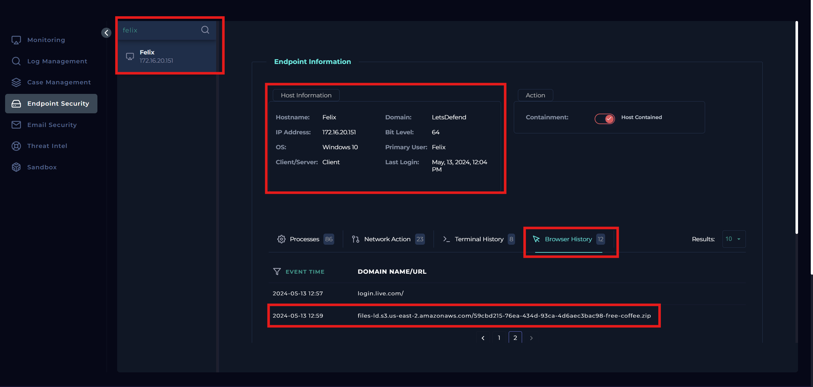

---

## Terminal Activity

Next, I examined the terminal history around the same timeframe.

Immediately after the download, I observed a series of system discovery commands being executed through **cmd.exe**.

These commands collected information such as:

- Operating system details
- Hostname
- Available drives
- Local user accounts
- Running services and processes
- Network configuration
- Routing information

Everything occurred within seconds of one another. This sequence is characteristic of the **discovery phase** following malware execution, 
where malware gathers information about the infected host before communicating with its operator or performing additional actions.

Seeing this activity strongly suggested that the attachment had not only been downloaded but had also been executed.
At this point, I immediately **contained the endpoint** to prevent any further communication with external systems while I continued the investigation.

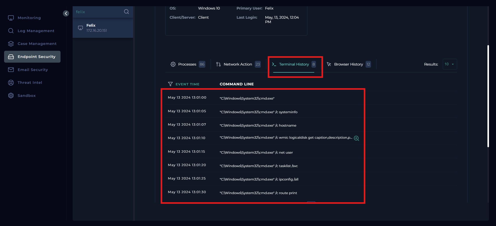

---

# Network Investigation

After containing the host, I wanted to verify the malware's network activity.

Rather than searching for the C2 IP directly as I had done previously, I decided to filter the logs using Felix's workstation.

This returned four network events occurring shortly after the ZIP file was downloaded.


The logs showed that a new process named: `coffee.exe` with proceess id **6697** established an outbound TCP connection with: `37[.]120[.]233[.]226`

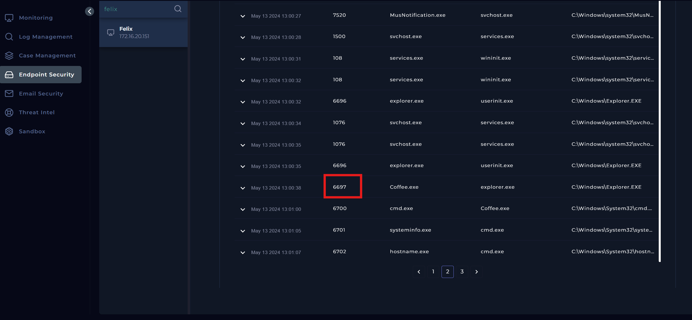

The destination IP matched one of the **Command-and-Control (C2)** addresses I had previously identified through VirusTotal during part one of
my investigation.

This correlation between endpoint telemetry and network logs confirmed that the malware had successfully executed and initiated 
communication with its C2 server. The firewall permitted the outbound connection over **TCP port 3451**.

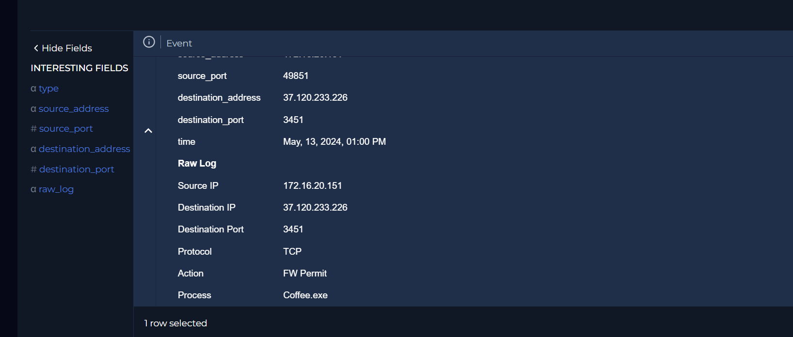

I also observed another event involving the same malware process attempting to communicate over the same port using the loopback address (**127.0.0.1**).

Unlike the previous connection, this traffic was denied by the firewall. Although the blocked connection was interesting, the earlier successful 
outbound communication with the external C2 server was sufficient to confirm that the malware had become active on the host.

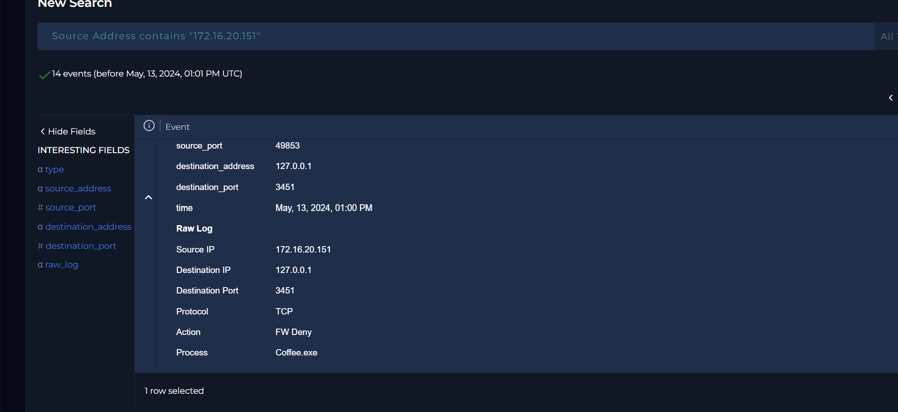

---

# Processes
On the affected host, I checked the processes running. The malicious process had the process ID **6697** with an image hash of
`CD903AD2211CF7D166646D75E57FB866000F4A3B870B5EC759929BE2FD81D334` and found that cmd which it spawned.. had **7** child processes
doing the terminal level stuff.


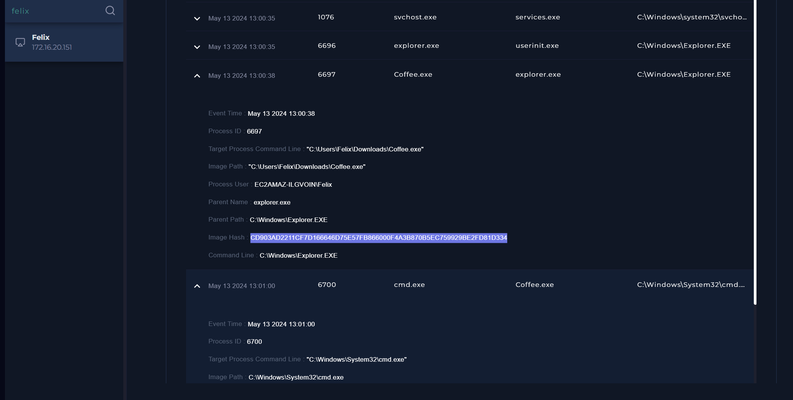

---

# Environment-Wide Verification

Finally, I searched the log management platform for the confirmed C2 address but the search returned no additional hosts communicating with the server.
This indicated that, based on the available telemetry, only Felix's workstation had established communication with the malware infrastructure.

---

# Updated Findings

The additional investigation significantly changed the outcome of the original case.

While my initial investigation confirmed the phishing email and malicious attachment, the endpoint evidence demonstrated that:

- Felix downloaded the malicious ZIP archive.
- The malware was executed.
- The malware performed host discovery activities.
- A process named **coffee.exe** established outbound communication with its Command-and-Control server.
- The affected endpoint was successfully contained.
- No evidence suggested that other endpoints communicated with the same C2 infrastructure.

This reinforced the importance of validating suspicious email activity not only through threat intelligence, but also by correlating endpoint 
telemetry with network logs to confirm actual compromise.


