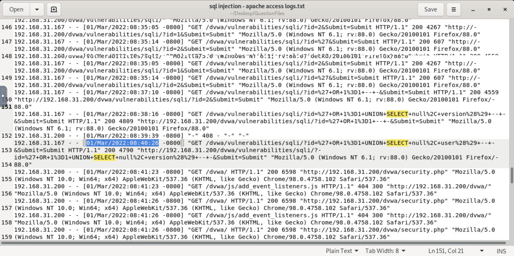

# Analysis of Web Server Access Log - SQL Injection Attack Investigation

I opened the access log with a text editor and began analyzing the HTTP requests to 
identify the SQL injection attack timeline and attacker details. The log showed a complete 
attack chain against a DVWA instance.

---

## Key Findings

### Attack Timeline
**Exploitation Date:** 01/Mar/2022:08:35:14

The exploitation phase began on March 1, 2022 at 08:35:14 when the attacker successfully confirmed the SQL injection vulnerability by injecting a single quote (`'`) into the `id` parameter. This caused a significant reduction in response size from 4267 bytes to 607 bytes, indicating a database error, which confirmed the presence of a SQL injection flaw.

### Attacker Identification
**Attacker IP Address:** 192.168.31.167

The attacker used Firefox 88.0 on Windows 7, which was consistent throughout the attack session.

### Attack Success
**Was the attack successful?** Y

The attacker successfully extracted database information including version and current user details.

### Attack Classification
**Type of SQL Injection:** Classic SQL Injection

The attacker used UNION-based SQL injection to retrieve data directly through the application response.

---

## Attack Pattern Analysis

The attacker followed a methodical approach:

1. **Reconnaissance (08:31:33)** - Identified the vulnerable parameter
2. **Baseline Testing (08:35:01 - 08:35:05)** - Established normal application behavior
3. **Vulnerability Confirmation (08:35:14)** - Confirmed SQL injection with single quote
4. **Boolean Exploitation (08:37:10)** - Used `OR 1=1` to return all records
5. **Data Extraction (08:38:16 - 08:40:26)** - Used UNION SELECT to retrieve sensitive data

---

## Conclusion

The investigation confirms a successful **Classic SQL Injection attack** on 01/Mar/2022
conducted from IP address **192.168.31.167**. The exploitation began at **08:35:14** when 
the attacker confirmed the vulnerability using a single quote payload. The attacker then 
used UNION-based techniques to extract sensitive database information including the database 
version and current user. The vulnerable application returned data directly in HTTP 
responses, confirming the classic nature of the attack. Immediate remediation actions should 
be taken to secure the application against SQL injection vulnerabilities.

---

