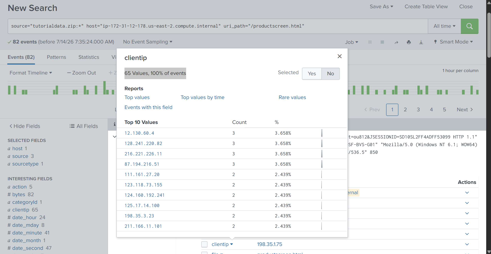
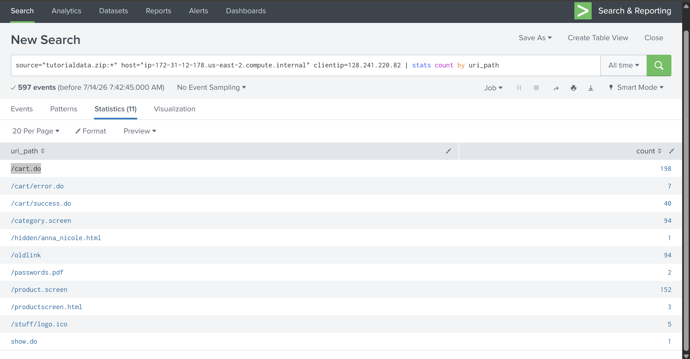

# Splunk

## Overview

Splunk is a data platform used for **security monitoring, log management, observability, and data analysis**. In 
cybersecurity, it is commonly used as a **SIEM (Security Information and Event Management)** platform, allowing analysts 
to collect, search, investigate, visualize, and report on security events from multiple sources.

A typical Splunk deployment consists of:

| Component | Purpose |
|-----------|----------|
| Indexer | Stores and indexes incoming data |
| Search Head | Provides the web interface for searching and reporting |
| Universal Forwarder | Collects logs from endpoints and forwards them to the indexer |
| Deployment Server | Centrally manages Universal Forwarder configurations (optional) |

---

## Deployment Considerations

Before installation, ensure the environment is properly planned.

### Sizing
Server resources should match the expected log volume.

### System Requirements
Verify hardware and OS requirements from Splunk's official documentation.

### Default Ports

| Port | Purpose |
|------|----------|
| 8000 | Splunk Web Interface |
| 8089 | splunkd Management Port |
| 9997 | Receiving data from Universal Forwarders |

The Enterprise trial can later be converted into the perpetual free version after 60 days.

---

# Installing Splunk

Splunk can be installed on both Windows and Linux.

### Windows

The installation is straightforward using the MSI installer.

Main steps include:

- Download the installer
- Accept the license
- Choose installation location
- Configure administrator credentials
- Complete installation
- Access Splunk through

```
https://127.0.0.1:8000
```

After installation, verify the **Splunkd Service** is running in **services.msc**.

---

### Linux

Installation can be performed through either:

- GUI (.deb installer)
- CLI (tgz archive)

Important commands:

Start Splunk

```bash
/opt/splunk/bin/splunk start --accept-license
```

Enable automatic startup

```bash
/opt/splunk/bin/splunk enable boot-start
```

Check status

```bash
/opt/splunk/bin/splunk status
```

---

# Splunk Universal Forwarder

The Universal Forwarder collects logs from endpoints and forwards them to the Splunk Indexer.

During installation you configure:

- Administrator credentials
- Receiving Indexer IP
- Receiving Port (9997)

Example:

```
Indexer IP: 192.168.56.110
Port: 9997
```

A Deployment Server is optional and is only used for centralized configuration management.

---

### Verifying the Forwarder

Check that:

- SplunkForwarder service is running
- Port 9997 is reachable

Example:

```powershell
Test-NetConnection -ComputerName <Splunk-IP> -Port 9997
```

The forwarder should also appear under:

```
Settings
Forwarder Management
```

---

# Adding Data into Splunk

Splunk supports multiple ingestion methods.

### Universal Forwarder

Useful for continuously collecting logs from systems such as:

- Windows Event Logs
- Linux Logs
- Sysmon
- IIS Logs

Typical workflow:

```
Forwarder -> Indexer -> Index -> Search
```

Remember to configure a receiving port (9997) under:

```
Settings
Forwarding and Receiving
```

Otherwise no forwarded events will be indexed.

---

### Uploading Log Files

Splunk also supports one-time uploads.

Process:

- Upload file
- Review field extraction
- Select host
- Choose destination index
- Index the data

Useful for:

- PCAP-derived logs
- Web logs
- Sample datasets
- Incident investigations

---

# Searching Data

Splunk searches are built using indexed fields.

Example:

```spl
source="tutorialdata.zip:*"
host="ip-172-31-12-178.us-east-2.compute.internal"
uri_path="/productscreen.html"
```

This filters events matching:

- source
- host
- uri_path

---

## Exercise 1

**Question**

> How many different client IPs requested `/productscreen.html`?

Initial search:

```spl
source="tutorialdata.zip:*"
host="ip-172-31-12-178.us-east-2.compute.internal"
uri_path="/productscreen.html"
```

The events contained a field named:

```
clientip
```

Using the field statistics, Splunk showed:

- **65 unique client IP addresses**

---

A cleaner SPL solution would be:

```spl
source="tutorialdata.zip:*"
uri_path="/productscreen.html"
| stats dc(clientip)
```

where

```
dc()
```

returns the **distinct count**.



---

## Exercise 2

**Question**

> Which path did client IP **128.241.220.82** request the most?

Search:

```spl
source="tutorialdata.zip:*"
clientip="128.241.220.82"
```

After grouping requests by **uri_path**, the highest count was:

| Client IP | Most Requested Path | Count |
|------------|--------------------|-------|
|128.241.220.82|/cart.do|198|

Equivalent SPL:

```spl
source="tutorialdata.zip:*"
clientip="128.241.220.82"
| stats count by uri_path
| sort -count
```



---

# Reports

A report is simply a **saved search**.

Instead of writing the same SPL repeatedly, save it and execute it whenever needed.

Example search:

```spl
source="WinEventLog:*"
index="winlog_clients"
EventCode=4625
AccountName=Admin
```

Reports can also be scheduled.

Example:

```
Daily
08:00 AM
```

Common report actions include:

- Daily summaries
- Scheduled execution
- Email delivery
- Script execution

---

# Alerts

Alerts are saved searches that execute **when specific conditions are met**.

Unlike reports, alerts automatically notify or trigger actions.

Example detection:

```
Failed logins greater than 35
```

Possible actions include:

- Email notification
- Run a script
- Create tickets
- Trigger webhooks

Alerts may be:

- Scheduled
- Real-time

Real-time alerts should be used carefully because they consume more resources.

---

# Dashboards

Dashboards combine multiple visualizations into a single page.

They are useful for:

- SOC monitoring
- Executive reporting
- Threat visibility
- Daily operations

A dashboard consists of multiple panels.

Each panel usually contains:

- Search
- Table
- Chart
- Single value
- Timeline

Different dashboards can be created for different audiences.

Example:

| Dashboard | Audience |
|-----------|----------|
| SOC L1 | Security Analysts |
| Management | Executives |
| Threat Hunting | Threat Hunters |

---

# Splunk Health Check

Splunk provides a health monitoring dashboard showing the status of internal services.

It helps identify issues involving:

- Search
- Indexing
- Resource usage
- Internal services

Checking the health dashboard should be part of routine administration.

---

# User Management

Splunk uses **Role-Based Access Control (RBAC).**

## Roles

Roles determine permissions such as:

- Search capability
- Data access
- Administrative privileges
- Index visibility

Default roles exist, but organizations usually create custom roles.

---

## Users

Every user belongs to a role.

Good practice:

- Create another administrator account.
- Reserve the default **admin** account for emergencies.

This makes administrative activity easier to monitor.

---

## Password Management

Password policies can be customized after installation.

Organizations should enforce stronger password requirements than the default minimum.

---

# Practical Takeaways

- Splunk indexes machine data, making it searchable.
- Universal Forwarders continuously send logs to Indexers.
- Always configure receiving port **9997** when using forwarders.
- Reports are **saved searches**.
- Alerts are **condition-based saved searches**.
- Dashboards provide reusable visualizations for different audiences.
- Roles control permissions using RBAC.
- Monitor Splunk's own health regularly.
- Use SPL functions like `stats`, `count`, and `dc()` to summarize large datasets efficiently.