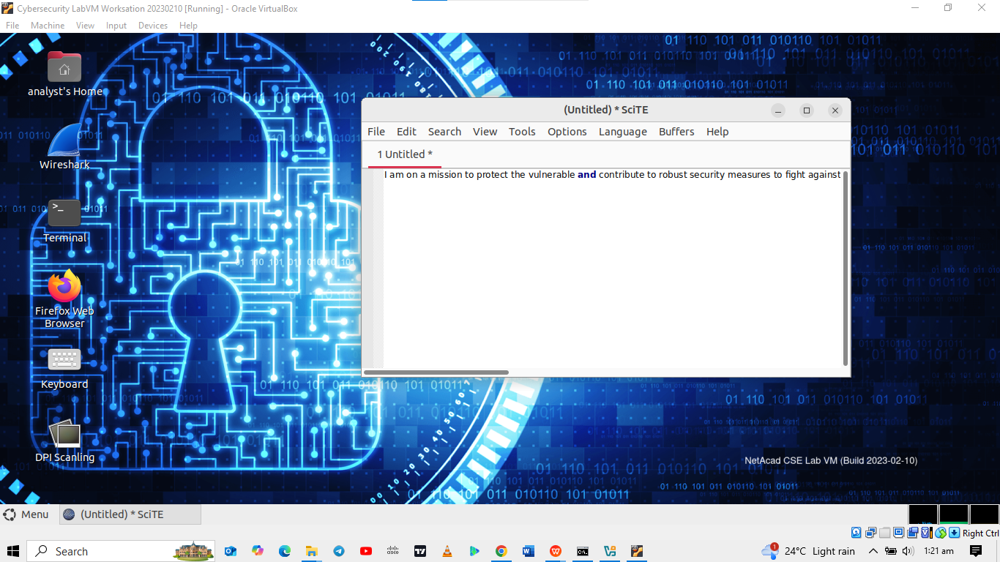

# Working with text files in the CLI

## Objectives
In this lab, I aim to become familiar with Linux command line text
editors and configuration files.

- Part 1: Graphical Text Editors

- Part 2: Command Line Text Editors

- Part 3: Working with Configuration Files

## Part 1: Graphical Text Editors

Some text editors include graphical interfaces, while others are only
usable via the command line. Each text editor includes a feature set
designed to support a specific work scenario. Some text editors focus on
the programmer and include features such as syntax highlighting, bracket
matching, spell check, and other programming-focused features. In this
lab, I will be using **SciTE** as a graphical text editor application.
**SciTE** is a simple, small and fast text editor. It does not have many
advanced features, but will support what I need to achieve with this
lab.

### Step 1: Open SciTE from the GUI

I logged in to the Security Workstation VM

On the top bar, I navigated to **Applications \> CyberOPS \> SciTE** to
launch the **SciTE** text editor.

In the main working area, I typed in some text as you can see in the
image below.

I then saved the file as space.txt

I closed SCite and reopened it. I navigated to open an existing file but
to my surprise, space.txt was not available.

Even though SciTE is looking at the correct directory (/home/analyst),
space.txt is not displayed. This is because SciTE is looking for known
extensions and .txt is not one of them. To display all files, I clicked
the dropdown menu at the bottom of the **Open File** window and selected
**All Files (\*)**. After which I selected **space.txt** to open it.

### Step 2: Open SciTE from the Terminal.

I closed the working instance and tried to open the text file with scite
through the command line interface.

## Part 2: Command Line Text Editors

The main benefit of command line-based text editors is that they allow
for text file editing from a remote shell on a remote computer. In this
part of the lab, I used nano but another extremely popular editor is
**vi** which is included by default in almost all Linux distributions
and its original code was first created in 1976. An updated version of
**vi** is named **vim** which stands for vi-improved. Today most **vi**
users are actually using the updated version, **vim**.

I opened the space.txt using nano and the display is as seen below

Ctrl + G displays the help screen.

**CTRL+X** can be used to exit **nano**. **nano** will ask if you want
to save the file before exiting ('Y' for Yes, or N for 'No'). If 'Y' is
chosen, you will be prompted to press enter to accept the given file
name, or change the file name, or provide a file name if it is a new
unnamed document.

## Part 3: Working with Configuration Files

In Linux, from the operating system standpoint, everything is a file.. specifically configuration files, they are usually text files and are used
by various applications and services to store adjustments and settings
for that specific application or service. Here, I will use text editors
to change the contents of such configuration files.

### Step 1: Locating Configuration Files

I entered ls to list files in the analyst home directory. I did not end
there lmao.. I entered **ls** command again but this time, I added the
**-a** option to also include hidden files in the output. After viewing
the hidden files, I used cat .bashrc to view the contents of that
file.The important thing to notice is that .bashrc contains
configuration for the terminal. For example, the line
**PS1=\'\\\[\\e\[1;32m\\\]\[\\u@\\h \\W\]\\\$\\\[\\e\[0m\\\] \'**
defines the prompt structure of the prompt displayed by the terminal:
**\[username@hostname current_dir\]** followed by a dollar sign, all in
green. What I need to understand is that, user configurations are
conventionally stored as hidden files in the user's home directory

Configuration files relating to system-wide services are place in the
**/etc** directory, by convention. Web services, print services, ftp
services, and email services are examples of services that affect the
entire system and of which configuration files are stored under
**/etc**. To list the content of /etc, I need to swith to root user.
This is important as it restricts the ability to change the system-wide
service configuration to the **root** user only.

I then used the **cat** command to display the contents of the
**bash.bashrc** file. This file defines the default behavior of the
shell for all users. If a user wants to customize his/her own shell
behavior, the default behavior can be overridden by editing the
**.bashrc** file located in the user's home directory.

### Step 2: Editing and Saving Configuration files

Using the CLI, I listed all the hidden files and opened .bashrc to edit its content by changing the color of the shell prompt from green to red for the analyst user.

I located 32 and replace it with 31. 32 is the color code for green,
while 31 represents red. I saved the file afterwards.

I opened a new terminal and verified the colour change.

The terminal window which was already open did not change to red because
the .**bashrc** file is executed and applied when a terminal is first
opened, therefore any previously opened terminals will be unaffected by
the changes to the .bashrc file.

### Step 3: Editing Configuration Files for Services

nginx is a lightweight web server that is installed in the VM. nginx can
be customized by changing its configuration file, which is located in
/etc/nginx. Will do that below..

The configuration file name used here is **custom_server.conf**. The -l
switch to turn on line-numbering.

**sudo nano -l /etc/nginx/custom_server.conf**

The configuration file has many parameters but I will configure only
two: the port nginx listens on for incoming connections, and the
directory it will serve web pages from, including the index HTML
homepage file.

On line 39, I changed the port number from **81** to **8080**. This will
tell nginx to listen to HTTP requests on **TCP** port **8080**.

Next, I moved to line 47 to change the path from
**/usr/share/nginx/html/** to **/usr/share/nginx/html/text_ed_lab/**

I saved the file afterwards.

I then executed nginx using the modified configuration file and opened
firefox and navigated to **localhost:8080** to view the web server
hosted on my local machine.

I then shut down the web server with s**udo pkill nginx** and restarted
Firefox. I confiremed I had no access to the web server. Mission
complete haha

# Reflection

I have come to understand that, depending on the service, more options
may be available for configuration and of course, I always need to have
the correct permissions to be able to modify configuration files.
