# Lab - Exploring Nmap

## Topology

## Objectives
- Part 1: Exploring Nmap

- Part 2: Scanning for Open Ports

## Background
In this lab, I explored using the Nmap utility which is a powerful network
utility that is used for network discovery and security auditing.

## Part 1 - Exploring Nmap
---
The **man** \[ *program \|utility \| function*\] command displays the
manual pages associated with the arguments. I used that command to
understand what Nmap is and it's various uses. See the screenshot
below..

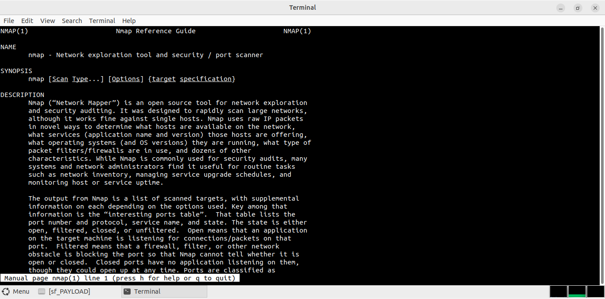

While in the man page, I used the up and down arrow keys to scroll
through the pages and also the space bar to forward one page at a time.
I used the forward slash (/) or question mark (?) followed by the term
or phrase to search for. The forward slash searches forward through the
document, and the question mark searches backward through the document.
The key **n** moves to the next
match.

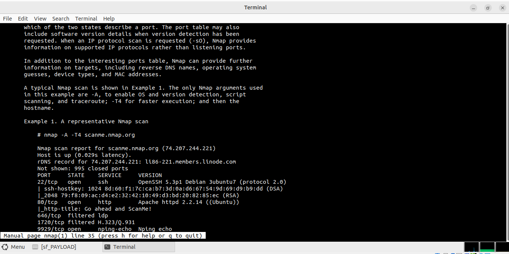
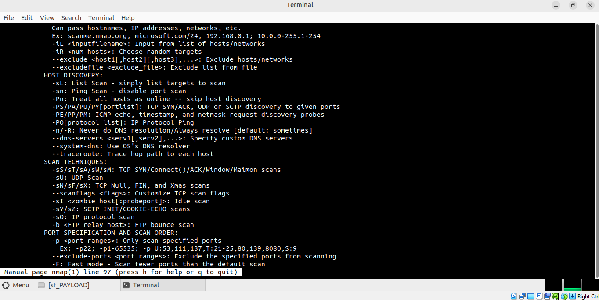

I typed **/example** which searched for the word example forward through the
man page. Pressing **n** moves to the next match.

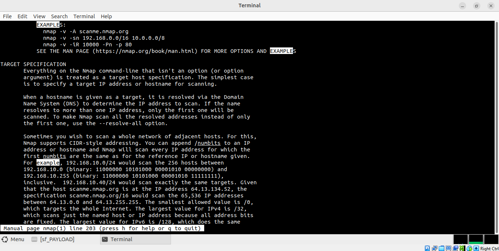

Looking at the example below, the nmap command used was `nmap -A -T4
scanme.nmap.org` which enables OS detection, version detection, script
scanning, and traceroute to scan the domain provided with a timing
template of 4 for faster scanning.

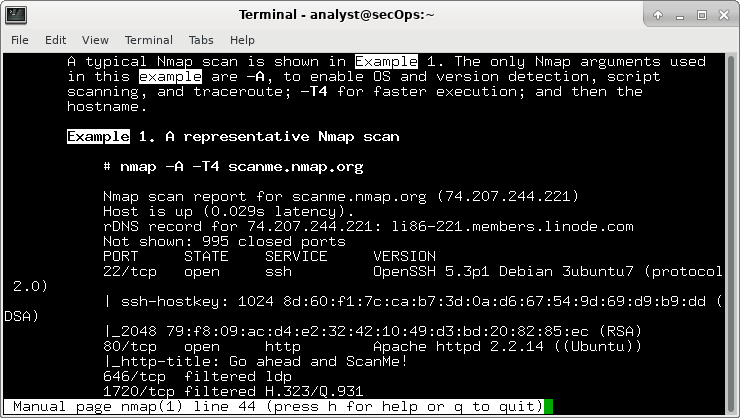

## Part 2 - Scanning for Open Ports
---
In this part, I used the switches from the example in the Nmap man pages
to scan my localhost, my local network, and a remote server at
scanme.nmap.org.

Starting with my localhost, Ports 21,22, & 23 were open with the
respective services FTP, SSH & Telnet and with the exact softwares
**vsftpd 2.0.8**, **OpenSSH 8.9p1 Ubuntu 3ubuntu0.1** and **Linux telnetd**
respectively. See the screenshot I took below..

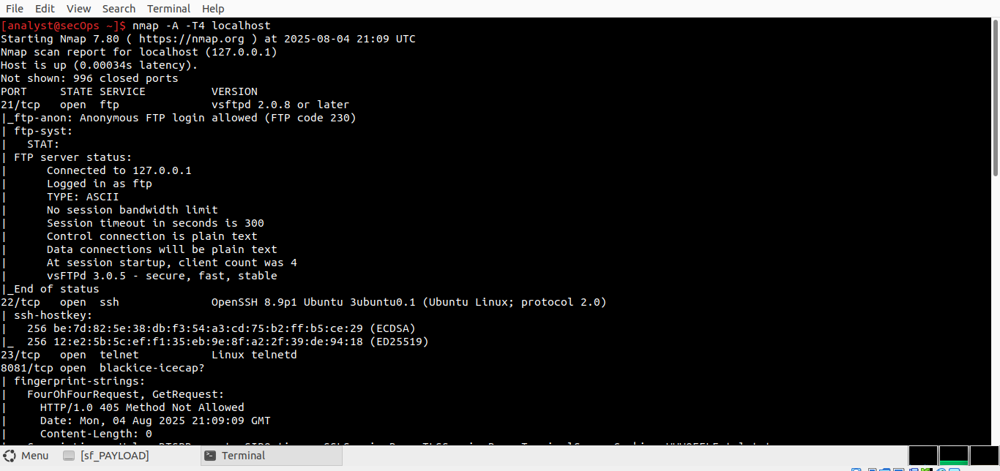

To scan my network, I enteredr **ip address** to determine the IP
address and subnet mask for my host.

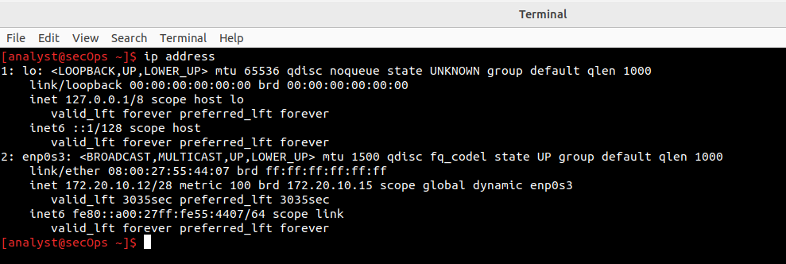

From the screenshot above, my host with ip **172.20.10.12** belongs to
the **172.20.10.0/28** network with a subnet mask of **255.255.255.240**
with **16 ip addresses** usable per block of subnet. For every block,
the **first** and **last** is reserved for the **network** and
**broadcast** address. Taking my host for example which belongs to the
first block of subnet (**172.20.10.0 - 172.20.10.15**). To locate other
hosts on the LAN, I used nmap to scan again but this time I used the
command **nmap -A -T4** **172.20.10.0/28**

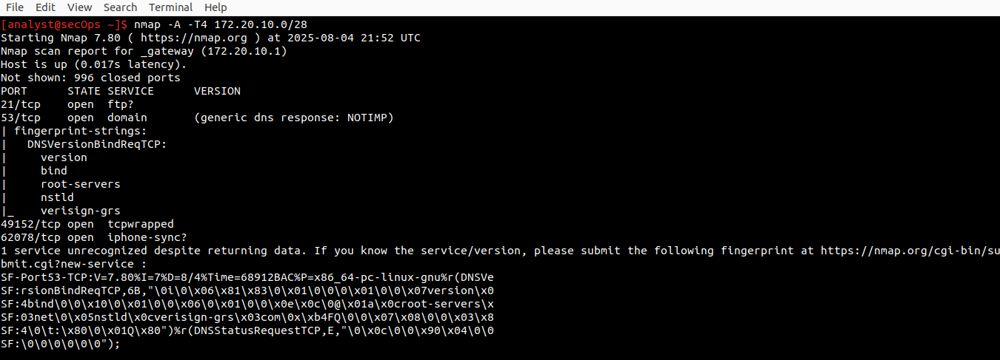
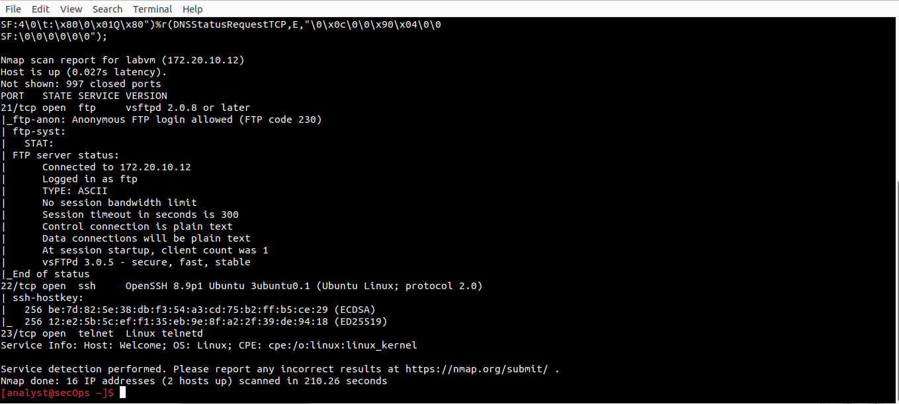

From the screenshots above, you could see that two hosts were up, out of
the 16 IPs scanned.

My third goal was to scan a ***remote server**. I navigated to
**scanme.nmap.org** to get a clear understanding of the purpose of the
website. From the results in the screenshot below, I read *"We set up
this machine to help folks learn about Nmap and also to test and make
sure that their Nmap installation (or Internet connection) is working
properly. You are authorized to scan this machine with Nmap or other
port scanners. Try not to hammer on the server too hard. A few scans in
a day is fine, but don't scan 100 times a day or use this site to test
your ssh brute-force password cracking tool."*

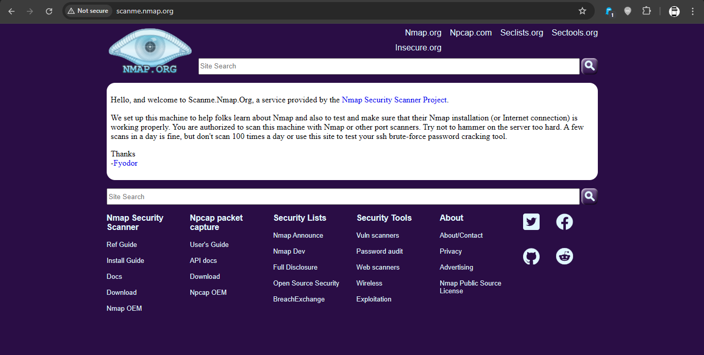

At the terminal, I scanned the site using the command **nmap -A -T4
scanme.nmap.org** and some observations made were as follows:

Ports 21,22,80,587,9929 & 31337 were open software OpenSSH 6.6.1p1
Ubuntu 2ubuntu2.13 running the ssh service.

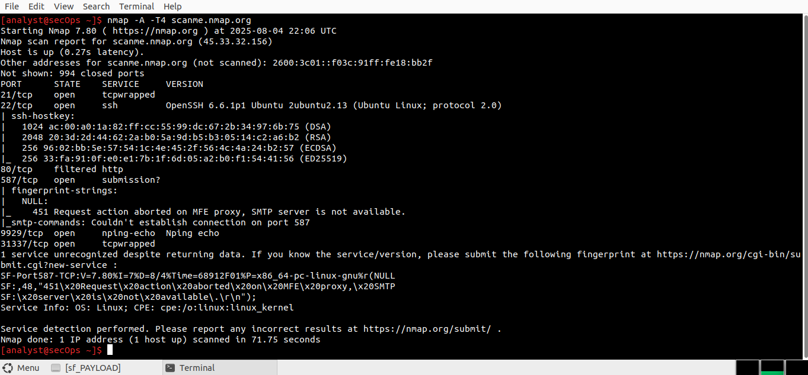

# Reflection
---
Nmap is a powerful tool in network security that allows system/network
admins and cybersecurity professionals to explore, audit and manage
their networks. It helps identify open ports, detect running services
and their versions, and uncover potential vulnerabilities or outdated
software that may require patching & all of which support proactive
defense. However, this same capability can be exploited by threat actors
who use Nmap to perform reconnaissance on a target, map out network
infrastructure, and identify weak entry points before launching an
attack.
