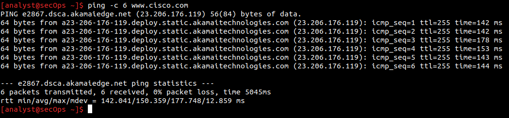
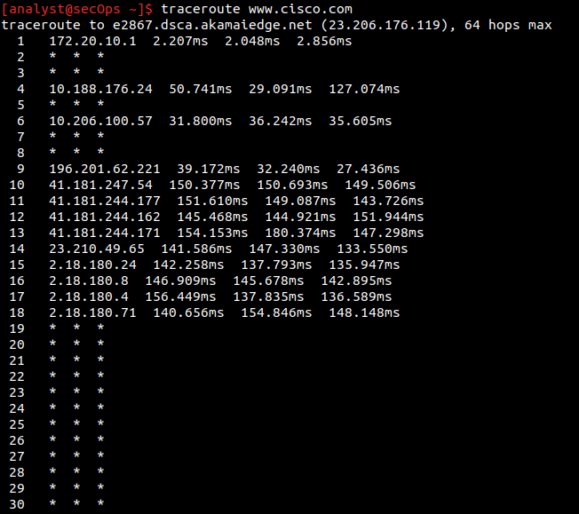
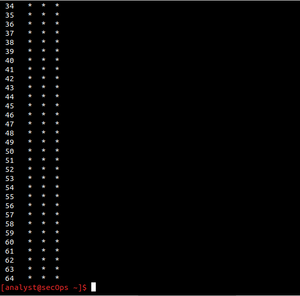
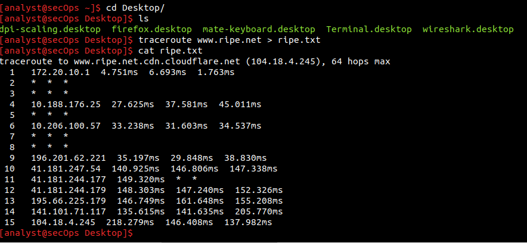
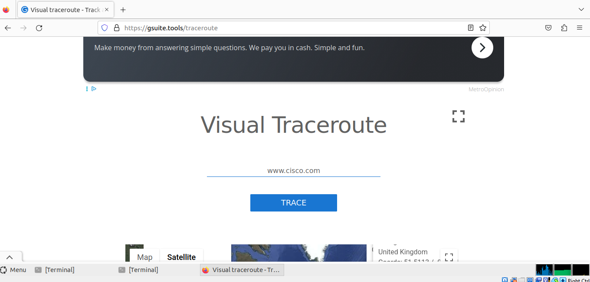
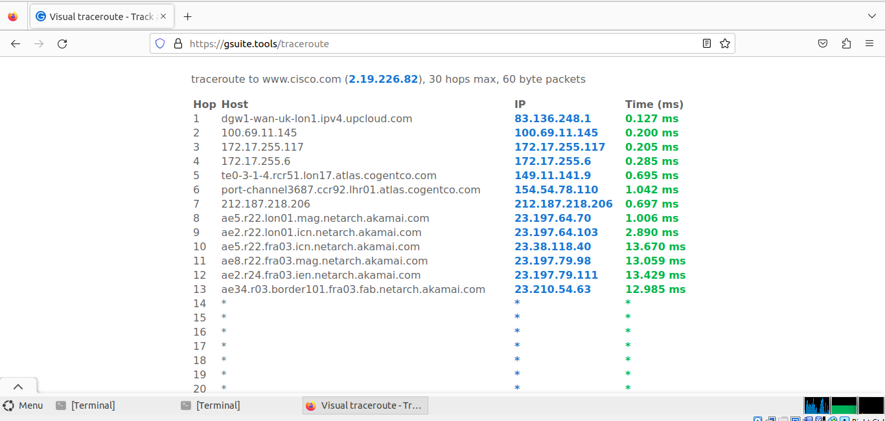
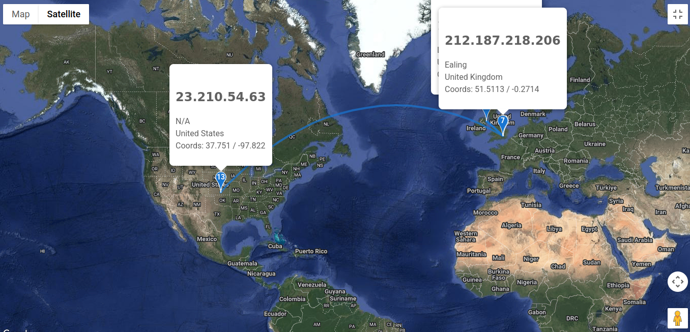

# Lab - Tracing a Route

## Objectives

- Part 1: Verifying Network Connectivity Using Ping

- Part 2: Tracing a Route to a Remote Server Using Traceroute

- Part 3: Trace a Route to a Remote Server Using Web-Based Traceroute Tool

## Overview

Tracing a route will list each routing device that a packet crosses as
it traverses the network from source to destination. The **traceroute**
(or **tracert**) tool is often used for network troubleshooting. By
showing a list of routers traversed, it allows the user to identify the
path taken to reach a particular destination on the network or across
internetworks. **Each router represents a point where one network
connects to another network and through which the data packet was
forwarded.** The number of routers is known as the number of \"hops\"
the data traveled from source to destination.

The displayed list can help identify data flow problems when trying to
access a service such as a website. It can also be useful when
performing tasks such as downloading data. If there are multiple
websites (mirrors) available for the same data file, one can trace each
mirror to get a good idea of which mirror would be the fastest to use.

## Part 1: Verifying Network Connectivity Using Ping**

I opened a terminal window and pinged a remote server (www.cisco.com)

The first output line displays the Fully Qualified Domain Name (FQDN)
`e2867.dsca.akamaiedge.net`. This is followed by the IP address
`23.206.176.119`. But Cisco hosts the same web content on different
servers throughout the world. Therefore, depending upon geographic
location, the FQDN and the IP address will be different.

Six pings were sent and a reply was received from each ping. Because
each ping received a response, there was 0% packet loss. On average, it
took 5045 ms (5045 milliseconds) for the packets to cross the network.

## Part 2: Tracing a Route to a Remote Server Using Traceroute

Routes traced can go through many hops and a number of different
Internet Service Providers (ISPs), depending on the size of the ISP and
the location of the source and destination hosts. Each "hop" represents
a router. A router is a specialized type of computer used to direct
traffic across the internet.

The **traceroute** tool shows what path through the network a packet of
information takes to reach its final destination. The **traceroute**
tool also gives an idea of how fast traffic is going on each segment of
the network. Packets are sent to each router in the path, and the return
time is measured in milliseconds.

a.  At the terminal, I typed **traceroute www.cisco.com**

Next, I used the same command but this time, direct the results to
another text file. I performed and saved traceroute results for [www.ripe.net](http://www.ripe.net) located in Europe.

## Part 3: Trace a Route to a Remote Server Using Web-Based Traceroute
Tool

I visited `https://gsuite.tools/traceroute`, a visual traceroute tool
and entered [www.cisco.com](http://www.cisco.com). In the geographical
locations of the responding hops, I observed the path taken by the
packets from UK to US.

In comparing the traceroute for [www.cisco.com](http://www.cisco.com)
using the CLI traceroute tool and the GUI Web-based tool, I realized
varying results. Number of hops were 64 max for the traceroute tool and
for the Web-based traceroute, it was 30 hops max. Also, the IP address
of the host varied as seen in the images.
