# Lab - Using Wireshark to Examine HTTP and HTTPS Traffic

## Objectives
---
- Part 1: Capture and view HTTP traffic

- Part 2: Capture and view HTTPS traffic

## Background / Scenario
---

HyperText Transfer Protocol (HTTP) is an application layer protocol that
presents data via a web browser. With HTTP, there is no safeguard for
the exchanged data between two communicating devices.

With HTTPS, encryption is used via a mathematical algorithm. This
algorithm hides the true meaning of the data that is being exchanged.
This is done through the use of certificates. I will work on another lab
on that.

Regardless of HTTP or HTTPS, it is only recommended to exchange data
with websites that you trust. Just because a site uses HTTPS does not
mean it is a trustworthy site. Threat actors commonly use HTTPS to hide
their activities.

In this lab, I will explore and capture HTTP and HTTPS traffic using
Wireshark.

## Part 1: Capture and View HTTP Traffic
---

I started by checking for my IP address which was `172.20.10.12` on the
interface enp0s3.

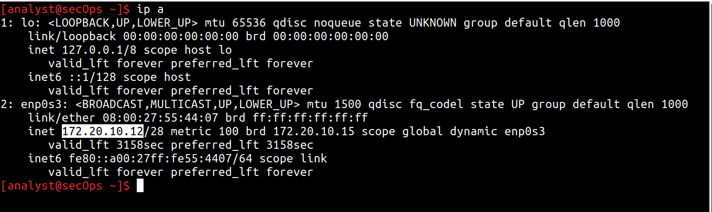

I then started tcpdump to record network traffic on the enp0s3 interface
using the command **sudo tcpdump --i enp0s3 --s 0 --w httpdump.pcap**

The **-i** command option allows me to specify the interface. If not
specified, the tcpdump will capture all traffic on all interfaces.

The **-s** command option specifies the length of the snapshot for each
packet. Setting snaplen to 0 sets it to the default of 262144, for
backwards compatibility with recent older versions of tcpdump.

The **-w** command option is used to write the result of the tcpdump
command to a file. Adding the extension **.pcap** ensures that operating
systems and applications will be able to read the file.

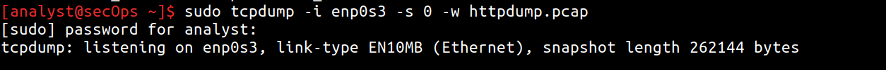

I opened the firefox browser and navigated to
**http://www.altoromutual.com/login.jsp** Because this website uses HTTP,
the traffic is not encrypted. When I entered that site, I was hit with
"server not found" so I used the Acunetix http site rather. I entered a
username of test with a password oftest and clicked Login. I closed the
web browser afterwards and on the terminal window where tcpdump was
running, I stopped the capture with CTRL+C.

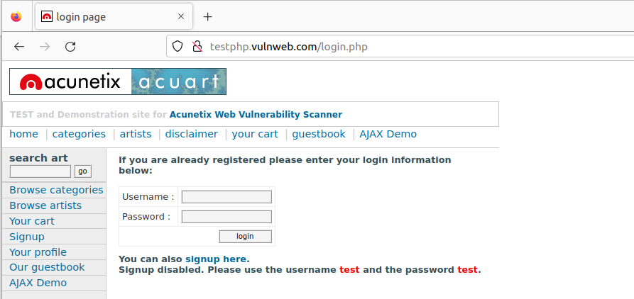

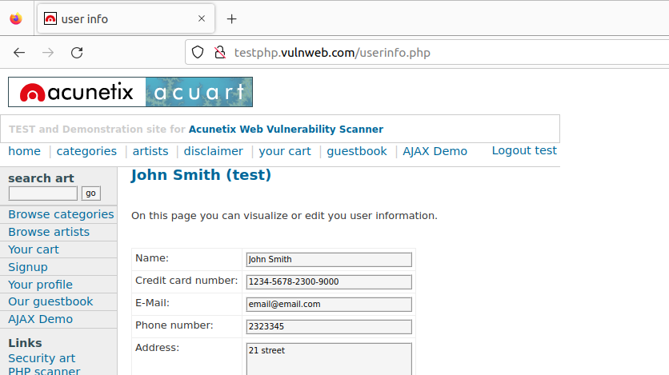

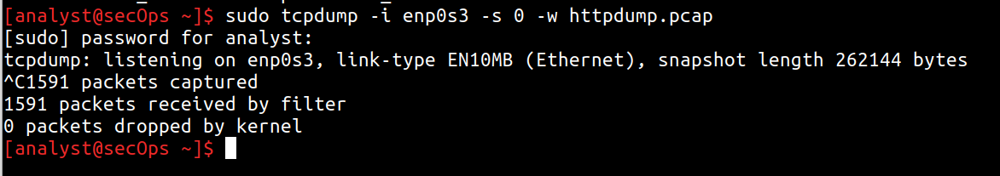

In my home folder, I double-clicked the pcap file and opened it with
Wireshark for analysis.

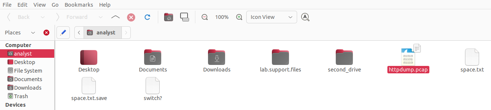

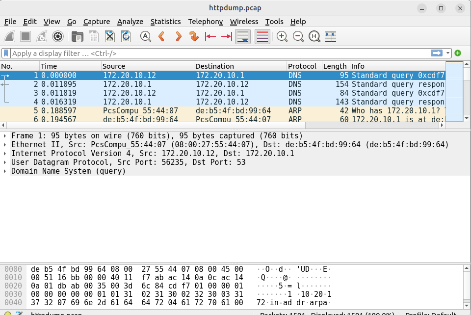

I filtered for http traffic and browsed through the different http
messages and selected the POST message.

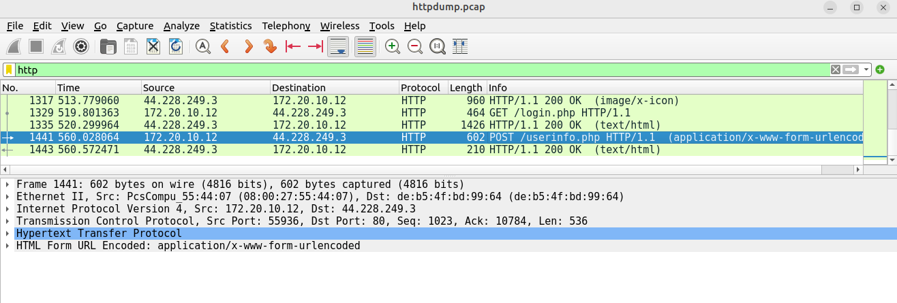

I expanded the HTML Form URL Encoded: application/x-www-form-urlencoded
section where I saw the plain login information I entered.

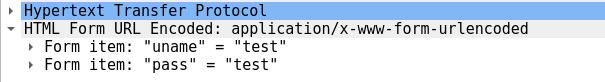

## Part 2: Capture and View HTTPS Traffic
---

Here, I literally did same steps I mentioned earlier on but this time, I
wrote the captured data to httpsdump.pcap. The site I accessed was
[www.netacad.com](http://www.netacad.com) which runs on https. I logged
in with random credentials and opened the captured data in wireshark.
Using **tcp.port==443** as a filter, I browsed through the different
HTTPS messages and selecedt an Application Data message.I realized the
Secure Sockets Layer replaced the HTTP section I previously noticed
earlier on. I clicked on the encrypted application data to see an
encrypted message. Yes, the credentials I submitted this time around was
not in plain text.

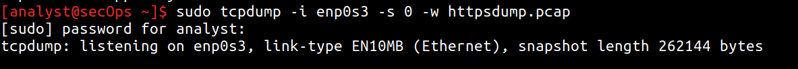

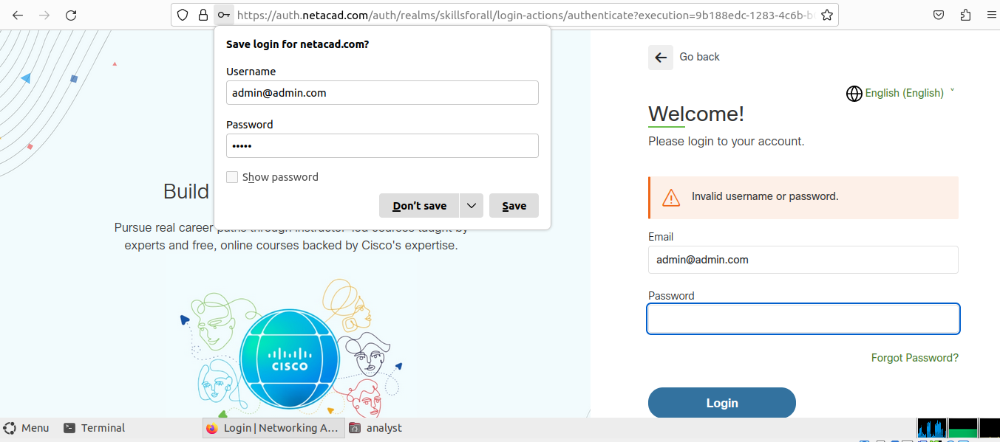

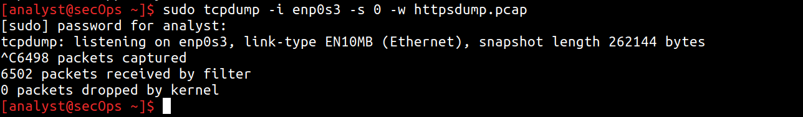

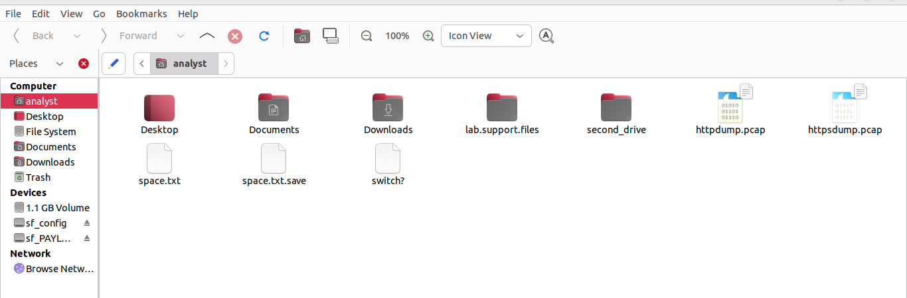

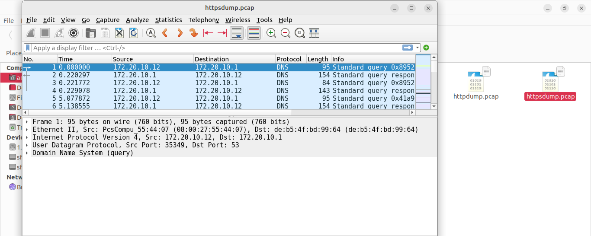

# REFLECTION

HTTPS uses SSL/TLS certificates to encrypt data and verify a website's
identity, ensuring secure communication. However, a valid certificate
only proves the connection is safe, not that the site itself is
trustworthy.
