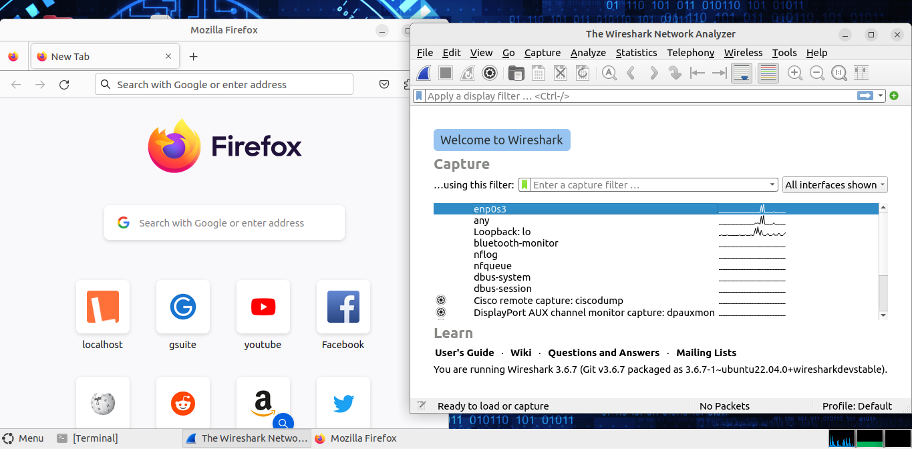
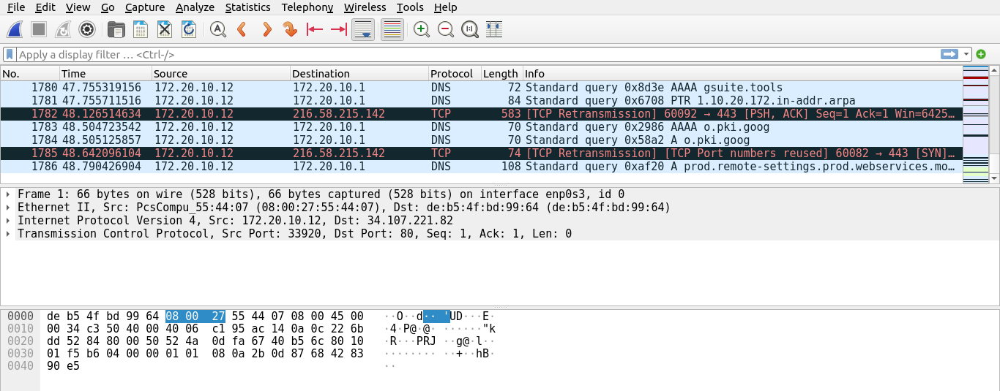

# Lab - Using Wireshark to Examine a UDP DNS Capture

## Topology
---

## Objectives
---

- Part 1: Record a PC's IP Configuration Information

- Part 2: Use Wireshark to Capture DNS Queries and Responses

- Part 3: Analyze Captured DNS or UDP Packets

## Overview

In this lab, I communicated with a DNS server by sending a DNS query
using the UDP transport protocol. I also used Wireshark to examine the
DNS query and response exchanges with the same server.

## Part 1: Record VM's IP Configuration Information
---
To find and record the MAC and IP addresses of my VM's virtual network
interface card (NIC), the IP address of the specified default gateway,
and the DNS server IP address specified for the PC, I run the commands
as seen in the screenshots below and later recorded this information
into the table. The information will be used in parts of this lab with
packet analysis.

| **Description**              | **Settings**       |
|------------------------------|--------------------|
| IP address                   | 172.20.10.12       |
| MAC address                  | 08:00:27:55:44:07  |
| Default gateway IP address   | 172.20.10.1        |
| DNS server IP address        | 127.0.0.53         |

## Part 2: Use Wireshark to Capture DNS Queries and Responses
---

In Part 2, I set up Wireshark to capture DNS query and response packets
to demonstrate the use of the UDP transport protocol while communicating
with a DNS server. I started wireshark, navigated to
**[www.google.com](http://www.google.com)** and stopped the capture for
analysis in part 3.

## Part 3: Analyze Captured DNS or UDP Packets
---

In Part 3, I examind the UDP packets that were generated when
communicating with a DNS server for the IP addresses for www.google.com.

I filtered DNS packets and in the packet list pane (top section) of the
main window, I located the packet that included **Standard query** and
**A** [www.google.com](http://www.google.com.)

I moved on to examining the fields in the DNS query packet. In the packet details pane, the first line shows frame 13 had 74 bytes of data on the wire. 
This is the number of bytes it took to send a DNS query to a named server requesting the IP addresses of www.google.com.

The Ethernet II line displayed the source and destination MAC addresses.
The source MAC address was from my VM because it originated the DNS
query. The destination MAC address was from the default gateway because
thiswas the last stop before the query exits the local network. The
source MAC address was the same as the one recorded from Part 1 for the
VM.

In the Internet Protocol Version 4 line, the IP packet Wireshark capture
indicates that the source IP address of the DNS query was 172.20.10.12
and the destination IP address is 172.20.10.1 being the default gateway.

| Device                                    | IP Address     | MAC Address         |
|-------------------------------------------|----------------|---------------------|
| Source Workstation                        | 172.20.10.12   | 08:00:27:55:44:07   |
| Destination DNS Server / Default Gateway  | 172.20.10.1    | de:b5:4f:bd:99:64   |

The IP packet and header encapsulates the UDP segment. The UDP segment
contains the DNS query as the data. A UDP header only has four fields:
source port, destination port, length, and checksum. Each field in a UDP
header is only 16 bits as depicted below.

The source port number in the screenshot above is 52514. The source port
was randomly generated by the VM using port numbers that are not
reserved. The destination port is 53. Port 53 is a well-known port
reserved for use with DNS. DNS servers listen on port 53 for DNS queries
from clients. The length of the UDP segment is 40 bytes as seen in the
screenshot I put above. Out of 40 bytes, 8 bytes are used as the header.
The other 32 bytes are used by DNS query data. The 32 bytes of DNS query
data is in the following screenshot in the packet bytes pane (lower
section) of the Wireshark main window.

The checksum is used to determine the integrity of the UDP header after
it has traversed the internet. The UDP header has low overhead because
UDP does not have fields that are associated with the three-way
handshake in TCP. Any data transfer reliability issues that occur must
be handled by the application layer.

### Examine the fields in a DNS response packet.

In this step, l examined the DNS response packet and verified that the
DNS response packet also uses the UDP. Frame 15 is the corresponding DNS
response packet. Notice the number of bytes on the wire is 90. It is a
larger packet compared to the DNS query packet. This is because the DNS
response packet will include a variety of information about the domain.

In the Ethernet II frame for the DNS response, the source MAC address
was the default gateway and the destination MAC address was for my VM. I
noticed the source IP address to be 172.20.10.1 and the destination IP
address as 172.20.10.12

In the UDP segment, the role of the port numbers has also reversed. The
destination port number became 52514. Port number 52514 is the same port
that was generated by the VM when the DNS query was sent to the DNS
server. The VM listens for a DNS response on this port. The source port
number is 53. The DNS server listens for a DNS query on port 53 and then
sends a DNS response with a source port number of 53 back to the
originator of the DNS query. When I expanded the DNS response, I noticed
the resolved IP addresses for www.google.com in the Answers section. I
took a screenshot

# REFLECTION

Using UDP instead of TCP for DNS offers faster query resolution and
lower overhead because UDP is connectionless. This makes DNS lookups
more efficient, especially for small queries and responses, reducing
latency and conserving network resources.
