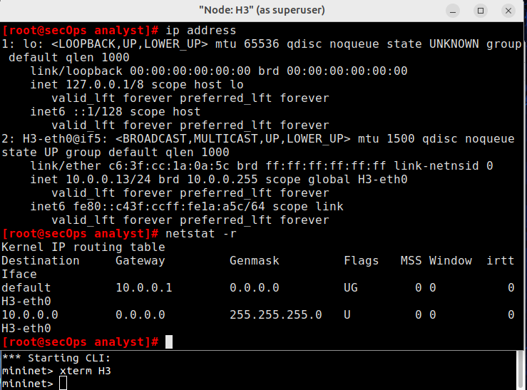

# Lab - Using Wireshark To Examine Ethernet Frames

## Mininet Topology

## Objectives

- Part 1: Examine the Header Fields in an Ethernet II Frame

- Part 2: Use Wireshark to Capture and Analyze Ethernet Frames

## Instructions

Examine the Header Fields in an Ethernet II Frame
-------------------------------------------------

- In Part 1, you will examine the header fields and content in an Ethernet
II Frame provided to you. A Wireshark capture will be used to examine
the contents in those fields.

### Review the Ethernet II header field descriptions and lengths.

| Field        | Description        | Size               |
|--------------|--------------------|--------------------|
| Preamble     | Synchronization     | 8 Bytes            |
| Destination Address | Receiver MAC Address | 6 Bytes          |
| Source Address      | Sender MAC Address   | 6 Bytes          |
| Frame Type   | Type of protocol (e.g., IPv4, ARP) | 2 Bytes   |
| Data         | Encapsulated payload (e.g., IP packet) | 46 – 1500 Bytes |
| FCS (Frame Check Sequence) | Error checking code | 4 Bytes          |

### Examine Ethernet frames in a Wireshark capture.

- The Wireshark capture below shows the packets generated by a ping being
issued from a PC host to its default gateway. A filter has been applied
to Wireshark to view the ARP and ICMP protocols only. The session begins
with an ARP query for the MAC address of the gateway router, followed by
four ping requests and replies.

### Examine the Ethernet II header contents of an ARP request.

- The following table takes the first frame in the Wireshark capture and
displays the data in the Ethernet II header fields.

| Field               | Value                | Description                                                                                                                                             |
|---------------------|----------------------|---------------------------------------------------------------------------------------------------------------------------------------------------------|
| **Preamble**         | Not shown in capture | This field contains synchronizing bits, processed by the NIC hardware.                                                                                  |
| **Destination Address** | Broadcast (ff:ff:ff:ff:ff:ff) | Layer 2 address for the frame. A broadcast address sends the frame to all devices on the local network.                                                  |
| **Source Address**      | IntelCor_62:62:6d (f4:8c:50:62:62:6d) | Each address is 48 bits (6 octets) expressed as 12 hexadecimal digits. The first 3 bytes (f4:8c:50) indicate the vendor (OUI), the last 3 are the NIC’s serial number. The source address is always unicast. |
| **Frame Type**          | 0x0806               | Indicates the upper-layer protocol in the data field. Common types include: • 0x0800 – IPv4 • 0x0806 – ARP                                         |
| **Data**                | ARP                  | Contains the encapsulated upper-layer protocol data. Ethernet frames have data fields between 46–1500 bytes.                                            |
| **FCS**                 | Not shown in capture | Frame Check Sequence used by the NIC to detect errors. Computed by the sender and verified by the receiver; includes addresses, type, and data fields.   |

#### Questions:

1. What is significant about the contents of the destination address field?

- **Answer:** The destination address is a broadcast address, meaning the
frame is intended for all devices on the local network.

2. Why does the PC send out a broadcast ARP prior to sending the first ping
request?

- **Answer:** The PC does not initially know the MAC address of the gateway
so, it sends an ARP request to get the MAC address associated with the
IP address of the default gateway.

3. What is the MAC address of the source in the first frame?

- **Answer:** f4:8c:50:62:62:6d

4. What is the Vendor ID (OUI) of the Source's NIC?

- **Answer:** f4:8c:50

5. What portion of the MAC address is the OUI?

- **Answer:** The first three octets.

6. What is the Source's NIC serial number?

- **Answer:** 62:62:6d

Part 2 - Use Wireshark to Capture and Analyze Ethernet Frames
----------------------------------------------------

- In Part 2, I used Wireshark to capture local and remote Ethernet
frames and examine the information that is contained in the frame header
fields.

I started the mininet and in the mininet prompt, I started terminal
windows on host H3 as seen in the screenshots below..

At the prompt on Node: h3, I entered **ip address** to verify the IPv4
address and the MAC address. I also entered the command **netstat -r**
to display the default gateway information.

| **Host-interface** | **IP Address** | **MAC Address**       |
|--------------------|----------------|------------------------|
| H3-eth0            | 10.0.0.13      | c6:3f:cc:1a:0a:5c      |

The observed IP address of the default gateway for the host H3 is
**10.0.0.1**

To start capturing traffic on host H3-eth0, I needed to clear its ARP
cache first. I entered **arp -n** to display the content of the ARP
cache. Since there was no existing info in the cache, I was good to
proceed but if there was, I could clear it by using the command **arp -d
IP-address**.

After, I opened wireshark on H3 for a live capture. From the terminal on
H3, I pinged the default gateway and stopped the capture after 5 echo
request packets were sent.

Next, I applied the **icmp** filter to the captured traffic so that only
ICMP traffic is shown in the results to help me examine the first Echo
(ping) request in Wireshark.

Note that the the top part is the Packet list pane, followed by the
middle part which is the Packet details pane and then the buttom is the
packet bytes pane.

In the Packet List pane (top section), I click the first frame listed
and I saw Echo (ping) request under the Info heading. I then Examined
the first line in the Packet Details pane (middle section). This line
displayed the length of the frame to be 98 bytes. The second line in the
Packet Details pane showed that it was an Ethernet II frame.

- The MAC address of the PC's NIC : **c6:3f:cc:1a:0a:5c**

- The default gateway's MAC address : **12:3e:8d:e8:c1:91**

I clicked the arrow at the beginning of the second line to obtain more
information about the Ethernet II frame to note the type of frame as
IPv4 (0x0800)

The last two lines displayed in the middle section provides information
about the data field of the frame. The data contained the source
(10.0.0.13) and destination (10.0.0.1) IPv4 address information.

In the Packet Bytes pane (bottom section), I clicked the **Internet
Control Message Protocol** line in the middle section and examined the
resulting highlighted data in the Packet Bytes pane.

I clicked the next frame in the top section and examined the Echo reply
frame. I noticed that the source and destination MAC addresses had
reversed, because this frame was sent from the default gateway router as
a reply to the first ping.

In a new wireshark capture, I sent 5 echo request packets to 172.16.0.40
from the terminal window of Node: H3. The resulting source and
destination MAC an IP addresses of the first echo ping request frame and
data field of the frame is showed in the screenshot below.

Comparing these addresses to the addresses I had earlier on, the only
address that changed was the destination IP address. The destination IP
address changed, while the destination MAC address remained the same
because the ping was directed toward a PC on a remote network and hence,
H3 checks its ARP cache and forwards the request to the default gateway
(that's the destination MAC) and the router now forwards the request to
the destination IP for which reason only the destination IP changes and
not the MAC.

## Reflection

- Wireshark does not display the preamble field of a frame header. What
does the preamble contain?

The preamble in an Ethernet frame contains 7 bytes (56 bits) of
alternating 1s and 0s (10101010) followed by 1 byte (8 bits) called the
**Start Frame Delimiter (SFD**) with a value of 1010101.

Wireshark doesn't show the preamble because it is handled by the NIC
(Network Interface Card) hardware and removed before the packet data
reaches Wireshark. The purpose of the Preamble is to help synchronize
the sender and receiver's clocks before actual data transmission
begins. It also signals the start of a new Ethernet frame.

