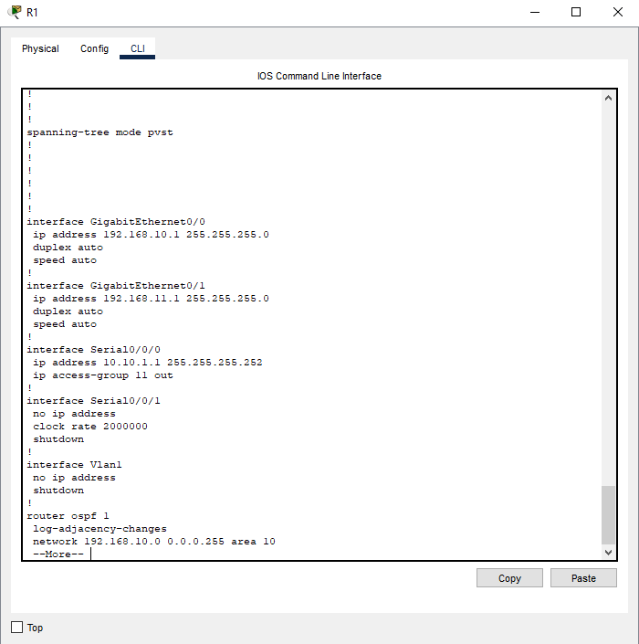

# Packet Tracer - Access Control List Demonstration

## Objectives
---

- **Part 1: Verify Local Connectivity and Test Access Control List**

- **Part 2: Remove Access Control List and Repeat Test**

## Background
---

In this activity, I will observe how an access control list (ACL) can be
used to prevent a ping from reaching hosts on remote networks. After
removing the ACL from the configuration, the pings will be successful.

## Part 1: Verify Local Connectivity and Test Access Control List
---

### Step 1: Pinging devices on the local network to verify connectivity.

I hovered my mouse on PC1, PC2 and PC3 in order to determine their IP
addresses which were 192.168.10.10, 192.168.10.11 and 192.168.11.10
respectively. From the command prompt of **PC1**, I pinged ping **PC2**
and **PC3**.

PC1 can sucessfully ping PC2 because both are on the same subnet and
communicate directly through S1 without needing the router. PC1 can also
ping PC3 even though it is in a different subnet because Router1
connects both networks with interfaces assigned to each subnet. When PC1
sends a packet to PC3, it recognizes that the destination is outside its
subnet and forwards it to the default gateway which then routes the
traffic to PC3 through S2.

### Step 2: Pinging devices on remote networks to test ACL functionality.

From the command prompt of **PC1**, I pinged **PC4**. and the **DNS
Server but the pings failed. The destination hosts were not reachable.**

The pings failed because Router1 did not have any IP configuration or
routing information for the 192.168.30.0 and 192.168.31.0 networks where
PC4 and the DNS server are located. In simulation mode, when packets
from PC1 reached Router1, they were dropped since router1 only knew
about its directly connected networks and had no route to forward
traffic toward the networks behind Router3.

## Part 2: Removing ACL and Repeating Test
---

### Step 1: Use show commands to investigate the ACL configuration.

At this point, I understood that the reason why the ping did not work
was due to ACL configuration on the router1 (R1). I used the **show
run** and **show access-lists** commands to view the currently
configured ACLs. However, **R1 **only has one ACL.But before I proceeded
with that command, I had to enter into privileged EXEC on the router.
Without doing that, the show access-lists command returns an error.

The first line of the ACL prevents any packets originating in
the **192.168.10.0/24** network, which includes Internet Control Message
Protocol (ICMP) echoes (ping requests). The second line of the ACL
allows all other **ip **traffic from **any **source to transverse the
router.

For an ACL to impact router operation, it must be applied to an
interface in a specific direction. In this scenario, the ACL is used to
filter traffic exiting the interface. Therefore, all traffic leaving the
specified interface of R1 will be inspected against ACL 11.

To view IP information, I used the show ip interface command and saw the interface and direction the ACL was applied as seen in the screenshot below.

### Step 2: Removing access list 11 from the configuration.

Here, I needed to remove the ACL from the configuration by issuing
the **no access list **[*number of the ACL*] command. The **no
access-list** command deletes all ACLs configured on the router.
The **no access-list** [*number of the ACL*] command removes only a
specific ACL.

Under the Serial0/0/0 interface, I removed access-list 11, previously
applied to the interface as an **outgoing** filter.

In global configuration mode, the command below can
be used to remove the ACL.

> R1(config)# **no access-list 11**

Next, I verified that **PC1** could now ping the **DNS
Server **and** PC4**. It worked!

