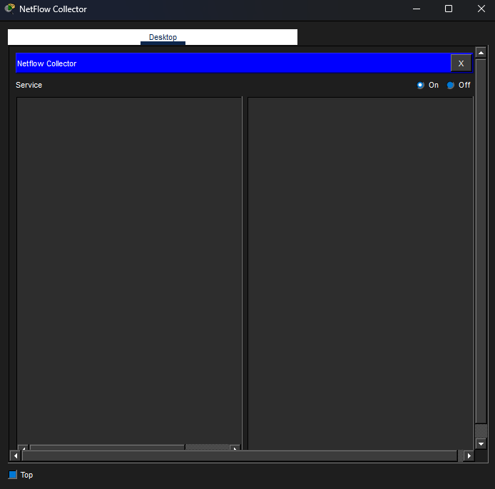
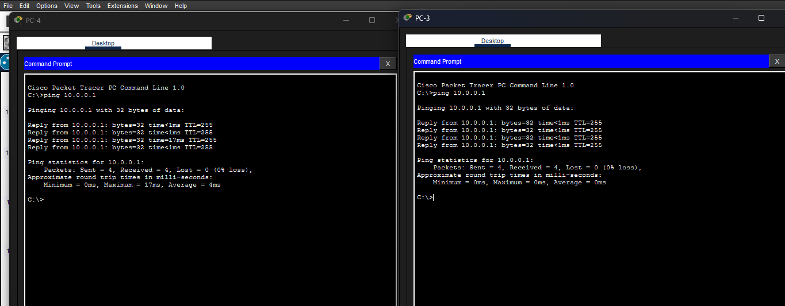
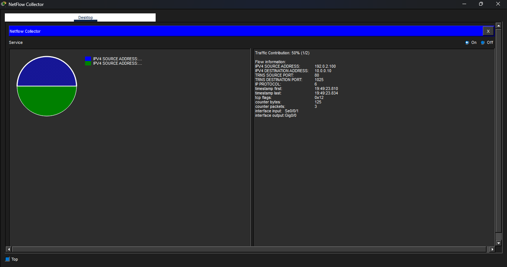

# Packet Tracer Lab Activity - Exploring a Netflow Implementation

## Objectives

In this activity, I will use Packet Tracer to create network traffic and
observe one directional NetFlow Flow Records and also observe NetFlow
Records for a Session that enters and leaves the Collector.

## Scenario

Packet Tracer offers a basic simulation of NetFlow functionality. It is
not a replacement for learning NetFlow on physical equipment. Some
differences may exist between NetFlow flow records generated by Packet
Tracer and by records created by full-featured network equipment.

## Tools Used
- Cisco Packet Tracer

## Topology

The Edge router has been configured as a NetFlow flow exporter. The LAN
interface is configured to monitor flows that enter it from the LAN. The
serial interface has been configured to collect flows that enter it from
the internet.

## Methodology

### Part 1: Observing NetFlow Flow Records - One Direction

From the NetFlow Collector, I clicked the Desktop tab and then clicked
the Netflow Collector icon.

I clicked to activate the collector as necessary.

From PC-1's Command Prompt, I pinged the default gateway at 10.0.0.1

The first set of pings were not sent to the NetFlow Collector because
the ARP process must first resolve IP and MAC addresses. After a minute,
I pinged the default gateway again.

Moving on, I pinged the default gateway again but from PC-2 and observed
the NetFlow collector flow records.

Now, I pinged the default gateway again but from PC-1 and observed the
NetFlow collector flow records.

I then issued pings from PC-3 and PC-4 to the default gateway address
and observed the display in the flow collector.

Part 2: Observing NetFlow Records for a Session that Enters and Leaves
the Collector

From the Netflow collector, I clicked on the physical tab.

I then clicked the red power button to turn off the server. Then I
clicked it again to turn the server back on. 

From the Netflow Collector, I switched to the Desktob tab and opened the
Netflow Collector.

I then clicked the "On" radio button to activate the collector. From
there, I closed the NetFlow Collector window.

Before accessing a web server from PC-1, I am predicting that, there
will be tw flows in the pie chart. One for the requests packets and
another flow for the response packets. The table below shows my
prediction in more detail.

 | **Record Field**     |   **Value**           |    **Guidelines**|
|-----------------------|----------------------|-------------------|
|  Source IP address     |  *10.0.0.10*          |     N/A         |
|  Destination IP address  |*192.0.2.100*        |    N/A          |
|  Source Port           |  1025-5000 (MS Windows default, which is what PT uses)  | This is an approximate value that is dynamically created|    
 | Destination Port      |  *80*                |      N/A|
 | Input Interface      |   *Gig0/0*            |     N/A|
|  Output Interface      |  *Se0/0/1*            |     N/A|
  

The values for the web page reply entering the NetFlow exporter router
from the internet is predicted as well below

|  **Record Field**     |   **Value**           |    **Guidelines**|
|----------------------|---------------------------|---------------|
|  Source IP address    |   *192.0.2.100*         |    N/A|
|  Destination IP address |  *10.0.0.10*              | N/A|
|  Source Port           |  1025-5000 (MS Windows default, which is what PT uses)  | This is an approximate value that is dynamically created|        
|  Destination Port       | *80*                    |  N/A|
 | Input Interface       |  *Se0/0/1*                | N/A|
 | Output Interface      |  *Gig0/0*                 | N/A|

From the web browser of PC-1, I accessed the web server via the IP
192.0.2.100. Afterwards, I observed the pie chart in the Netflow
Collector.

I then clicked the link to the copyrights page and made a few
observations from the Netflow Collector.

Now, I power cycle the NetFlow Collector to clear the flows and turn on
the Netflow Collector service.

Before accessing the web browser via its URL, I am predicting that there
will be four flows. This is because there has to be a DNS query and
response before the HTTP query and response.

From PC-1, I entered <http://www.example.com> and
observed the floe in the Netflow Collector.

## Results

After pinging the default gateway through PC-1, there was a brief delay
until I saw the pie chart from the Netflow Collector displaying the flow
record details.

In the above case, the flow represents the ICMP ping from host 10.0.0.10
to 10.0.0.1. Four ping packets were in the flow and the packets entered
interface G0/0 of the exporter. The flow record had entries explained in
the table below.

After pinging the default gateway from PC-2, I realized a new flow
record appeared in the pie chart but the statistics for the existing
flow records did not change.

After pinging with PC-1 again, I realized the pie chart had had a slight
change and there was a mdification in the existing flow record. Traffic
contribution was now 66.67%

After pinging with PC-3 and PC-4, I observed the addition of two new
segments to the pie chart from the Netflow Collector for each flow. I
also saw that the traffic contribution was now 40%

After accessing the web server from PC-1, I saw two pie segments for the
HTTP request and response. I then clicked each HTTP pie segment to
record and verify my predictions. From the results as seen below, my
predictions were indeed solid!

After accessing the copyright page, I observed two new flows created. I
observed that a new source port was used to initiate the new request to
the web server.

Aside from the obvious timestamp, source and destination IP address,
port, and interfaces, differences, I saw that the TCP flags were
different. The flags for the request flows were 0x02 and the response
flags are 0x12.

After accessing the web browser via its URL, my prediction was correct.
I saw four flows with a DNS query occuring first. I included the
screenshots below.

After inspecting the flow record, the IP protocol field had different
values with value 6 for TCP (the HTTP traffic on TCP port 80) and value
17 for UDP traffic (DNS query and response)

