# Packet Tracer - Identify Packet Flow

## Objectives
---

> In this activity, you will observe packet flow in a LAN and WAN
> topology. You will also observe how the packet flow path may change
> when there is a change in the network topology.

- **Part 1: Verify Connectivity**

- **Part 2: Remote LAN Network Topology**

- **Part 3: WAN Network Topology**

## Scenario
---

> Packet Tracer allows the design and creation of a simulated networking
> topology. In this activity, I am presented with a simplified topology
> to observe packet flow. I will explore how packets travel through the
> network using the simulation mode in Packet Tracer. I will also
> observe the changes in packet flow when there is a change in the
> network topology.

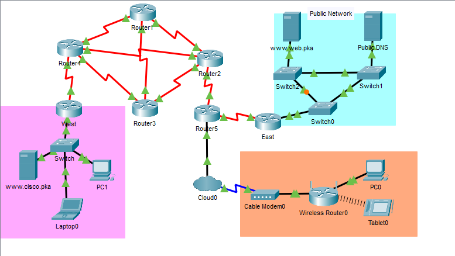

## Part 1: Verifying Connectivity

In this part, I verified that I could access the other networks from
devices on the Home Network. I clicked PC0, selected the Desktop tab and
opened the Web Browser.

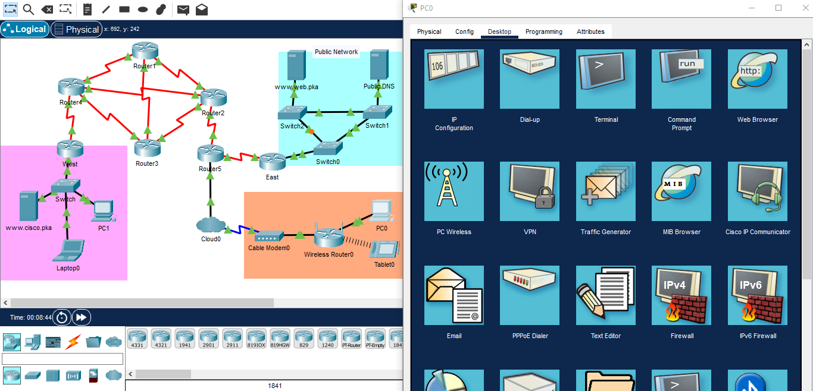

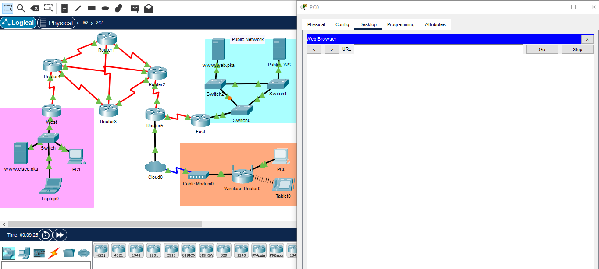
In the URL field, I entered www.cisco.pka since this was a simulated
environment.

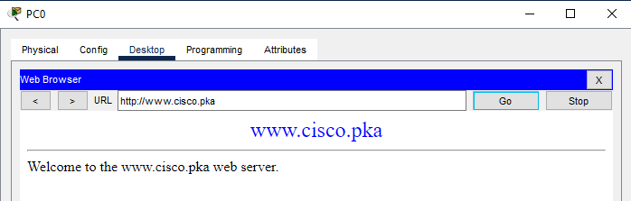

I repeated this for [www.web.pka.](http://www.web.pka.) I exited the
browser after verifying network connectivity.

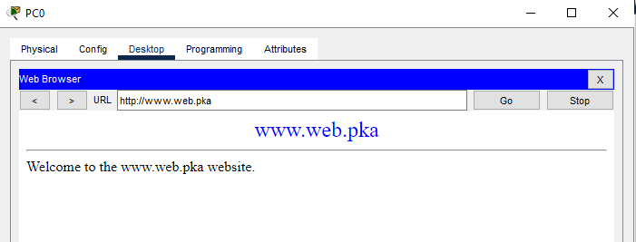

## Part 2: Remote LAN Network Topology
----

In this part, I will use the simulation mode in Packet Tracer to observe
how packets flow through a remote LAN network.

I switched to Simulation mode (Shift + S) and I clicked **Show
All/None** to clear all the selected event list filters.

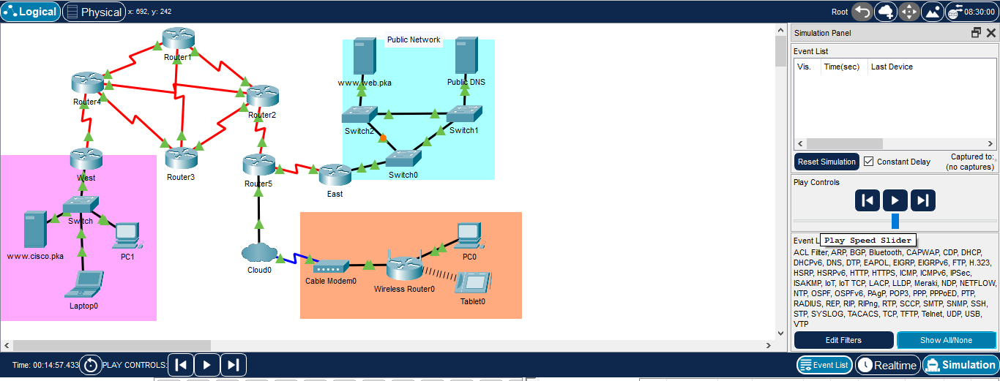

I clicked on **Edit Filters** and selected **DNS** under the IPv4 tab
and **HTTP** under **Misc** tab.

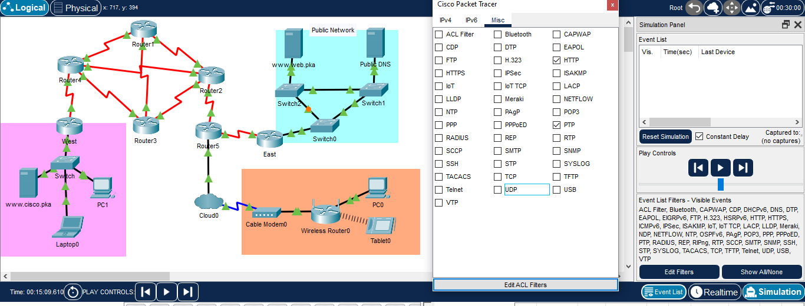

I navigated to the web browser on **PC0** and
visited **[www.web.pka.](http://www.web.pka.) I then captured the packet
path to resolve** **[www.web.pka](http://www.web.pka) to an IP address
as shown in the screenshots below.**

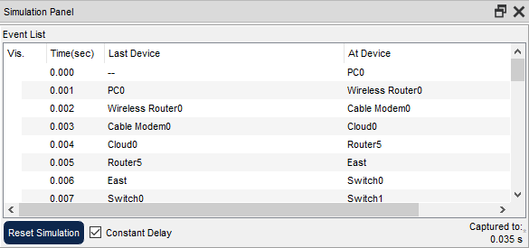

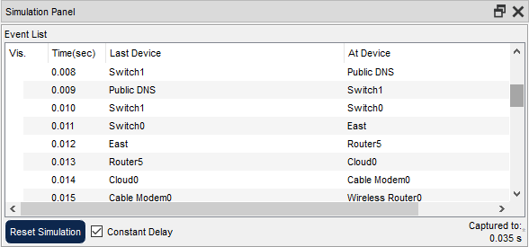

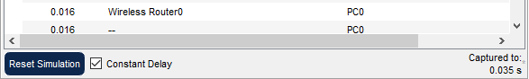

I forwarded until the webpage was displayed on PC0 to view the packet flow. After the IP address had been resolved, I followed the path it took HTTP packets travel to display the webpage? I recorded my observations below.

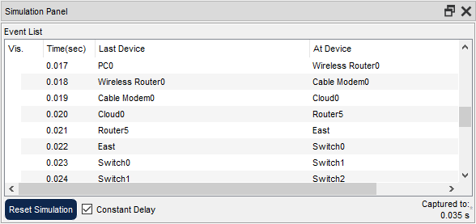
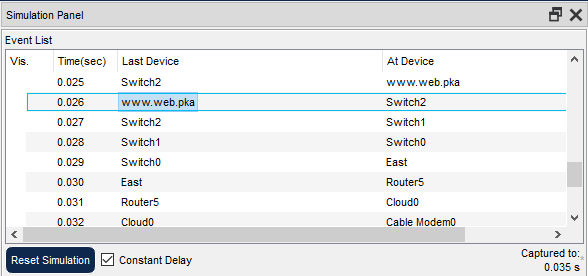
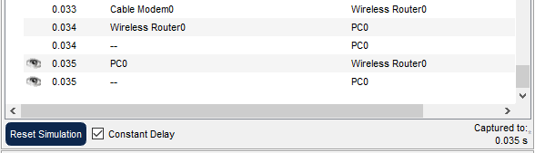

I then switched to Real time mode (Shift + R). Clicked the X icon in the
right tool panel to select the Delete tool and I removeed the link
between Switch0 and Switch 1 from the Public Network to simulate a
broken link.

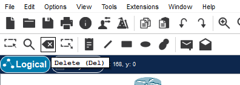

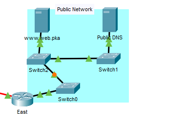

After 30 seconds, the network will learn of the broken link. I followed
the packet path and realized from the East router, the packet used the
path through Switch) to Switch2 then to Switch1 before the reaching the
Public DNS to resolve the IP.

I undid the deletion then I switched to Simulation mode (Shift + S).
Opened a web browser in **Tablet0** and navigated to **www.web.pka**. I
captured the packet path and it was almost the same as what I did earlie
but one thing I noticed was that, when the packet gets to router5 and
East, a duplicate or stray packet is received by the wireless Router 0
but it gets dropped after reaching tablet 0. The valid one continues its
journey through to the DNS server and back to Tablet0 successfully. With
a broken link in the LAN, the path changed just as observed earlier.

## Part 3: WAN Network Topology
---

### Step 1: PC0 to websites.

I switched to Real time mode (Shift + R) and I remove the link between
Router4 and Router2 from the topology to simulate an inaccessible path.
The routers are using Enhanced Interior Gateway Routing Protocol (EIGRP)
to dynamically adjust routing tables to account for the deleted link.

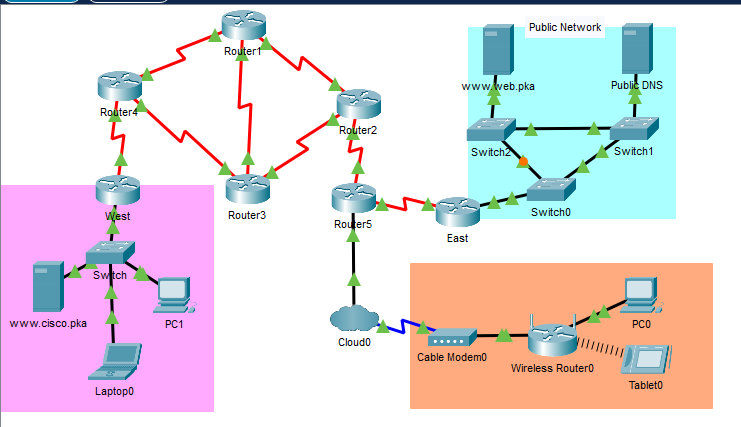

I switched back to Simulation mode (Shift + S), pened a web browser
in **Tablet0** and navigated
to [**www.cisco.pka**.](http://www.cisco.pka.) and observed the path
taken by the packet. I tried to make a visual illustration of the path.
See the screenshot below. I tried hahaha.

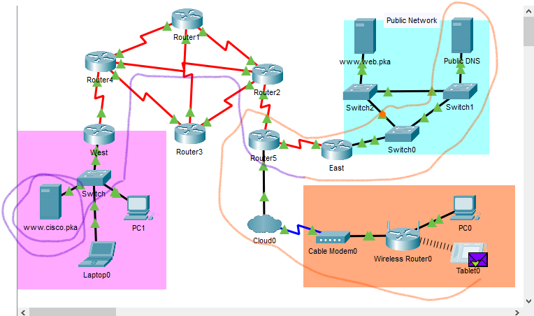

Note that from the DNS server, the packet was sent to the tablet after
learning the IP of [www.cisco.pka](http://www.cisco.pka) before from the
tablet again, the the packet went through the Wireless Router 0, through
Cable Modem0, Cloud0 and followed the path I indicated with the blue
line colour.

With a broken link in the WAN, thus between Router 4 and Router 2, I
recorded my observation of the path changed. See screenshots below

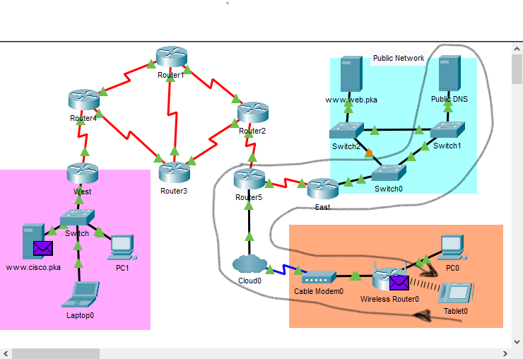

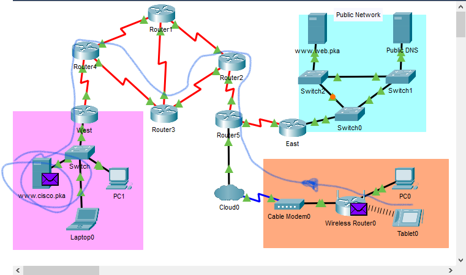

I switched to Real time mode (Shift + R).

### Step 2: PC1 to websites.

From PC1's command prompt, I entered **tracert www.web.pka** 

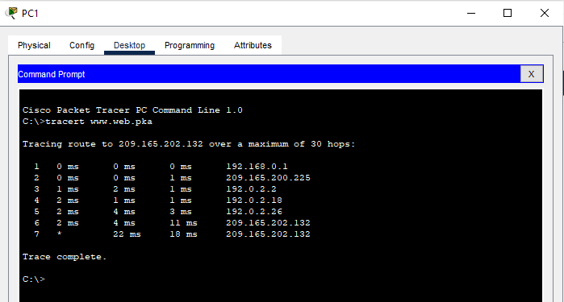

I then matched the IP addresses in the **tracert** results to the
devices in the topology. I hovered over the routers in the topology to
view the IP addresses of the interfaces on the routers.

| **Trace Number** | **Device**   | **Interface**        | **IP Address**                      |
|------------------|--------------|----------------------|-------------------------------------|
| 1                | West         | GigabitEthernet0/1   | 192.168.0.1                         |
| 2                | Router4      | Serial 0/0/1         | 209.165.200.225                     |
| 3                | Router3      | Serial 0/0/0         | 192.0.2.2                           |
| 4                | Router2      | Serial 0/0/1         | 192.0.2.18                          |
| 5                | Router5      | Serial 0/1/1         | 192.0.2.26                          |
| 6                | East         | Serial 0/0/0         | 209.165.202.132                     |
| 7                | www.web.pka  | NIC                  | 209.165.202.132 / 192.168.2.254     |

Network address translation (NAT) is used to translate the
private www.web.pka IP address of 192.168.2.254 to a routable IPv4
address of 209.165.202.132. In the tracert result, the first line of
IPv4 address of 209.165.202.132 is for the G0/1 interface of East. The
second line of IPv4 address of 209.165.202.132 displays the public IPv4
address of the web server.

I switched to Simulation mode (Shift + S), opened the web browser on PC1
and entered www.web.pka as the URL. Click **Go**. I then captured the
patch taken by packets to load the web page. I compared
the **tracert** results to the simulation results for the HTTP packets
and saw that it was the same path.
