# Packet Tracer Activity - Verify IPv4 and IPv6 Addressing

## Scenario

Dual-stack allows IPv4 and IPv6 to coexist on the same network. In this
activity, I investigated a dual stack implementation including
documenting the IPv4 and IPv6 configuration for end devices, testing
connectivity for both IPv4 and IPv6 using **ping**, and tracing the path
from end to end for IPv4 and IPv6. All done in the Cisco Packet Tracer.

## Objectives

- Part 1: Complete the Addressing Table Documentation

- Part 2: Test Connectivity Using Ping

- Part 3: Discover the Path by Tracing the Route

## Addressing Table

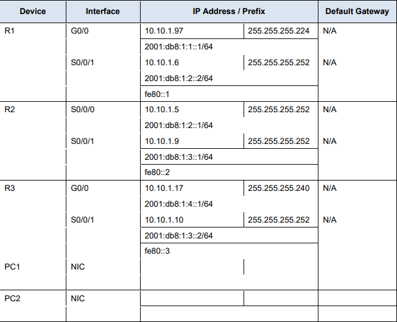

Using ipconfig to verify IPv4 addressing, I opened Command Prompt on PC1
and PC2 and entered the **ipconfig /all** command to collect the IPv4
information.

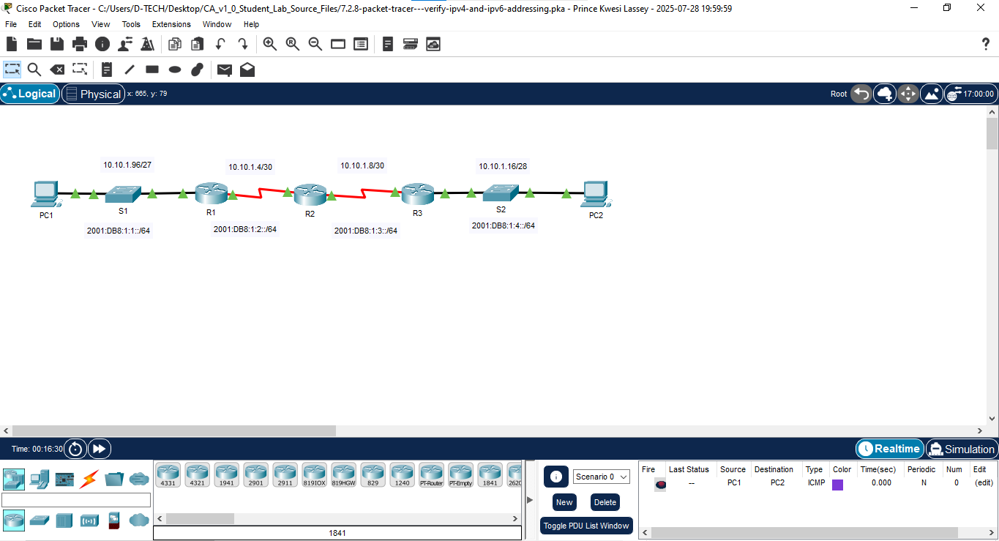

The topology represents a linear network with two PCs (PC1 and PC2)
connected through a series of switches (S1, S2) and routers (R1, R2,
R3). PC1 is connected to S1, which links to R1. The path continues
through R2 and R3, with S2 connecting R3 to PC2. The network uses IP
addresses in the 10.0.0.0 range and employs a `2001:DB8::/64` IPv6 subnet.

### PC1
- IPv4 address : 10.10.1.100

- Subnet mask: 255.255.255.224

- Default gateway: FE80::1

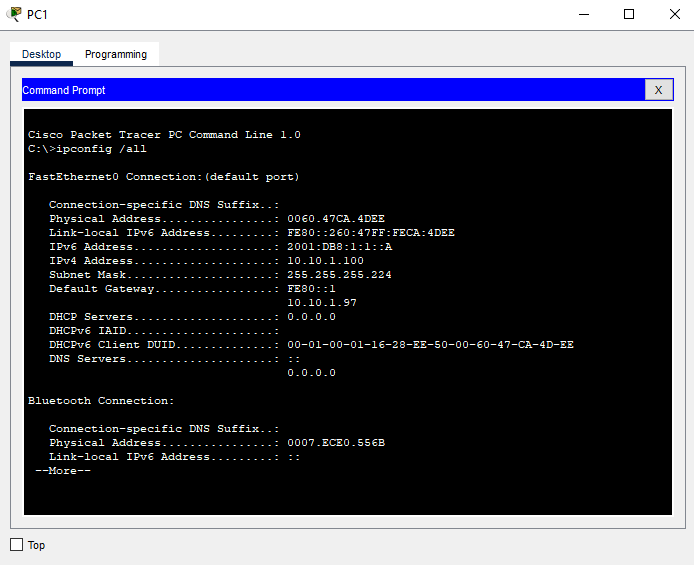

### PC2
- IPv4 address : 10.10.1.20

- Subnet mask: 255.255.255.240

- Default gateway: FE80::3

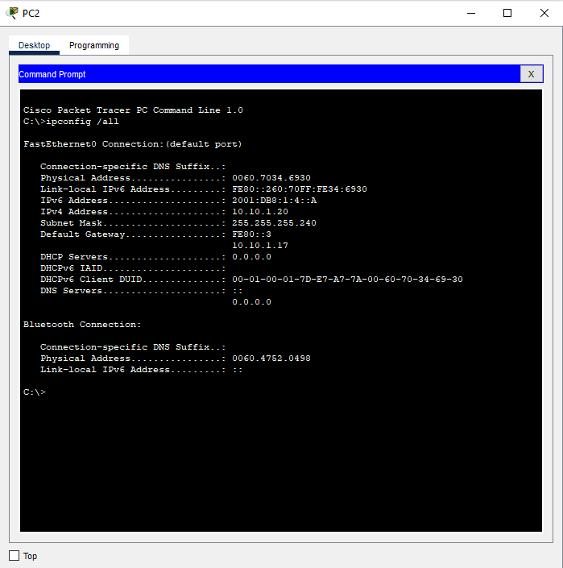

I then used ipv6config to verify IPv6 addressing. On PC1 and PC2, I
entered the **ipv6config /all** command to collect the IPv6
information.I then recorded the IPv6 address, subnet prefix, and default
gateway.

### PC1
- IPv6 address: 2001:DB8:1:1::A

- Subnet prefix:

- Default gateway: FE80::1

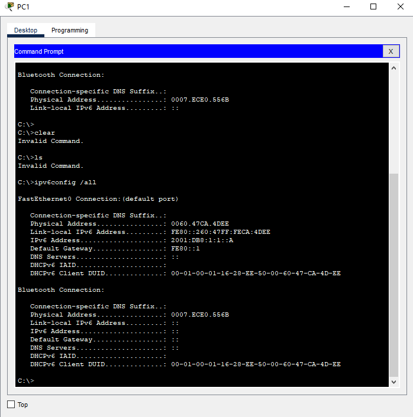

### PC2
- IPv6 address: 2001:DB8:1:4::A

- Subnet prefix:

- Default gateway: FE80::3

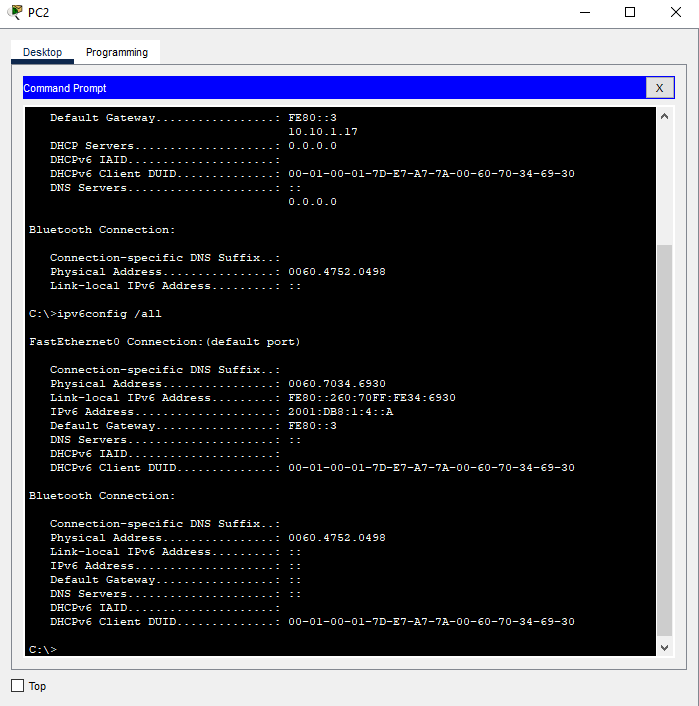

## Part 2: Test Connectivity Using Ping

I used ping to verify IPv4 connectivity. From PC1, I pinged the IPv4
address for PC2. The ping statistics showed a successful ping.

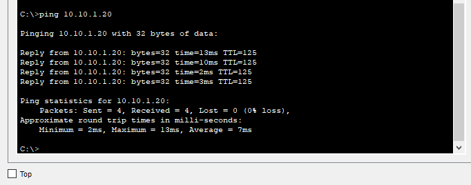

From PC2, I pinged the IPv4 address for PC1. The ping statistics showed
a successful ping.

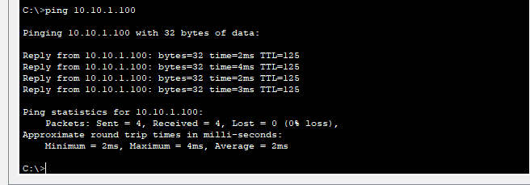

I went ahead to use ping to verify the IPv6 connectivity. From PC1, I
pinged the IPv6 address for PC2 and it showed success.

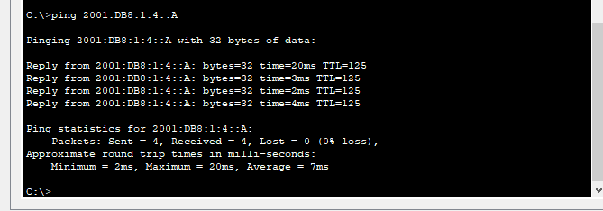

From PC2, I pinged the IPv6 address of PC1 and it was successful as
well.

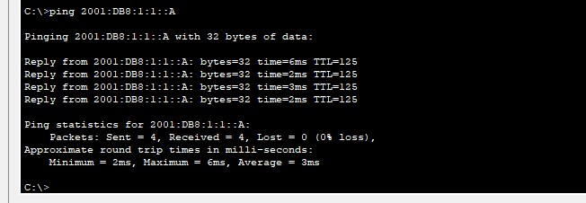

## Part 3: Discover the Path by Tracing the Route

Here, I used tracert to discover the IPv4 path. From PC1,I traced the
route to PC2 using the command **tracert 10.10.1.20**

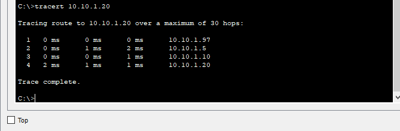

The addresses encountered along the path were :

- 10.10.1.97

- 10.10.1.5

- 10.10.1.10

Before finally reaching 10.10.1.20

From the addressing table, the four addresses are associated with the
interfaces:

- G0/0 on R1

- S0/0/0 on R2

- S0/0/1 on R3

- NIC

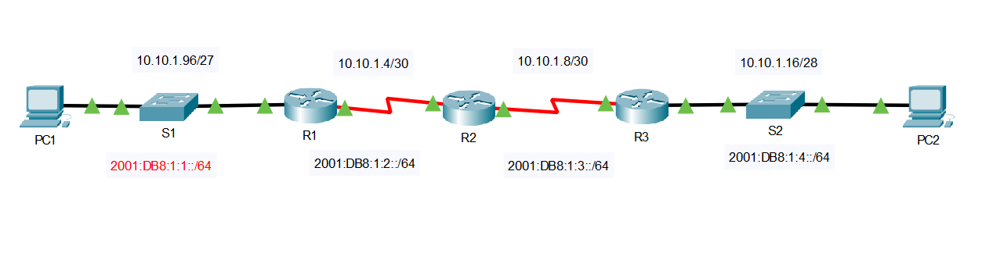

From PC2, I traced the route to PC1 as well.

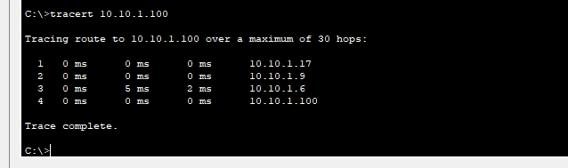

The addresses that were encountered along the path were:

- 10.10.1.17

- 10.10.1.9

- 10.10.1.6

And then finally 10.10.1.100

The interfaces with which the four addresses associated:

- G0/0 on R3

- S0/0/1 on R2

- S0/0/1 on R1

- NIC

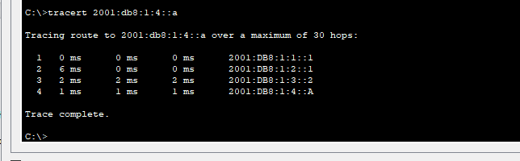

I moved on to using tracert to discover the IPv6 path. From PC1, I
traced the route to the IPv6 address for PC2 using the command **tracert
2001:db8:1:4::a**

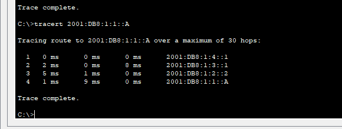

The addresses encountered along the path were :

- 2001:DB8:1:1::1

- 2001:DB8:1:2::1

- 2001:DB8:1:3::2

Before finally reaching 2001:DB8:1:4::A

The four addresses are associated with the interfaces:

- G0/0 on R1

- S0/0/0 on R2

- S0/0/1 on R3

- NIC

From PC2, I traced the route to the IPv6 address for PC1.

The addresses encountered along the path were :

- 2001:DB8:1:4::1

- 2001:DB8:1:3::1

- 2001:DB8:1:2::2

Before finally reaching 2001:DB8:1:1::A

The four addresses are associated with the interfaces:

- G0/0 on R3

- S0/0/1 on R2

- S0/0/1 on R1

- NIC

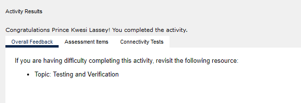
