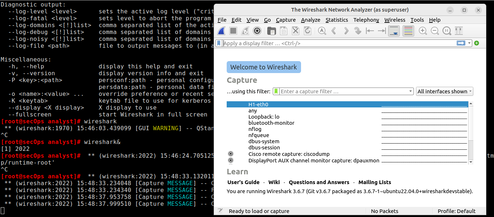

# Lab - Intro To Wireshark

## Mininet Topology

## Introduction

In this lab, a python script will be used to set up and configure the
devices shown in the figure above. I will then have access to four
hosts, a switch, and a router all inside the same VM. This will allow me to
simulate a variety of network protocols and services without having to
configure a physical network of devices.

## Objectives

- Part 1: Install and Verify the Mininet Topology

- Part 2: Capture and Analyze ICMP Data in Wireshark

## Part 1: Install and Verify the Mininet Topology

I started the mininet.

At the mininet prompt, I started terminal windows on hosts H1 and H2
using the commands 'xterm H1' and 'xterm H2'. This opened separate
windows for these hosts.

At the prompt on **Node: H1**, I entered **ip address** to verify the
IPv4 address and recorded the MAC address. I did same for **Node: H2**.

| **Host-interface**  | **IP Address**  | **MAC Address**     |
|-------------------- |---------------- |---------------------|
|  H1-eth0             | *10.0.0.11/24*  | *Ae:f5:c7:34:d3:11* |
|  H2-eth0             |*10.0.0.12/24*  | *7a:ed:a2:77:83:d9* |

## Part 2: Capture and Analyze ICMP Data in Wireshark

On **Node: H1**, I entered `wireshark&` to start Wireshark. In the
Wireshark window, under the **Capture** heading, I selected the
**H1-eth0** interface and started to capture data.

On **Node: H1**, I hit the Enter key to get a prompt. Then pinged H2
five times. I then navigated to the wireshark window to stop the
capture.

I then applied a filter for the icmp packets which I'm interested in.

Wireshark data is displayed in three sections: (notes)

-   The top section displays the list of PDU frames captured with a
    summary of the IP packet information listed.

-   The middle section lists PDU information for the frame selected in
    the top part of the screen and separates a captured PDU frame by its
    protocol layers.

-   The bottom section displays the raw data of each layer. The raw data
    is displayed in both hexadecimal and decimal form.

I clicked the first ICMP request PDU frame in the top section of
Wireshark. I noticed that the Source column has H1's IP address, and the
Destination column has H2's IP address. Also from the image below, I
realized yes, the source MAC was that for H1 and destination MAC was
that of H2 as recorded in the table earlier.

## Step 2: Examine the captured data on the remote LAN.

Here, I pinged remote hosts (hosts not on the LAN) and examined the
generated data from those pings. I then assessed what was different
about the captured data from the data examined in Part 1.

At the mininet prompt, I started terminal windows on hosts H4 and R1
using xterm H4 and xterm R1 respectively.

I then checked to record their IP and MAC addresses using the command ip
address in the terminal.

|**Host-interface**  | **IP Address**   |  **MAC Address**   |
| --------------------| ------------------ |---------------------|
| H4-eth0            |  *172.16.0.40/12*  | *8a:5b:b8:a2:c5:53* |
| R1-eth1          |    *10.0.0.1/24*    |  *8a:09:9a:93:c1:07* |
| R1-eth2           |   *172.16.0.1/12*   | *22:28:f8:a6:48:a3* |

I then opened the wireshark instance on H1 to ping H4 (a simulated
remote server)

I reviewed the captured data in Wireshark. I notice that the MAC address
pinged was for the R1-eth1 interface.

**Destination IP address:** 172.16.0.40 (R4)

**Destination MAC address:** *8a:09:9a:93:c1:07 (R1-eth2)*

To clean up all the processes that were used by Mininet, I used the
**sudo mn -c** command at the prompt.

## Reflection

When H1 pings H4, it first realizes that H4 is not on its local network
(10.0.0.0/24). Because of this, it forwards the packet to its default
gateway, which is the router R1 (10.0.0.1). At layer 3, the destination
IP remains H4's (172.16.0.40) but at layer 2, the destination MAC
becomes the MAC address of R1's-eth1 interface on the 10.0.0.0/24
network. The router then routes the packet to the correct network and
forwards it to H4 with the appropriate layer 2 details. This was why the
ping showed the destination MAC as R1's but the destination IP as H4's.
