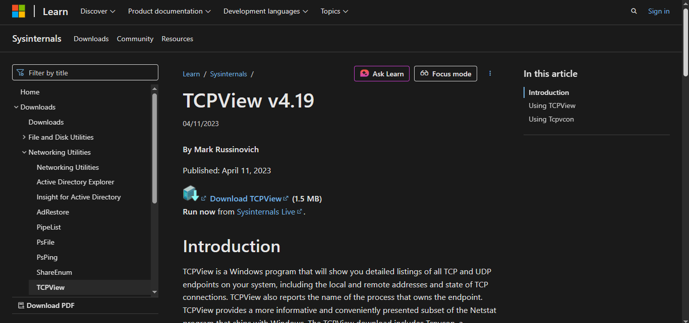
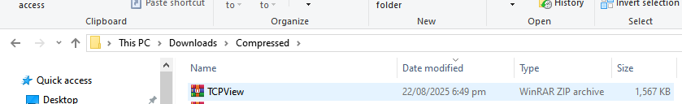
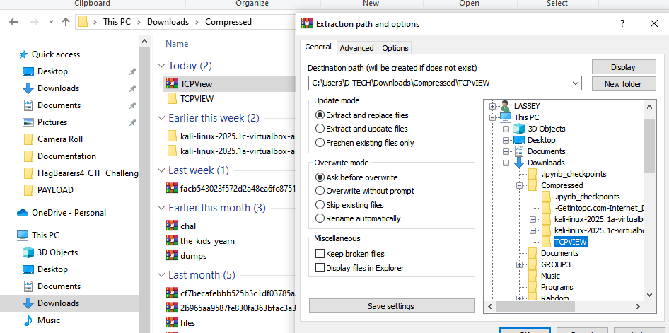
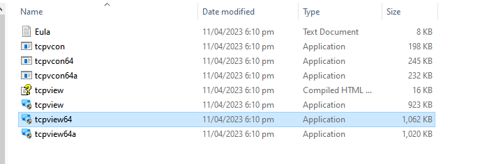
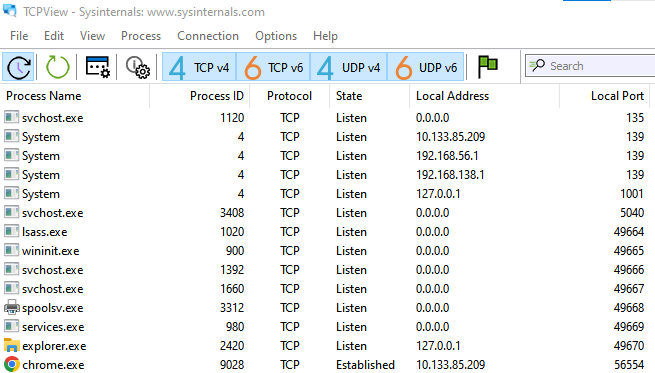

# Class Activity - What's going on?

## Objectives
---

Identify the processes running on a computer, the protocol they are
using, and their local and remote port addresses.

- Part 1: Download and install the TCPView software.

- Part 2: Answer the questions.

- Part 3: Use a browser and observe the TCPView window.

Background
---

For a hacker to establish a connection to a remote computer, a port must
be listening on that device. This may be due to infection by malware, or
a vulnerability in a legitimate piece of software. A utility, such as
TCPView, can be used to detect open ports, monitor them in real-time,
and close active ports and processes using them.

## Part 1: Download and install the TCPView software.
---

I used the link below to reach the download page for TCPView.

-   <http://technet.microsoft.com/en-us/sysinternals/tcpview.aspx>
  

Then I created a folder called TCPVIEW and exptracted the zip into it.

I then started the TCPView application.

## Part 2: Answer the questions.
---------------

### Questions:

- How many Endpoints are listed?

From here, I counted 148 endpoints listed. The endpoint is a unique
local socket thus, a combination of a Local address and a local port
that a process is using.

- How many are Listening?

29 of 148 endpoints were listening

- How many Endpoints are Established?

35 endpoints were in the established state which meant there was an active connection between my machine and a remote machine.

## PART 3: Use a browser and observe the TCPView window.

- When I first opened Microsoft Edge, in TCPView, I saw several endpoints already listed. Some were in the LISTENING state. A few were in other states like 
TIME_WAIT or CLOSE_WAIT from older connections. The window kept updating, and I noticed some entries flashing in different colors when new activity happened.

- When I browsed to Cisco.com,a number of new connections appeared in TCPView. These showed up with the browser process nam msedge.exe.
Most of them quickly went into the ESTABLISHED state, showing that my computer had successfully made TCP connections to Cisco's servers. 
I also saw multiple remote IP addresses and ports appear, because modern websites usually load resources like images from more than one server.

- When I closed the browser, the entries in TCPView started to disappear. Many of the connections changed to states like CLOSE_WAIT and TIME_WAIT before vanishing completely.
  Some lines flashed different colors while they were closing. After a while, only the original listening ports and background processes remained.

- What I think the colors mean:
  - Green means a new connection was just created.
  - Yellow means a connection is in the process of closing.
  - Red/Orange means a connection has been terminated or ended.

    Basically, the colors helped me see which connections were starting,
    active, or shutting down in real time.
