# Packet Tracer - Logging Network Activity

## Setup

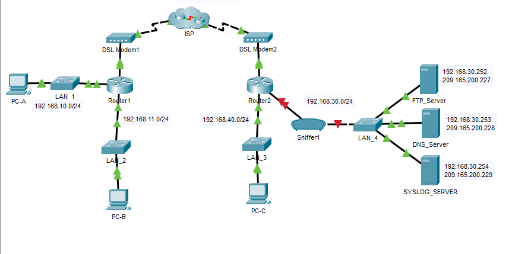
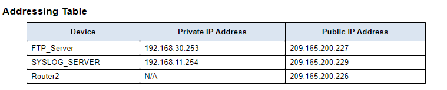

## Objectives

- Part 1: Create FTP traffic.

- Part 2: Investigate the FTP Traffic

- Part 3: View Syslog Messages

## Background

In this activity, I will use Packet Tracer to sniff and log network
traffic. I will view a security vulnerability in one network
application, and also view logged ICMP traffic with syslog.

---

## Part 1: Create FTP traffic

In this part, I clicked on the sniffer device Sniffer1, navigated to the
Physical tab and turned on the power to the sniffer.

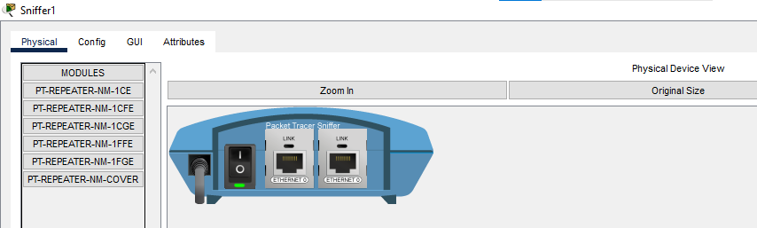

I then went to the GUI tab and turned the sniffer service on. The FTP
and syslog packets entering the sniffer from Router2 were then being
monitored.

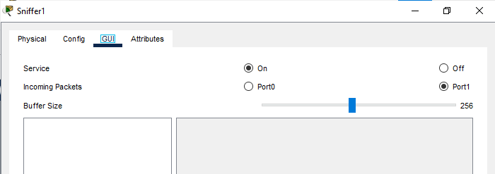

In order to remotely connect to the FTP server, I navigated to the
desktop on PC-B and opened Command Prompt. From the command prompt, I
opened an FTP session with **FTP\_SERVER** using its public IP address.

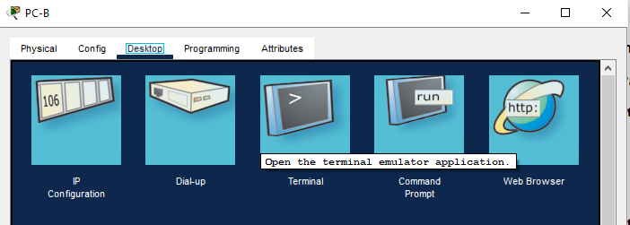

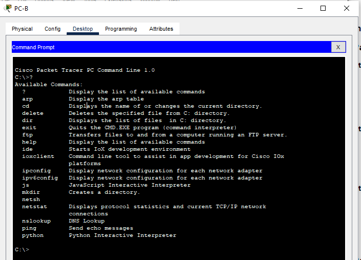

I entered the username of cisco and password of cisco to authenticate
with the FTP_Server.

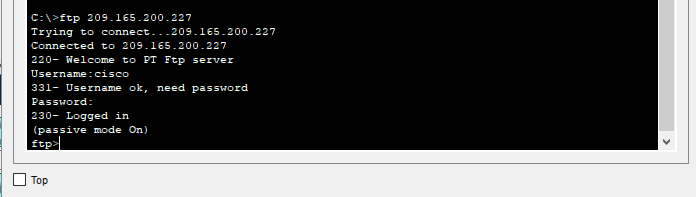

At the ftp\> prompt, I entered the command **dir** to view the current
files stored on the remote FTP server. I then uploaded the
clientinfo.txt file to the FTP server by entering the command **put
clientinfo.txt.**

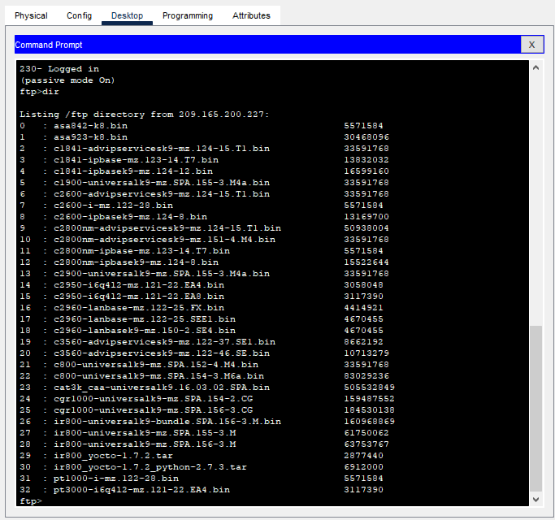

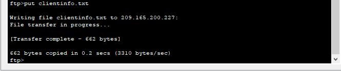

At the ftp\> prompt, I entered the command **dir** to verify that the
**clientinfo.txt** file is now on the FTP server. After verifying, I
entered **quit** at the FTP prompt to close the session.

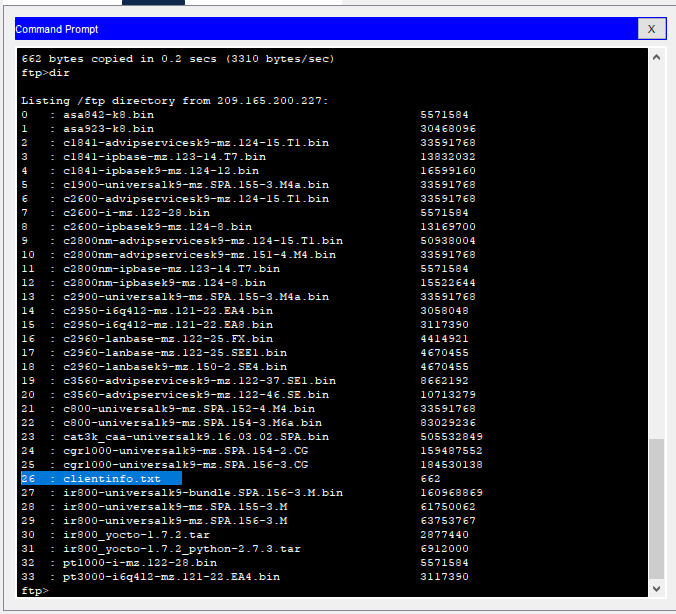

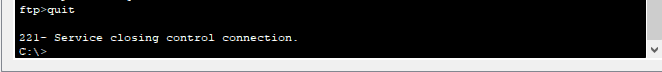

---

## Part 2: Investigate the FTP Traffic

I clicked the Sniffer1 device and navigated to the GUI tab. I then
clicked through some of the first FTP packets in the session.

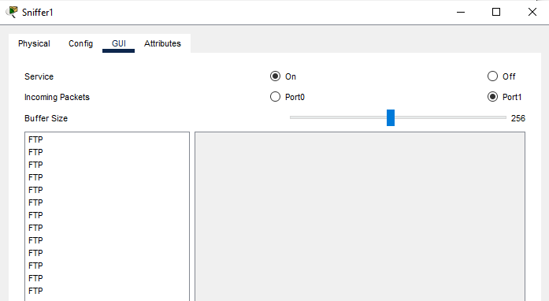

I scrolled down to view the application layer protocol information in
the packet details for each.

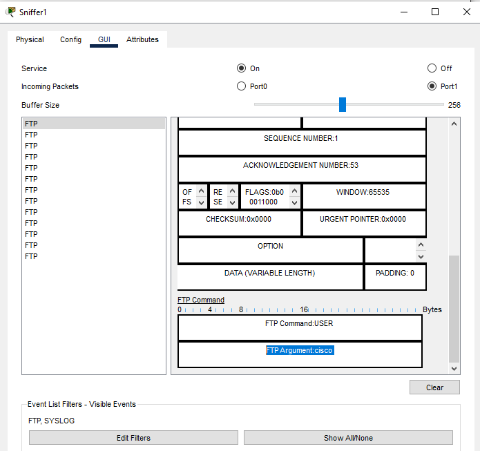

I realized a big security vulnerability presented by FTP. I could see
sniffed data in clear text just as you see in the screenshot above. The
username and password, \`cisco\` was captued in plain text. Since
there's no encryption of this data, it means anyone running a packet
sniffer on the same network can intercept and read this information.
This makes FTP vulnerable.

To mitigate this vulnerability,the FTP server must be replaced with a
secure alternative such as SFTP (over SSH) or FTPS (FTP over TLS), which
encrypts the session and protects data in transit. But even before SFTP
and FTPS, SCP (Secure Copy) can also be leveraged upon. I remember when
our group worked on a task with regards to **network security** during the
**CyBlack Cybersecurity Bootcamp** and while I presented our task solution,
our facilitator asked, `"apart from SFTP and FTPS, what other secure
protocol can be used for file sharing?"` That was where she advised us
that, **SCP** can also be used which is for quick direct file transfers and
runs on the same port as FTP. ALternatively, traffic from the FTP server
could be tunneled through a VPN if a full replacement can't be done.

---

## Part 3: View syslog Messages

Here, I needed to remotely connect to Router2. From the PC-B command
line, I telnet to Router2 using the username **ADMIN** and password **CISCO**
for authentication.

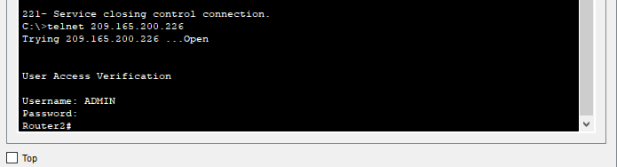

At the router prompt, I entered **debug ip icmp** and closed the Telnet
session afterwards.

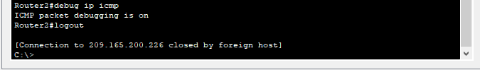

I then generated and viewed the syslog Messages. On the SYSLOG_SERVER
device, I navigated to the Services tab. I then clicked the SYSLOG
service to verify that the service was on. Syslog messages will appear
there. (I mean on the interface seen below)

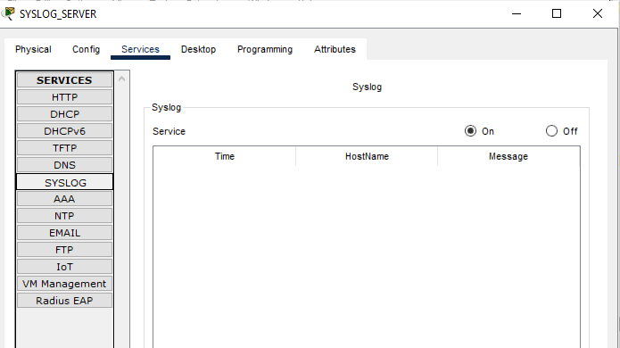

In the Command Prompt of PC-B, I pinged Router2. I did same from PC-A to
the Router2 as well.

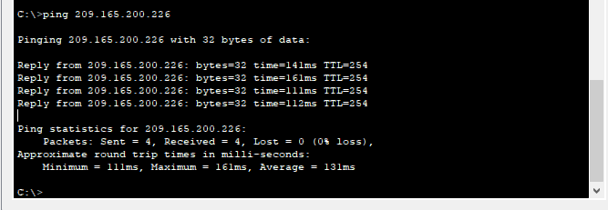

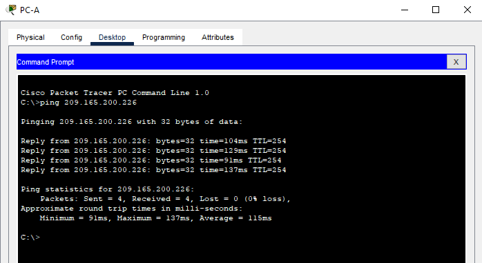

On the syslog server, I investigated the logged messages. There was four
messages from PC-A and four from PC-B as seen in the screenshot below.

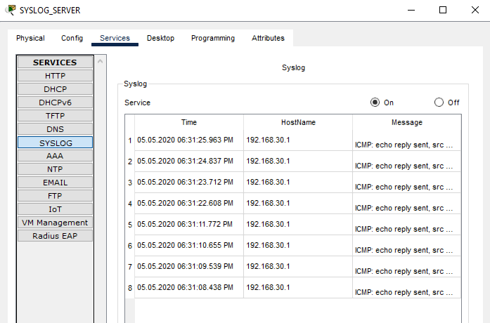

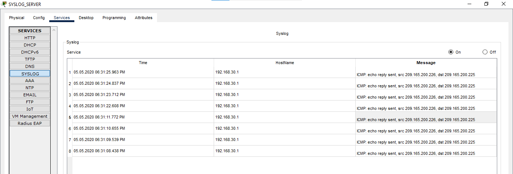

Can you tell which echo replies are for PC-A and PC-B from the
destination addresses? Explain.

So in answering the question above, let me put down the screenshot below
before continuing.

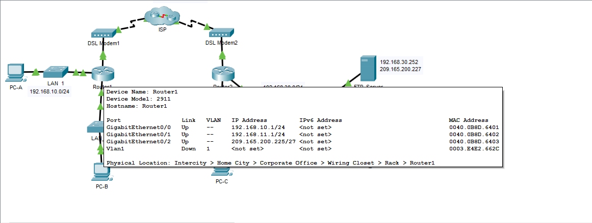

So, PC-A and PC-B are inside behind Router1 and therefore when they ping
Router2's public IP, Router1 translates each host's source to Router1's
outside IP which is `209.165.200.225`. Router2 then sees both echo
requests as coming from `.225`, and sends echo replies back to `.225`.When
the replies get to Router1, it uses NAT to give Ceasar what belongs to
him :) Haha.. I wish I could add smiling emojies but I'm typing with the
laptop. So here I just mean the replies for PC-A and PC-B is sent
accordingly.

A ping to Router2 from PC-C will have the destination address for PC-C
(LAN address) because PC-C is on Router2's side and there would be no
need for NAT through Router1.

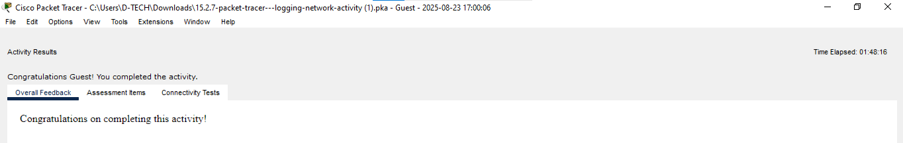
