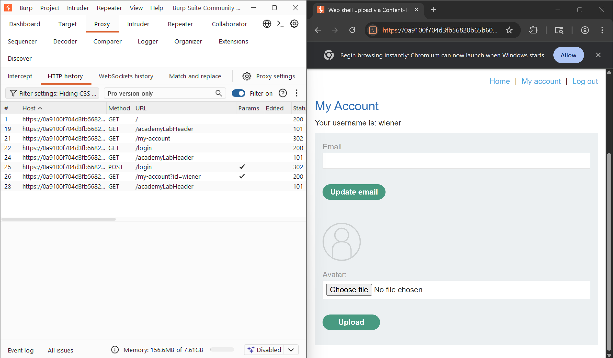
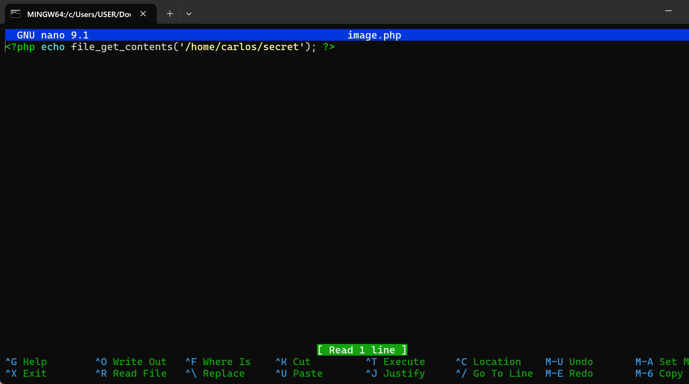
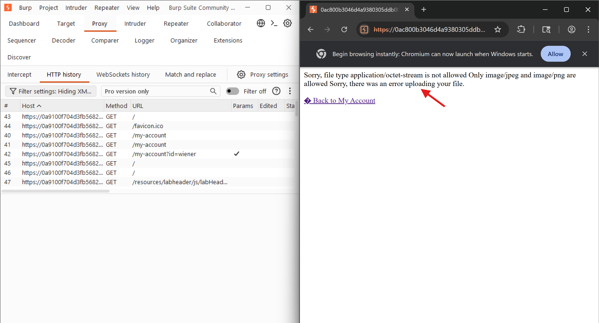
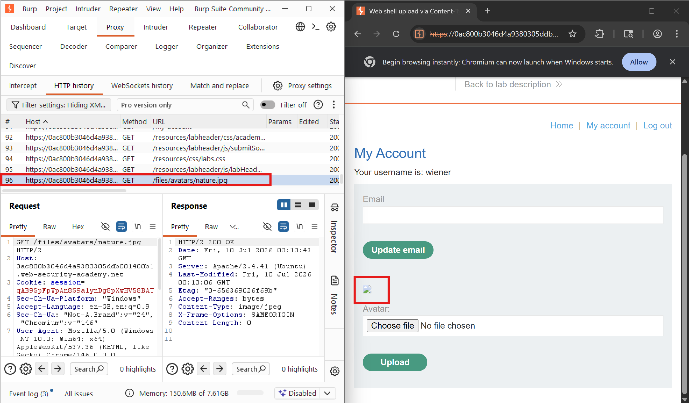
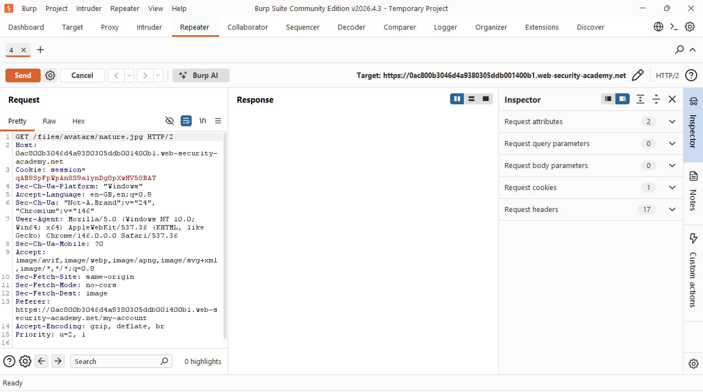
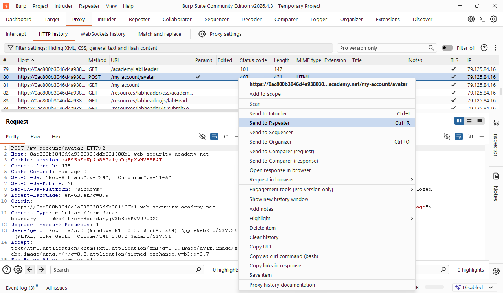
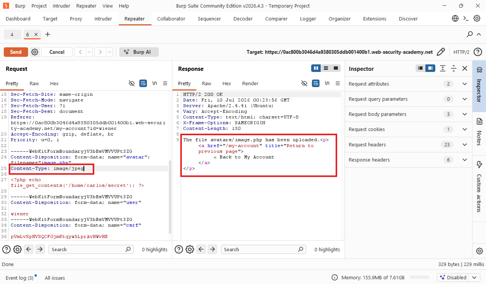
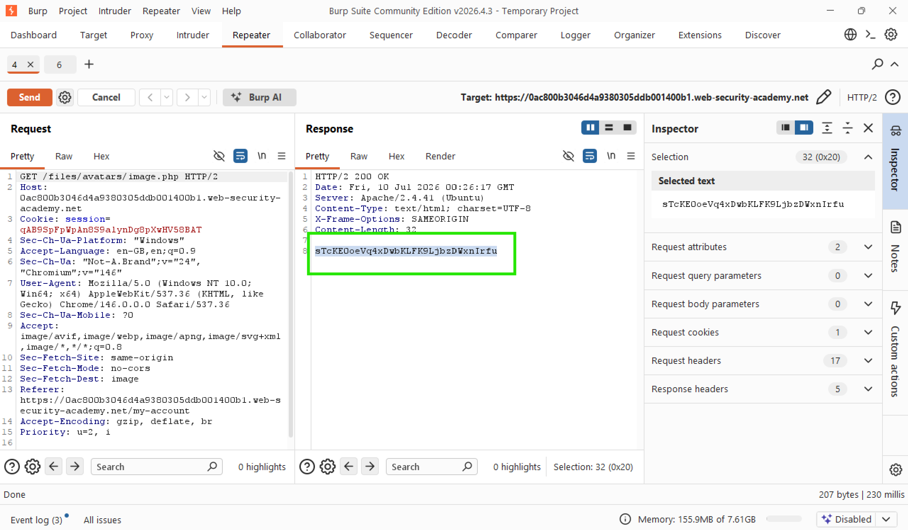
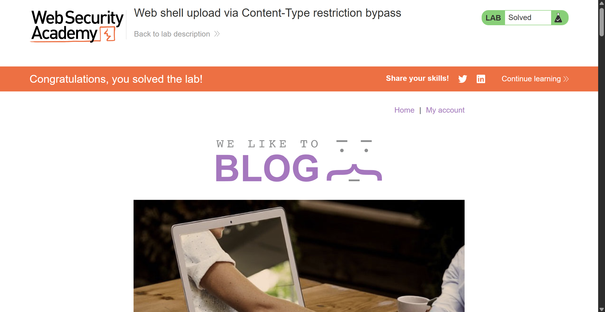

# Lab: Web shell upload via Content-Type restriction bypass

## Scenario

This lab contains a vulnerable image upload function. It attempts to
prevent users from uploading unexpected file types, but relies on
checking user-controllable input to verify this.

## Objective

To solve the lab, I will upload a PHP web shell and use it to exfiltrate
the contents of the file `/home/carlos/secret` and will submit the
secret using the button provided in the lab banner.

## Tools

- Burpsuite

## Methodology

I started burp, accessed the lab and logged in as `wiener`.

Afterward I created the php web shell intended to exfiltrate the
contents of the secret file within carlos' home directory. I named it
`image.php`

I then tried to upload the script but was met with an error saying only
`jpeg` and `png` filetypes were allowed.

Now, I will upload an image and send the request to repeater

Then, I went back to the proxy history and found the `POST
/my-account/avatar` request that was used to submit the php file and I
sent that as well to Burp Repeater.

With both requests in Burp repeater, I navigated to the tab containing
the POST /my-account/avatar request where I changed the Content-type
from `application/octet-stream` to `image/jpeg`. I then sent the request and
now got the feedback that the script was successfully uploaded. This
clearly shows that although there was a mechanism put in place thus
content type restriction, I was still able to bypass it since it had a
flaw.

On the other Repeater tab containing the `GET
/files/avatars/nature.jpg` request, I swapped out `nature.jpg` for
`image.php`, sent the request and observed the response showing that the
script executed successfully.

I then uploaded the secret for the lab

## Reflection

One way that websites may attempt to validate file uploads is to check
that this input-specific Content-Type header matches an expected MIME
type. Problems can arise when the value of this header is implicitly
trusted by the server such as the scenario solved in this lab. If no
further validation is performed to check whether the contents of the
file actually match the supposed MIME type, this defense can be easily
bypassed using tools like Burp Repeater.
