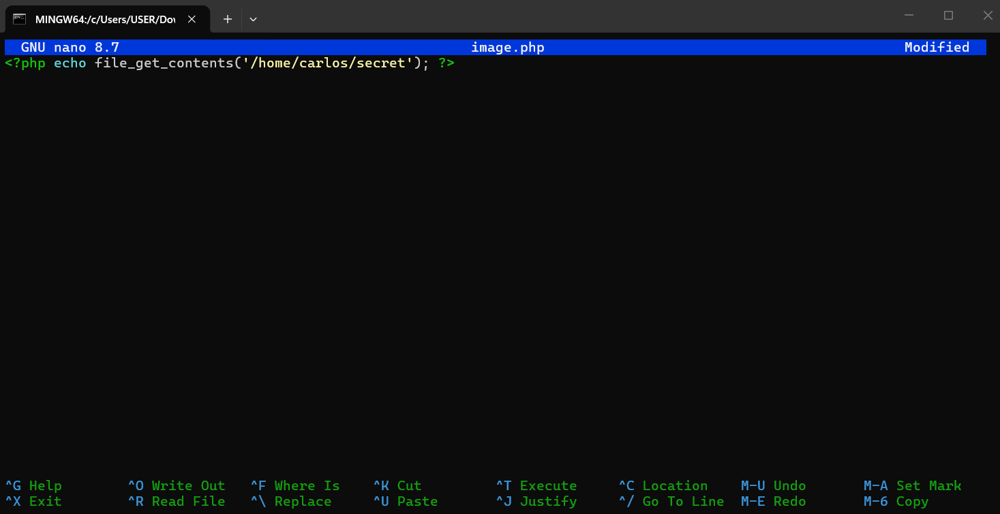
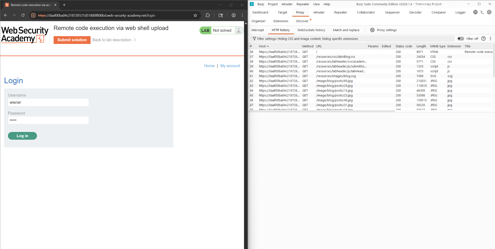
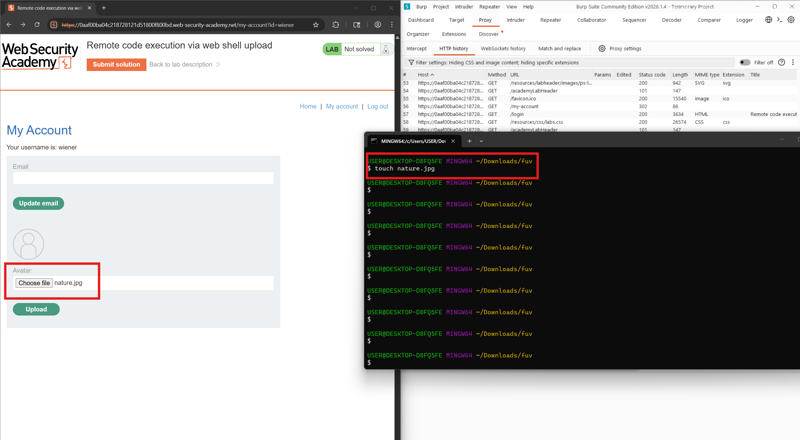
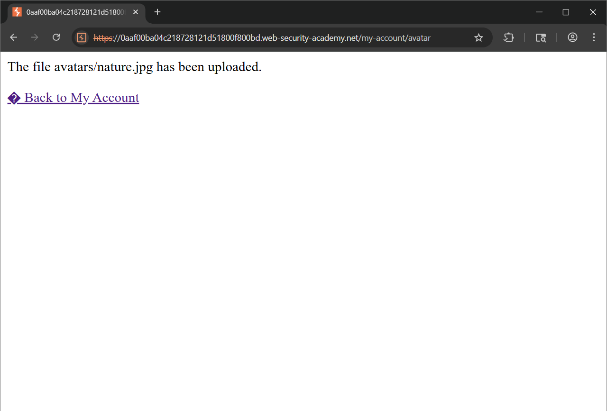
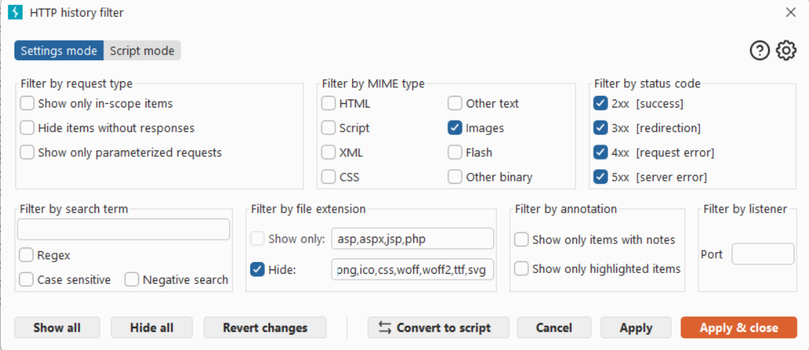
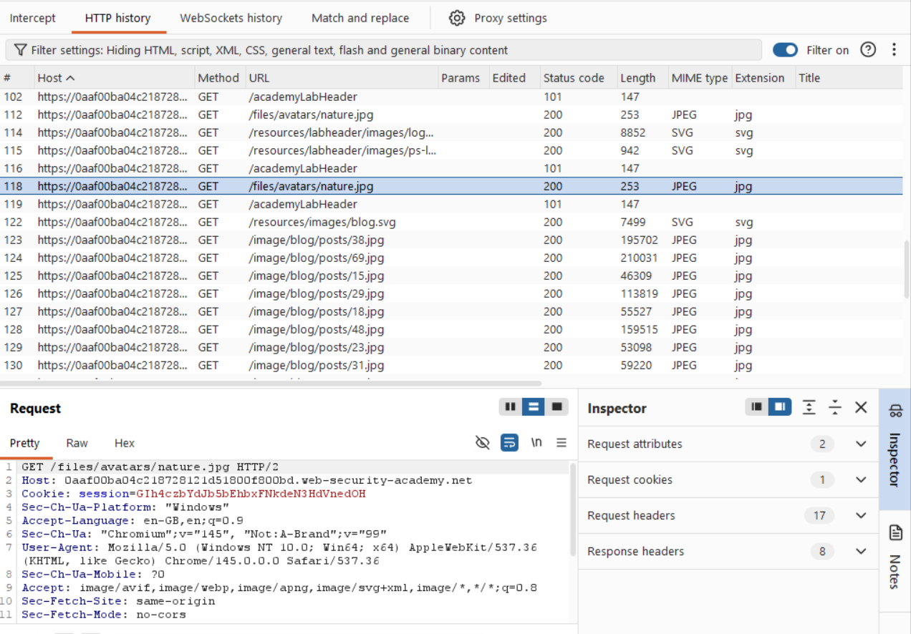
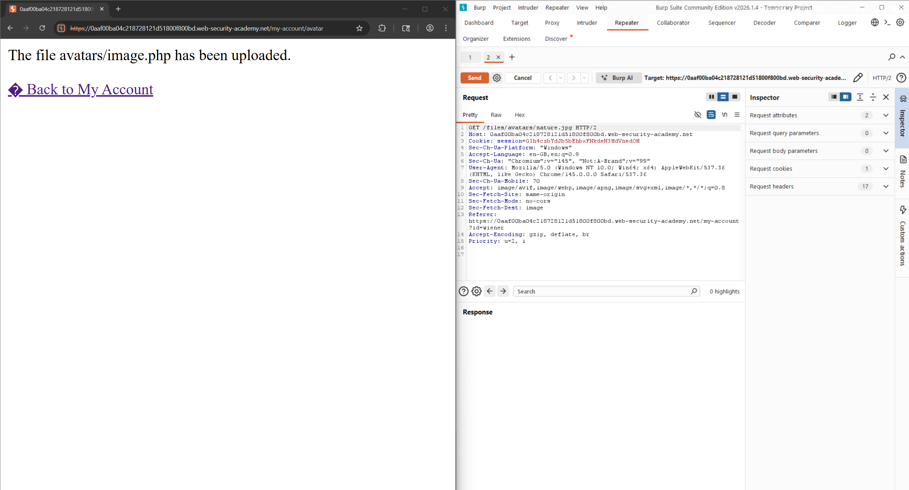
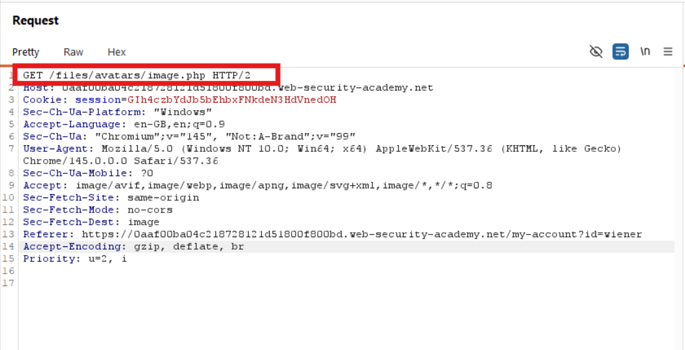
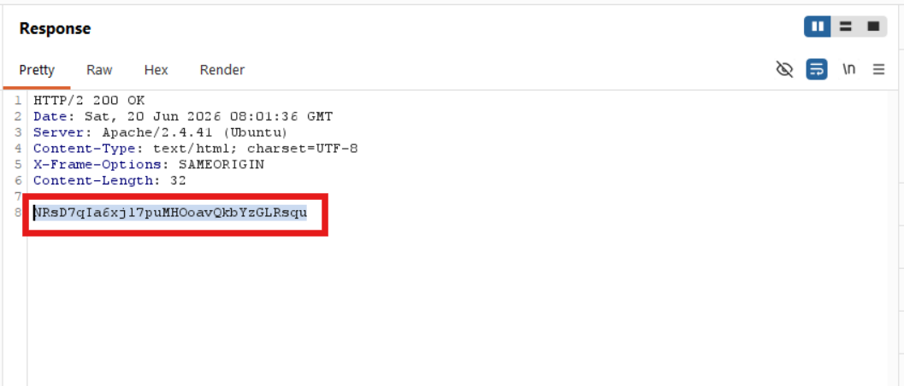
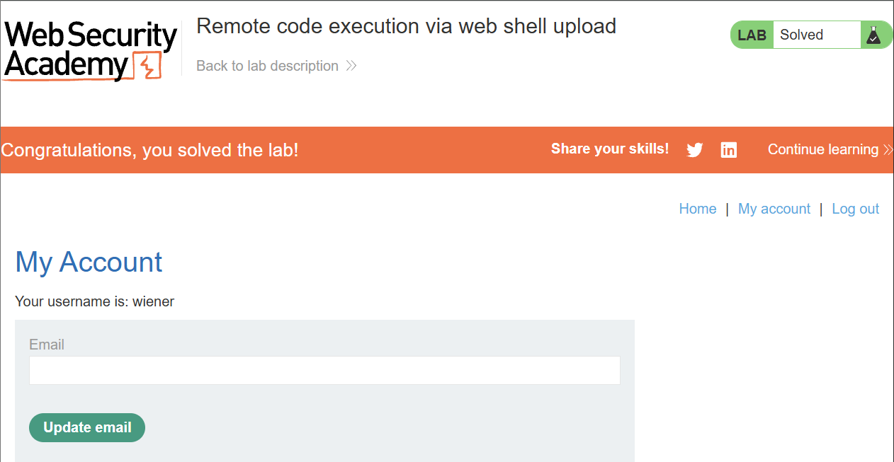

# Lab: Remote code execution via web shell upload

## Objectives

To solve the lab, upload a basic PHP web shell and use it to exfiltrate
the contents of the file **/home/carlos/secret.** Submit this secret
using the button provided in the lab banner.

You can log in to your own account using the following
credentials: wiener:peter

## Background

This lab contains a vulnerable image upload function. It doesn't
perform any validation on the files users upload before storing them on
the server's filesystem.

## Tools Used

- Kali Linux

- Burpsuite

## Methodology

I started by creating the php web shell which will help me fetch the
contents of /home/carlos/secret.

While proxying traffic through Burp, I logged in to the wiener account
to upload an image

I then created an arbitrary image, uploaded it and returned to the
account page.

After a successful upload, I fitered the http history in Burp by MIME
type

In the proxy history, I noticed that my image was fetched using
a GET request to /files/avatars/nature.jpg

I then sent it to repeater and used the avatar upload function to upload
the malicious PHP file.

In Burp repeater, I changed the path of the GET request to point to the
PHP file then I submitted the request

## Results

I noticed that the server had executed my script and returned its output
(Carlos's secret) in the response. I then submitted the secret to solve
the lab.

## Reflection

Through this lab, I was able to exploit unrestricted file uploads to
deploy a web shell.
