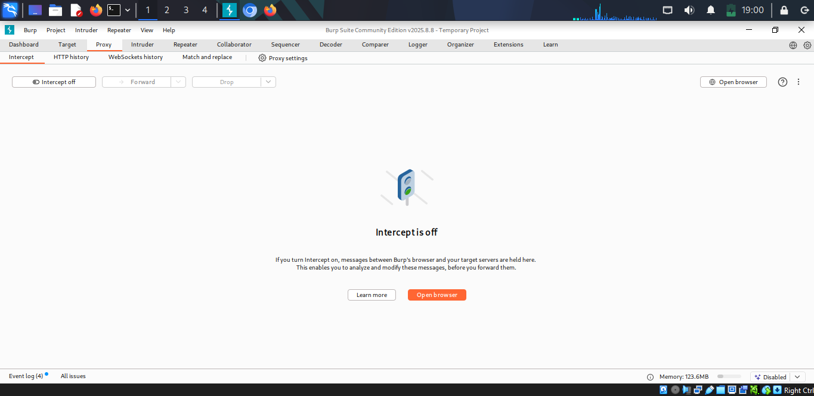
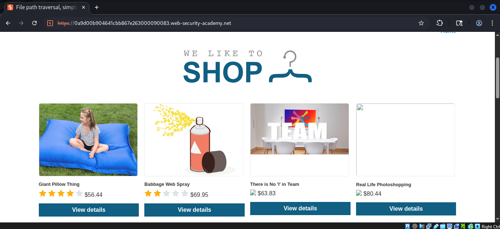
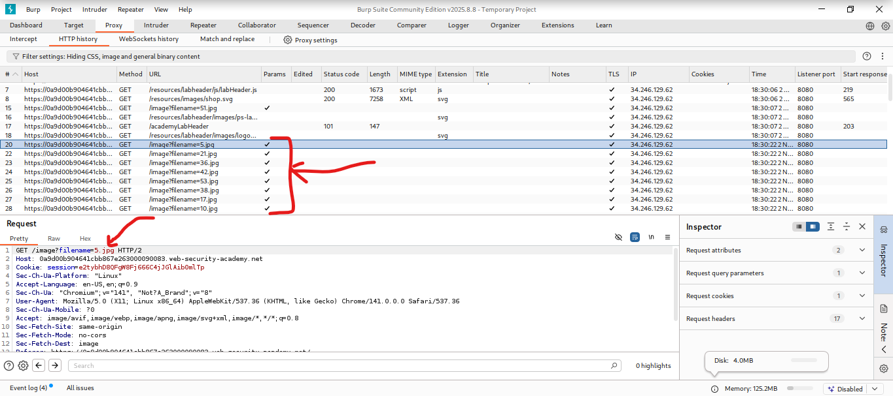
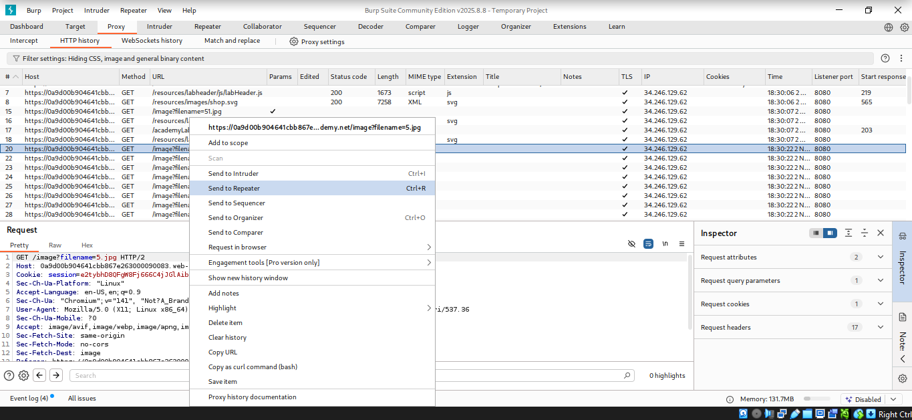
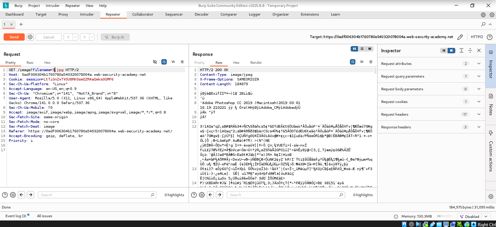
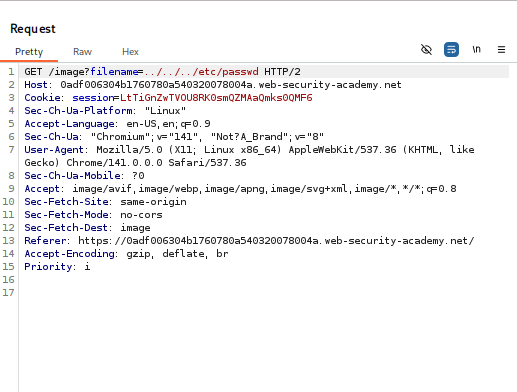
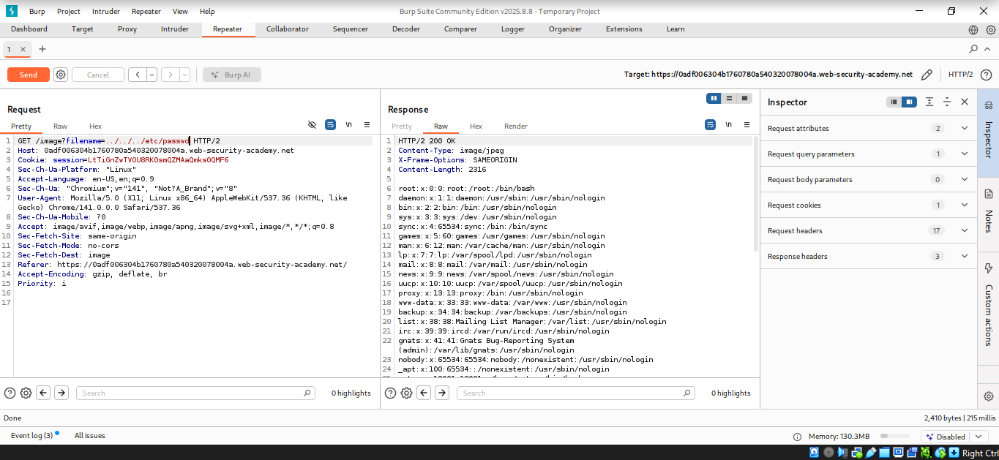

# Lab: File path traversal, simple case

## Objectives
To retrieve the contents of the /etc/passwd file.

## Background
This lab contains a path traversal vulnerability in the display of
product images.

## Tools Used
- Kali Linux VM
- Burpsuite

## Methodology
I opened Burpsuite to intercept the requests with its built in browser.

I started the lab by navigating to `https://0a9d00b904641cbb867e263000090083.web-security-academy.net/`
which has the file path traversal vulnerability.

From the intercepted requests, I realized that the site loaded quite a
number of images which perhaps are are stored on disk in the location
/var/www/images/.

I forwarded the request to repeater to observe the result.

The response had a 200 OK HTTP status code which was a clear indication
that the image loaded succesfully.

Now, I exploited the path traversal vulnerability by modifying the
request that fetches the product image from 5.jpg to `../../../etc/passwd`
causing the application to read from the
`/var/www/images/../../../etc/passwd` file path.

## Results
I succesfully dumped the contents of the etc/passwd file.

## Reflection
Through this lab, I was able to read arbitrary files on a server running
an application via path traversal. Solved! On to the next.
