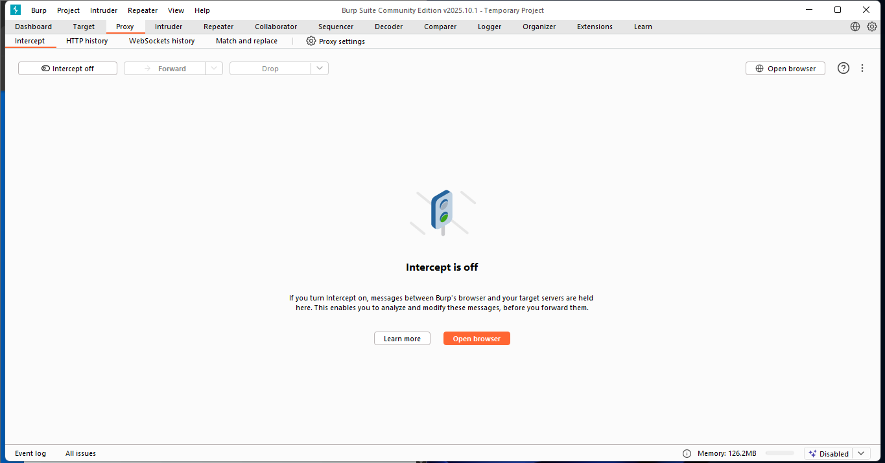
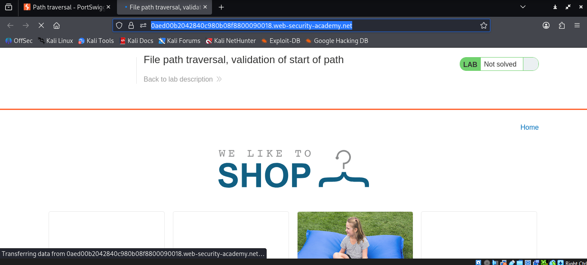
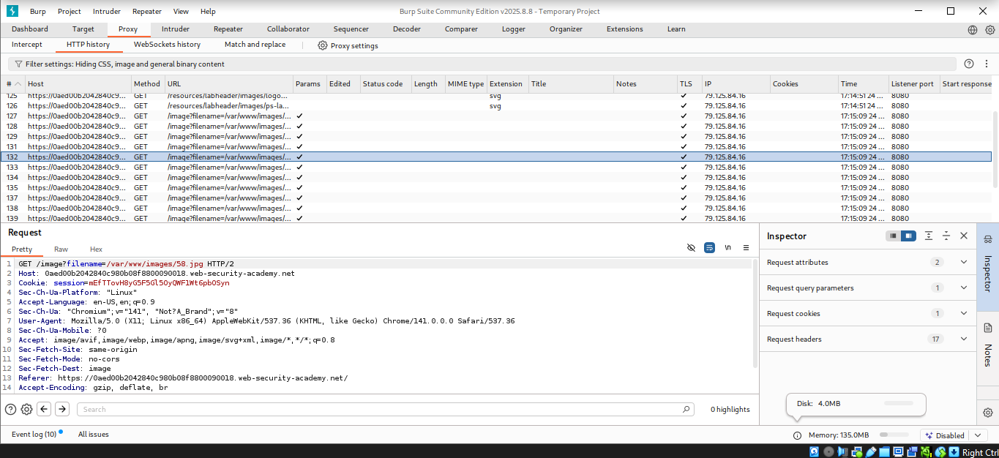
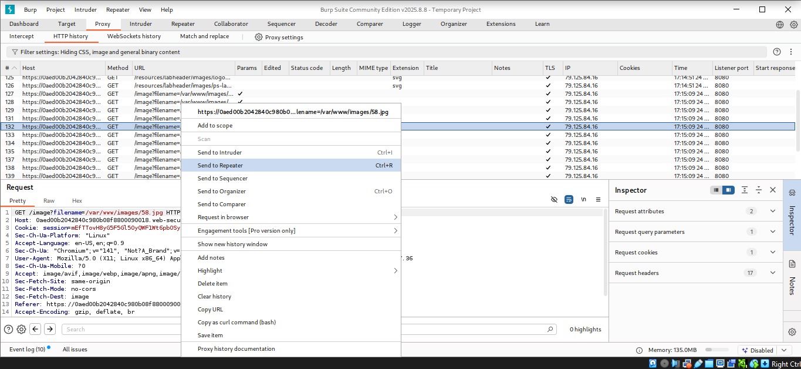
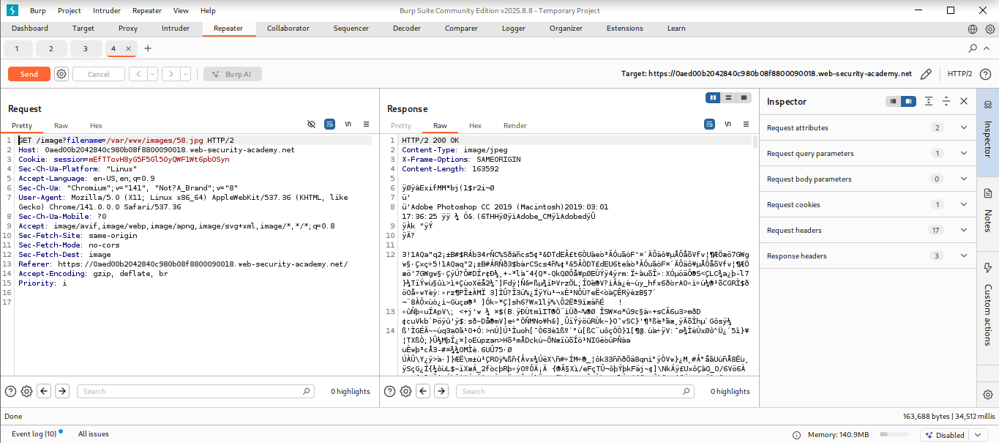
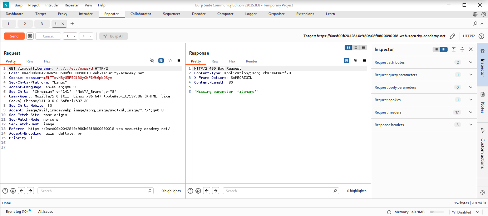
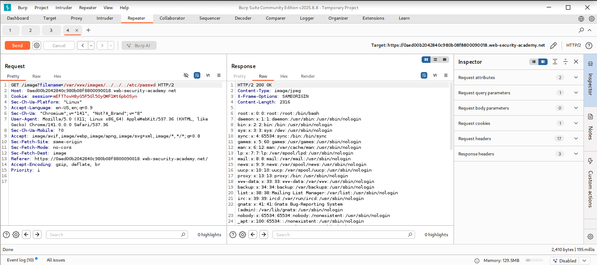

# Lab: File path traversal, validation of start of path

## Objectives
To solve the lab, retrieve the contents of the /etc/passwd file.

## Background

This lab contains a path traversal vulnerability in the display of
product images. The application transmits the full file path via a
request parameter, and validates that the supplied path starts with the
expected folder.

## Tools Used
- Kali Linux
- Burpsuite

## Methodology
I opened Burpsuite to intercept the requests with its built in browser.

I started the lab by navigating to `https://0aed00b2042840c980b08f8800090018.web-security-academy.net/`
which has the file path traversal vulnerability with the application
validating that the supplied requests path starts with the expected
folder.

From the intercepted requests, I realized that the site loaded quite a
number of images which are are stored on disk in the location
/var/www/images/.

I forwarded the request to repeater to observe the result.

The response had a 200 OK HTTP status code which was a clear indication
that the image loaded succesfully.

Now, I tried to exploit the path traversal vulnerability by modifying
the request that fetches the product image from **/var/www/images/58.jpg**
to **../../../etc/passwd** to observe what happens when the absolute path is
included.

After confirming that the application blocks input with traversal
sequences, I then specified the path /var/www/images/ with path
traversal sequences to get out of the specified folder and further
exploit its vulnerabilities.

## Results
I succesfully dumped the contents of the etc/passwd file.

## Reflection
Through this lab, I was able to read arbitrary files on a server running
an application via path traversal although the application blocks
traversal sequences. I noticed that the application transmited the full
file path via a request parameter, and validated that the supplied path
started with the expected folder. Through that, I exploited its
vulnerabilities. Solved! On to the next.
