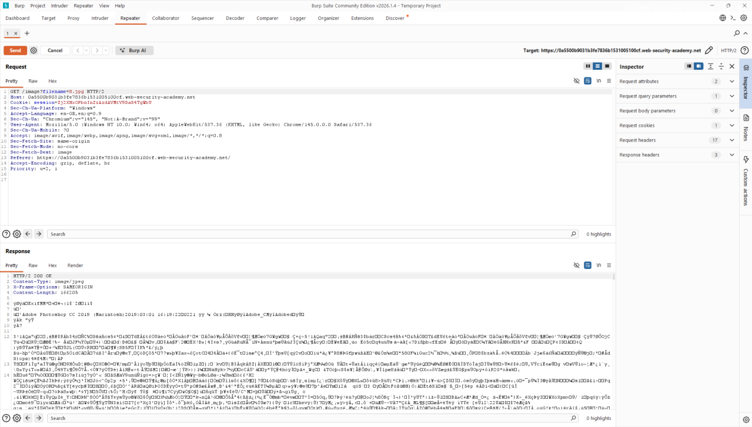
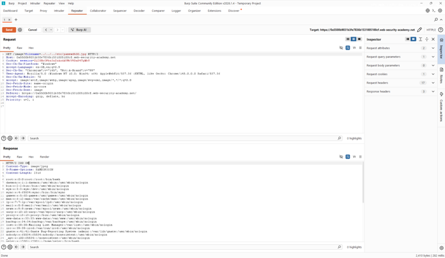

# Lab: File path traversal, validation of file extension with null byte bypass

## Objectives
To solve the lab, retrieve the contents of the /etc/passwd file.

## Background

This lab contains a path traversal vulnerability in the display of
product images. The application transmits the full file path via a
request parameter, and validates that the supplied path starts with the
expected folder.

## Tools Used
- Kali Linux
- Burpsuite

## Methodology
I opened Burpsuite to intercept the requests with its built in browser then I started the lab by navigating to `https://0aed00b2042840c980b08f8800090018.web-security-academy.net/` which has the file path traversal validation of file extension with null byte bypass vulnerability 

From the intercepted requests, I realized that the site loaded quite a
number of images. I forwarded the request to repeater to observe the result.

The response had a 200 OK HTTP status code which was a clear indication
that the image loaded succesfully.

Now, I tried to exploit the path traversal vulnerability by modifying
the request that fetches the product image from **8.jpg**
to **../../../etc/passwd%00.jpg** to observe what happens when I use a file extension with null byte bypass

## Results
I successfully dumped the contents of the etc/passwd file.

## Reflection
Through this lab, I was able to read arbitrary files on a server running
an application via path traversal although the application blocks
traversal sequences. I noticed that the application transmited the full
file path via a request parameter, and validated file path traversal using file extension with null byte bypass to exploit vulnerabilities. Solved!
