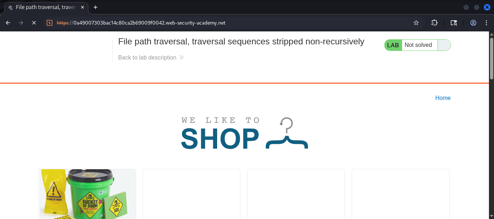
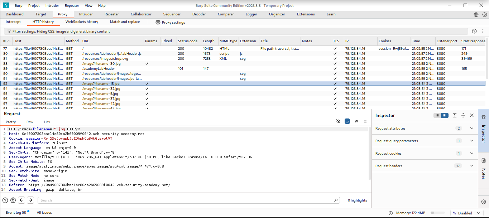
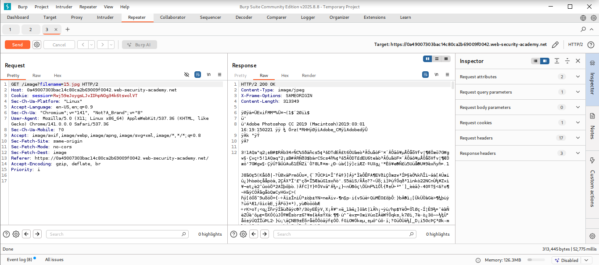
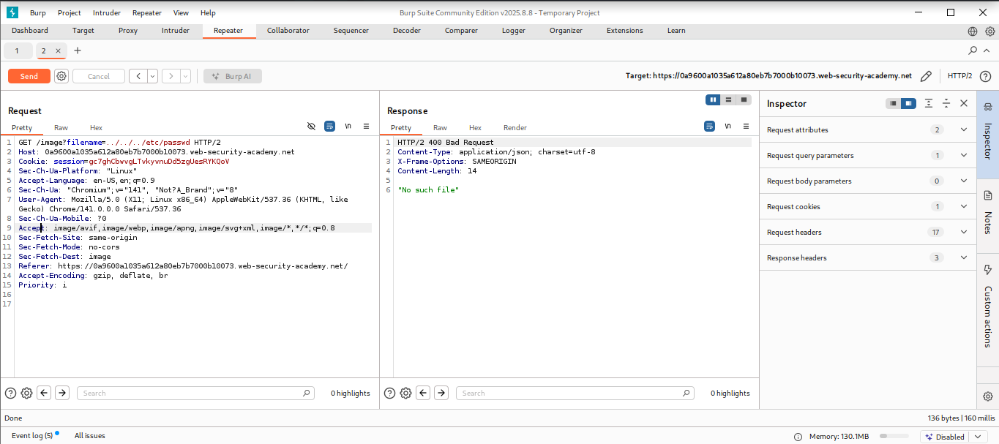
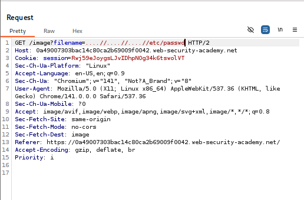

# Lab: File path traversal, traversal sequences stripped non-recursively

## Objectives
To solve the lab, retrieve the contents of the /etc/passwd file.

## Background

This lab contains a path traversal vulnerability in the display of
product images. The application strips path traversal sequences from the
user-supplied filename before using it.

## Tools Used
- Kali Linux VM
- Burpsuite

##Methodology

I opened Burpsuite to intercept the requests with its built in browser.

I started the lab by navigating to `https://0a49007303bac14c80ca2b69009f0042.web-security-academy.net/`
which has the file path traversal vulnerability with traversal sequences
stripped non-recursively.

From the intercepted requests, I realized that the site loaded quite a
number of images which perhaps are are stored on disk in the location
/var/www/images/.

I forwarded the request to repeater to observe the result.

The response had a 200 OK HTTP status code which was a clear indication
that the image loaded succesfully.

Now, I tried to exploit the path traversal vulnerability by modifying
the request that fetches the product image from 15.jpg to
../../../etc/passwd to observe what happens when the absolute path is
included.

After confirming that the application blocks traversal sequences, I will
use nested traversal sequences \....//....//....//etc/passwd which will revert to simple traversal
sequences when the inner sequence is stripped.

## Results
I succesfully dumped the contents of the etc/passwd file.

## Reflection
Through this lab, I was able to read arbitrary files on a server running
an application via path traversal although the application blocks
traversal sequences. I made use of nested Solved! On to the next.
