# Lab: File path traversal, traversal sequences stripped with superfluous URL-decode

## Objectives
To solve the lab, retrieve the contents of the /etc/passwd file.

## Background

This lab contains a path traversal vulnerability in the display of
product images. The application blocks input containing path traversal
sequences. It then performs a URL-decode of the input before using it.

## Tools Used
- Windows Host
- Burpsuite

## Methodology
I opened Burpsuite to intercept the requests with its built in browser.

I started the lab by navigating to `https://0ab5001c047bf5a380b70dad00b40019.web-security-academy.net/`
which has the file path traversal vulnerability withtraversal sequences
stripped with superfluous URL-decode.

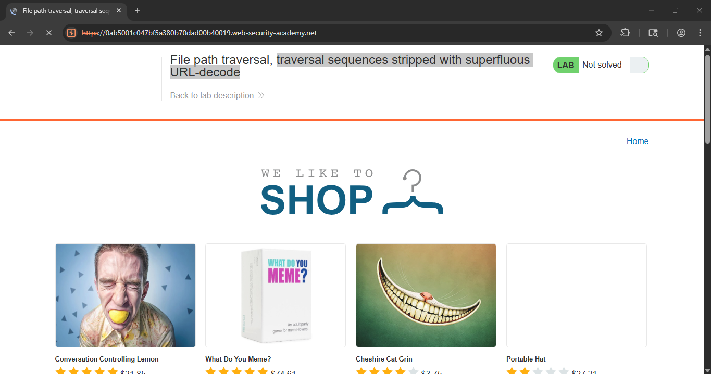

From the intercepted requests, I realized that the site loaded quite a
number of images which perhaps are are stored on disk in the location
/var/www/images/.

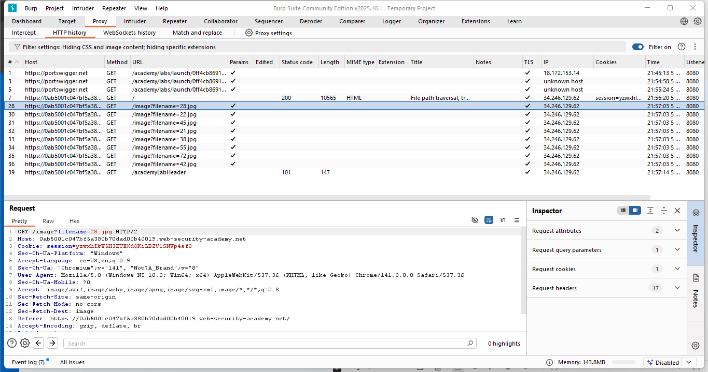

I forwarded the request to repeater to observe the result.

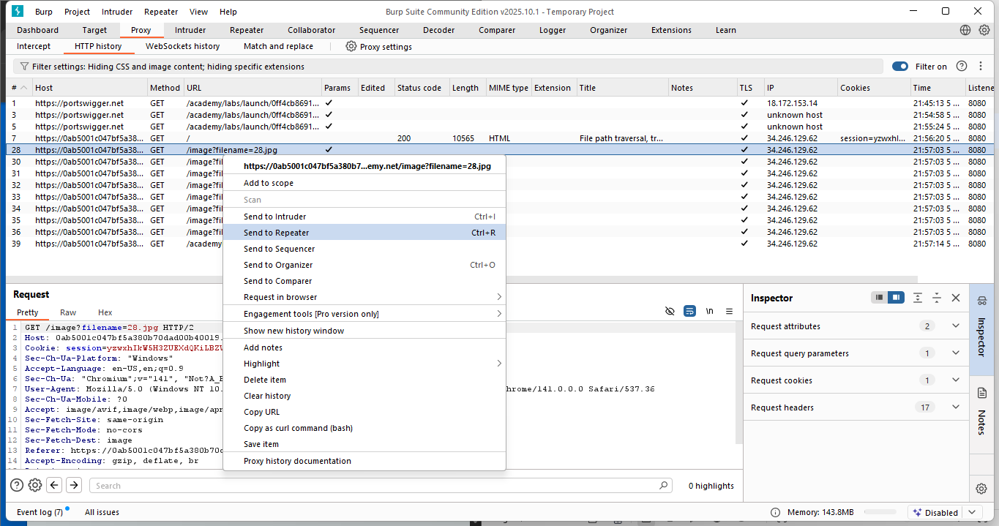

The response had a 200 OK HTTP status code which was a clear indication
that the image loaded succesfully.

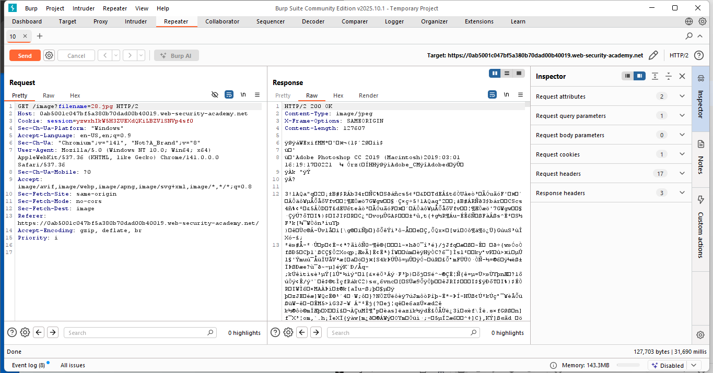

Now, I tried to exploit the path traversal vulnerability by modifying
the request that fetches the product image from 20.jpg to
../../../etc/passwd to observe what happens when the absolute path is
included.

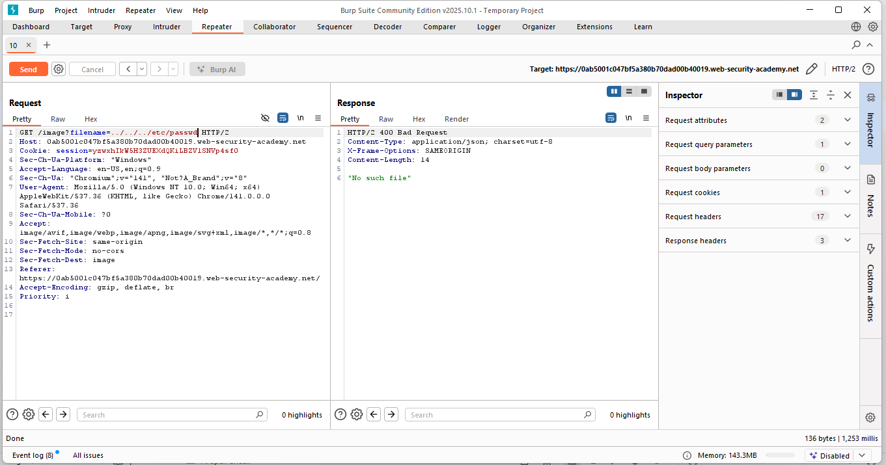

After confirming that the application blocks input with traversal
sequences, I URL-encoded the traversal sequences
\....//....//....//etc/passwd or ../../../etc/passwd which will revert
to simple traversal sequences when the inner sequence is stripped.

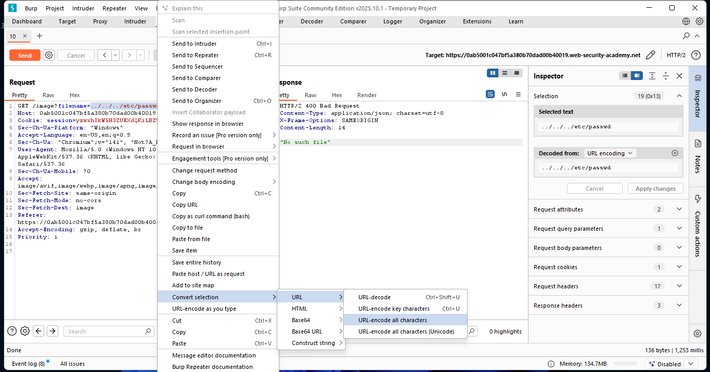
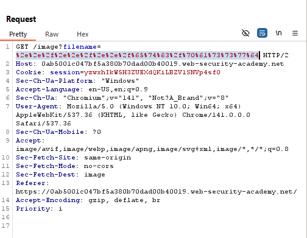

I then realized that the application performs a url-decode before using
it and hence decoded the path traversal sequences.

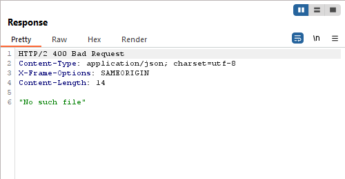

I then had to encode the decoded URL.. thus, double encoding of the path
traversal sequences.

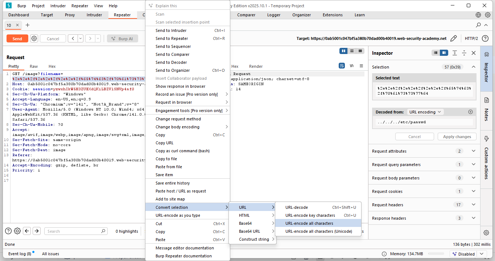
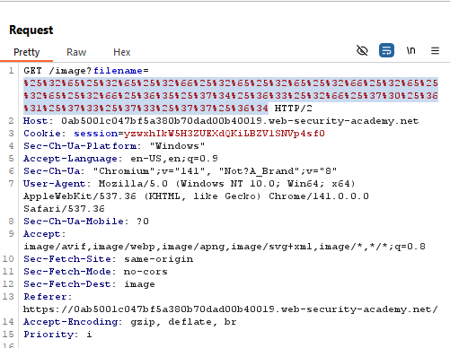

## Results
I succesfully dumped the contents of the etc/passwd file.

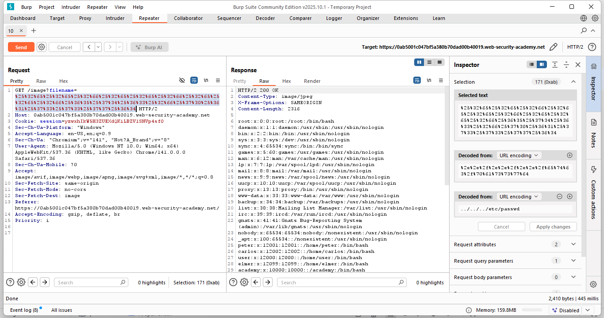
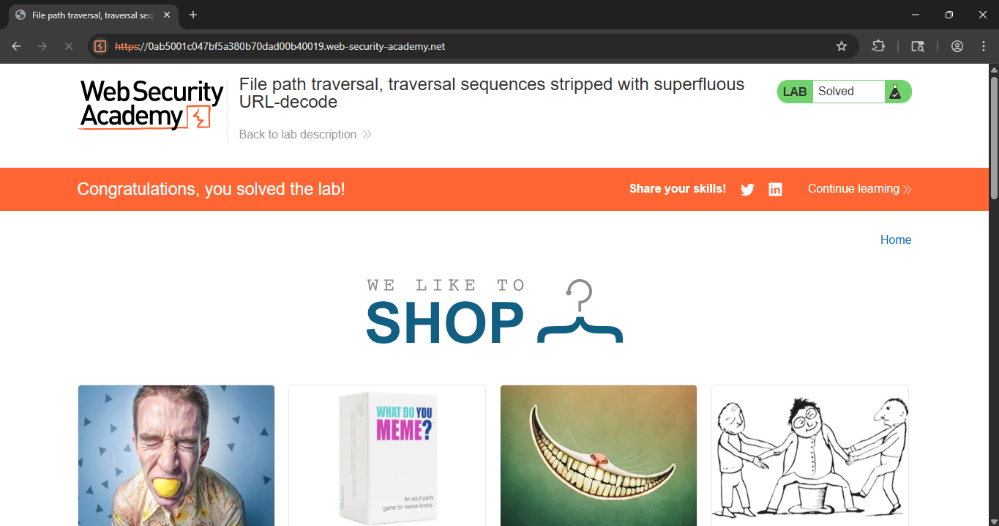

## Reflection
Through this lab, I was able to read arbitrary files on a server running
an application via path traversal although the application blocks
traversal sequences. I made use of double URL-encoding to bypass the
initial decoding the application does to identify traversal sequences.
Solved! On to the next.
