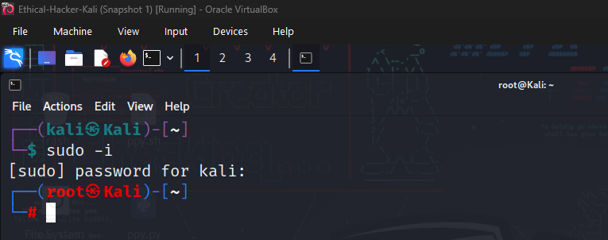
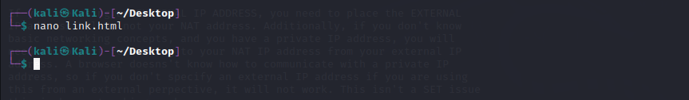

# Lab Report: Exploring the Social Engineer Toolkit (SET)

## Objectives

In this activity, I will explore the Social Engineer Toolkit and use it
to clone a website with the aim of capturing and viewing user
credentials under carefully controlled conditions within a virtual
environment.

## Background

Many exploits begin with a social engineering attack that is designed to
obtain credentials or plant malware to create entry points into the
target network. One of the tools used to perform these social
engineering attacks is the Social Engineer Toolkit (SET). In an actual
penetration test, this procedure could be used to reveal problems with
user security training and the need take measures to educate users about
various types of phishing attacks.

## Tools Used
- Cisco Customized Ethical Hacker VM
- Social Engineer Toolkit

## Methodology

### Part 1:Launching SET and Exploring the Toolkit

I started my Kali VM and opened a terminal window. To run the SET tool,
I need root access. Hence, I used `sudo -i` to obtain persistent root
access. I could also run it through the application tab in the VM.

Since I had previously run the tool, I was not presented with the
license terms and conditions just because I had previously agreed to it.

At the SET prompt, I entered **1** and pressed **Enter** to access the
Social-Engineering Attacks submenu.

I selected the infectious media generator option to see a brief
description of the exploit. It facilitates creation of a DVD or USB
thumb drive that will autorun malicious software when inserted into the
target device. As a penetration tester, it could be used create and
distribute some sort of benign malware on USB drives and the number of
instances in which the USB drives were inserted into corporate computers
could be quantified and reported if there was a phone home
functionality.

### Part 2:Cloning a Website to Obtain User Credentials

In this part, I will create a perfect copy of a login page for a
website.The cloned page will gather all credentials submitted to it and
then redirect the user to the real website.

From the Social-Engineering Attacks submenu, I chose Website Attack
Vectors to begin the web site cloning exploit.

I then reviewed the various attack description of each tyoe of attack
under the Website attack Vectors and selected Credential Harvester
Attack Method since I need to create a cloned website to obtain login
credentials for users on the target network.

Now, I will create a cloned website that duplicates the DVWA.vm login
website. Internally, the website is hosted on `http://10.6.6.13/` but in
the host file of the machine has been mapped to
`http://DVWA.vm/` hence I tried to visit the site
via Firefox Browser to make sure it was reachable.

I returned to the terminal session. Selected **2) Site Cloner** from the
**Credential Harvester Attack Method** menu and entered the IP
**10.6.6.1** to receive the POST data. This is the IP address of the
virtual Kali internal interface on the 10.6.6.0/24 network of which the
DVWA server is on. In an actual exploit, this would be the external
address of the attack computer.

Next, I entered the URL of the DVWA website, `http://DVWA.vm`
Next, the listener becomes active on port 80 on the Kali computer and all port 80
traffic will be redirected to this screen.

Using Nano text editor, I created and saved an html document unto my
desktop (simulating a distributed phishing URL) to direct the user to
the fake webpage.

I then double-clicked the html document I created from the desktop
screen.

After the site had opened, I entered random info into the username and
password fields. After clicking login, I was now redirected to the
original site.

I then returned to the terminal session that was running the SET
application. Output from the login attempt appeared.

To save the report in XML format to use in other penetration testing
applications, I entered **CTRL + C** and continued pressing 99 until I
had exited the SET toolkit.

To view the content of the XML file, I navigated to the
**/root/.set/reports/ folder.** Earlier on after pressing ctrl + c, I was
presented with the filename but I forgot to copy it so I check through
manually.

Now, knowing the filename as seen above, I will use the cat command to
view the report.

## Results

After opening the html link, I realised that I was shown the login page
of the DVWA website which was not the same as the original site. A
cloned version to say.

After the login attempt, the cloned web page redirected the browser to
the real web site. However, the random credentials had been provided to
the my clone of the original website. Viewing the XML report, I
confirmed I succussfully gained the credentials I entered earlier on.

As a pentester, I could now go to the real site and log in with the
information.

## Reflection

An ethical hacker could use this procedure with a phishing email with a
very convincing write-up and spoofed sender addresses. The URL links to
the very familiar login page that was cloned from the real site. From
there, credentials could be harvested for multiple users. The results of
this test could then be reported with the mitigation strategies for user
training to prevent similar actual attacks.
