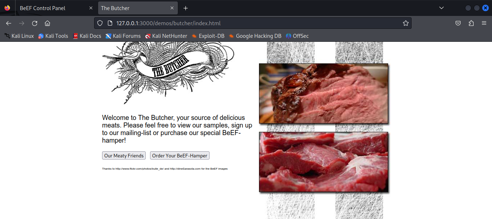
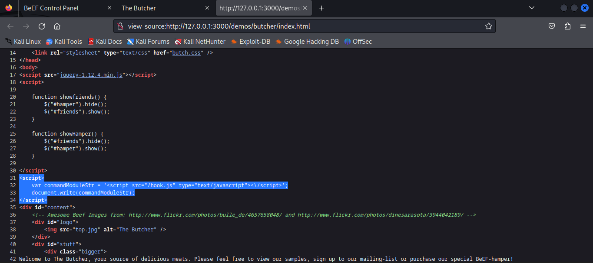

# Lab Report: Using the Browser Exploitation Framework (BeEF) for Browser-based Exploitation

## Objectives

In this activity, I will use BeEF to hook a local browser and perform a
browser-based exploit under carefully controlled conditions within a
virtual environment.

## Background

The Browser Exploitation Framework (BeEF) enables penetration testers to
perform client-side attacks using the target's web browser. Pentesters
use BeEF to "hook" web browsers. The attacker somehow makes a user
execute a JavaScript file name hook.js to take control of the user's
browser and launch further attacks against the target system from within
the browser context. The malicious script can be run in various ways,
including using a phishing message to make a user go to a webpage that
carries the script.

## Tools Used
- Cisco customized Ethical Hacker VM

## Methodology
### Part 1:Loading the BeEF GUI Environment

To start BEEF, I entered sudo beef-xss in the terminal which opened a
browser window automatically at `http://127.0.0.1:3000/ui/authentication`

The first time BeEF is run, I prompt will appear to change the password
for the BeEF user. Myself, I had run this lab severally and the password
I set was just kali so that's what I used to authenticate.

I still had two zombies from the previous ones I took hence I will first
delete them.

To use BeEF to exploit a target system, you first have to "hook" the
target browser, in this case my local system. If I were running an
actual penetration test, my reconnaissance would identify web pages that
the user may visit often and I would use one of the commonly visited web
pages to deliver the "beef hook" JavaScript code. In this lab, I will
use a demo web page that is included with the BeEF application.

I opened a new tab in my Firefox browser and navigated to
`http://127.0.0.1:3000/demos/butcher/index.html` ; a fake web page that
resembles a simple storefront app and contains JavaScript code which
will run in the browser environment when the page is loaded.

I then viewed the source code for the HTML page that was displayed using
CTRL+U. I also scrolled to observe the part of the code that contained
the beef hook.

I returned to the browser window that contained the BeEF Control Panel
and noticed that the information in the Hooked Browsers panel on the
left side of the screen had changed. I then clicked the entry listed
under Online Browsers for observation.

### Part 2:Investigating BeEF Exploit Capabilities

I clicked the commands tabto explore the modules that could be executed
against the target browser.

Expanding the command categories in the **Module Tree** pane, I noticed
the color-coded icons next to each function. These icons are referred to
as "traffic lights". Under the host category was the module **Detect
Antivirus** which had a green icon.

I then clicked the Network tab to view the network map displaying the
current network topology.

Now, I need to send a fake alert message to the hooked browser window to
entice the user to download and install a malicious plug-in. Therefore,
I clicked the **Commands** tab in the **BeEF Control Panel** and
scrolled down to the **Social Engineering** category. I opened the
category and selected the **Fake Notification Bar (Firefox)** choice
from the module list.

The default message that the alert displays is "An additional plug-in is
required to display some elements on this page."

Moving on, I changed the plugin URL to `http://10.6.6.13/` which
redirects the user to the login screen for the DVWA virtual server. The
URL could point to any webpage, either locally stored or on the network.
In a live penetration testing environment, this would be a cloned
website, a malicious application download, or a webpage containing a
malicious script.

I also changed the alert text to say" **AdBlocker Security Extension is
out of date. Install the new version now."**

I then clicked **Execute** to send the alert to the hooked browser
window and returned to the browser tab that displayed **The Butcher**
fake web page. An alert message is was seen in the Firefox banner area.

Clicking the Install plug-in button redirected me to the DVWA login page

Next, I used TabNabbing to redirect the user to a different URL if a
browser tab of a hooked browser is idle for a specified length of time.

To get it done, I closed the firefox instance and opened a new instance.
I then navigated to the BeEF login screen using the URL `http://127.0.0.1:3000/ui/authentication` and logged in.

I opened a new tab and navigated back to The Butcher web page at
<http://127.0.0.1:3000/demos/butcher/index.html.>

I returned to the **BeEF Control Panel** tab, selected the instance
listed under the **Online Browsers** in the **Hooked Browsers** panel
and opeened the **Commands** tab. Further on, I expanded the **Social
Engineering** category and scrolled down to select **TabNabbing**.

The default wait time before the page in the browser changes to the one
specified in the URL field was 15 minutes hence I changed it to 1 minute
and clicked the **Execute** button to start the exploit.

I observeed the Butcher page change into the Beef basic demo page. Hence
I went ahead to type "Prince Lassey documented this" In the box at the
center of the BeEF Basic Demo screen.

I then returned to the **BeEF Control
Panel** tab. With the entry under Online Browsers selected, I selected
**Logs** from the menu bar to observe.

## Results

Lines 31 through 34 in the HTML source of the demo page loaded and run
the "beef hook".

The entry listed under Online Browsers had six tabs that appeared under
the Current Browser :Details, Logs, Commands, Proxy, XssRays, Network.
Under the Details tab, BeEF knows about the target user's browser type,
version, operating system, and installed plugins. This is interesting
because additional vulnerabilities may be associated with thoseitems.

Each command module has a traffic light icon, which is used to indicate
the following:

- `Green` The command module works against the target and should be
invisible to the user.
- `Orange` The command module works against the target but may be visible
to the user.
- `White` The command module is yet to be verified against this target.
- `Red` The command module does not work against this target.

After hooking the browser, one significance I can talk about is that,
the browser becomes hijacked and forced to redirect to any malicious
page of the attacker.

For the TabNabbing function, I remained idle for one minute and observed
that the Butcher webpage had changed to The BeEF Basic Demo page
demonstrating successful exploitation of the browser.

After typing in some phrases, I observed that they were captured in the
Logs. BeEF logs activity performed in the hooked browser.All activity,
including mouse clicks and navigation wererecorded in the logs.

## Reflection

This activity was really an exciting one. In an earlier lab, I was
introduced to the Social Engineer Toolkit (SET) which enables easy
website cloning and also has the functionality to capture whatever a
target inputs. BeEF enables command and control of the target's browser
as well hence, they can be used together to create both server-side and
client-side exploits. ETHICALLY OH
