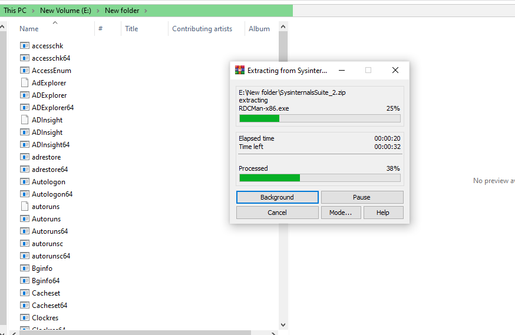
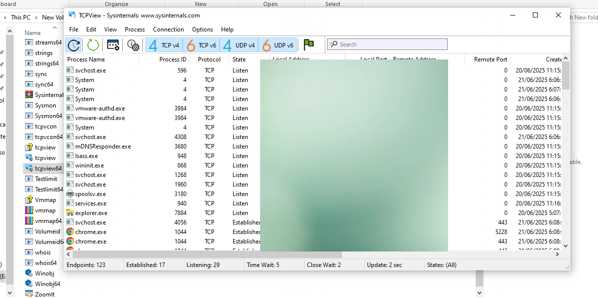
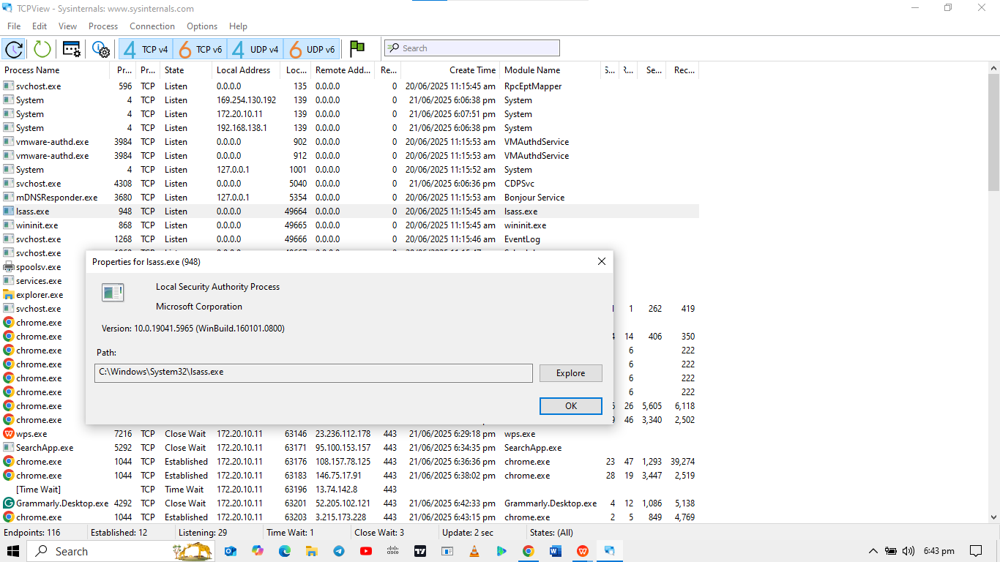
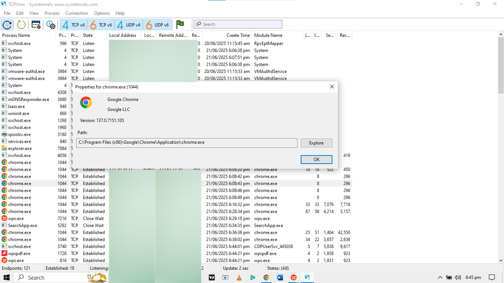
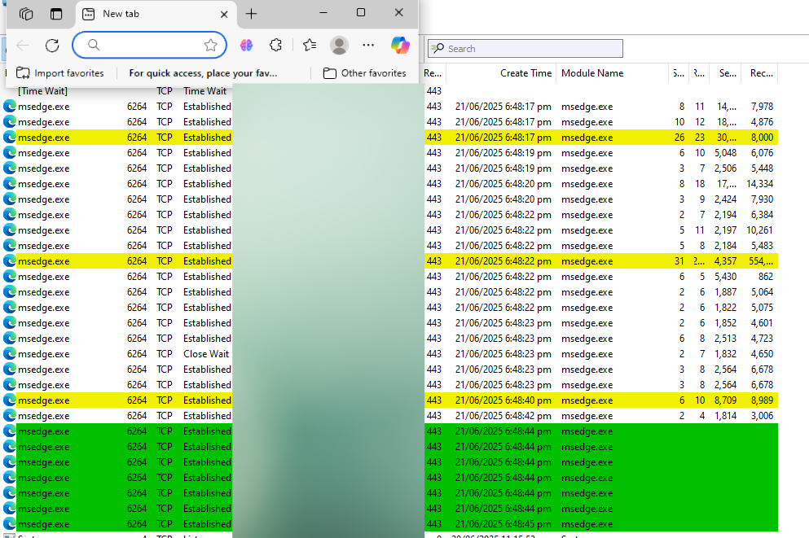
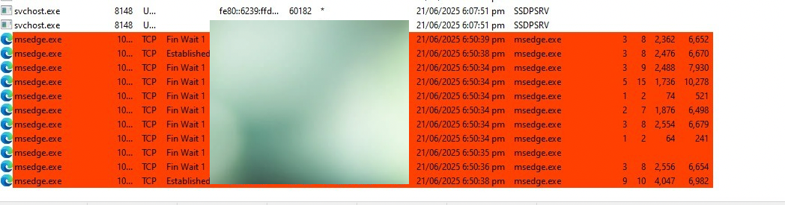

# Scenario
In this lab, I explored windows processes. Processes are programs or applications in execution. I explored 
the processes using Process Explorer in the Windows Sysinternals Suite. I also started and observed a 
new process.

# Steps
- Downloaded [Windows Systinternals Suite](https://technet.microsoft.com/en-us/sysinternals/bb842062.aspx)
- Extracted the contents of the zip file and opened `tcpview.exe`
- Closed most softwares that were running
- Explored the `Isass.exe` windows process and identified the folder in which it was located to be `C:\Windows\System32\lsass.exe`
- Closed the properties window and checked that of other processes.
- I opened Microsoft Edge and observed in tcpview that the service had started and running in green colour.
- I closed the browser and realised the processes turned red in colour and stopped gradually.
- I opened Microsoft Edge again and researched the `msedge.exe` process. This executable runs the browser and its related processes, such as rendering web pages and handling network connections. It appeared multiple times and it means Edge uses a multi=process architecture, creating separate instances for tabs, extensions, etc.

# Screenshots

