# Lab -- Create User Accounts

## Objective

In this lab, I created and modified user accounts in Windows.

## Part 1: Creating a New Local User Account**

- I opened the Control Panel and selected User Accounts

- In that window, I selected Manage another Account

- I clicked to add a new user in PC settings

- I was redirected to "Family & other users" in settings

- I created a new user "User2" (An account where no administrative
privileges were added.)

- I logged in to the new user profile and navigated to C:\Users folder. I
right-clicked the User2 folder and clicked the properties tab. SYSTEM
and ADMINISTRATORS had full control of that folder.

- I was not able to access the folder because I lacked the permission to
access it.

- I logged out and logged back into my account where I checked the
properties of the C:\Users folder where the all groups/users had full
control.

- See screenshots below

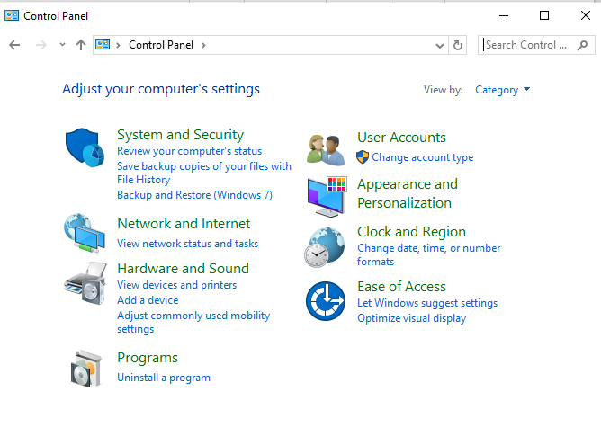

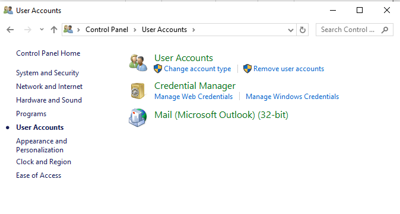

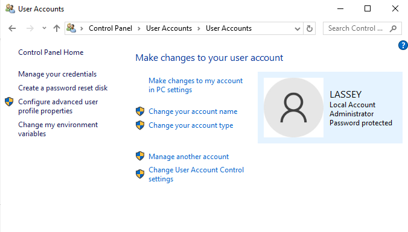

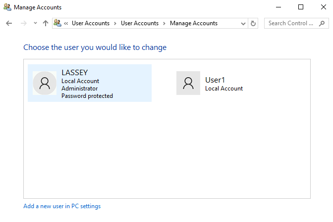

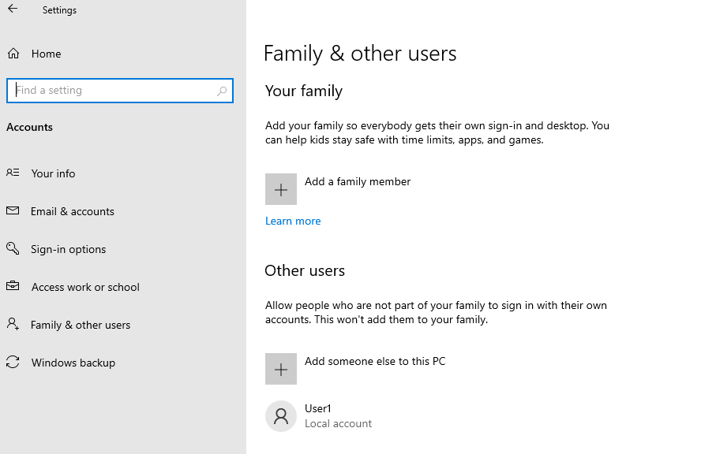

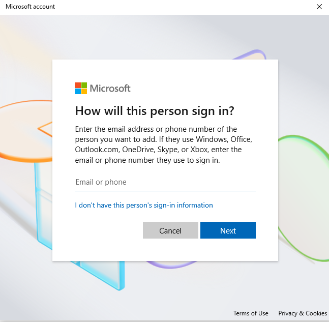

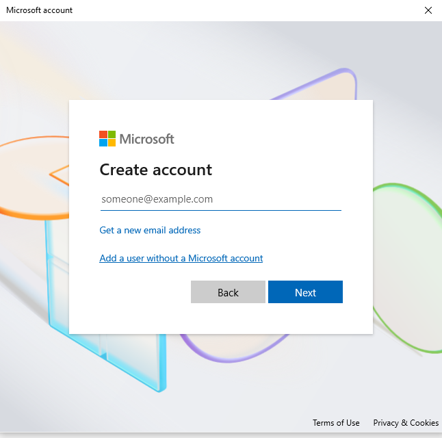

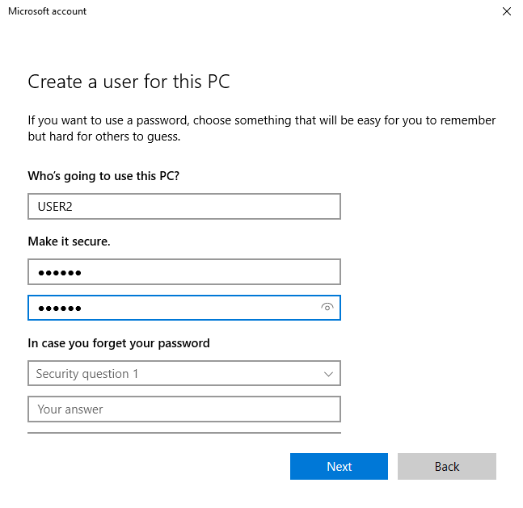

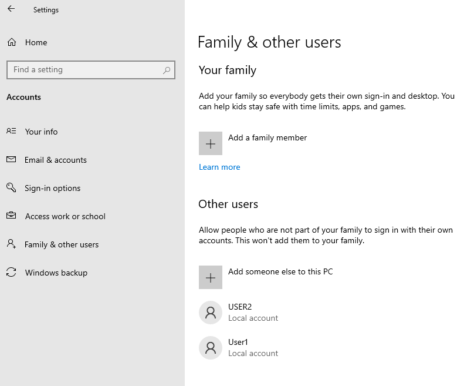

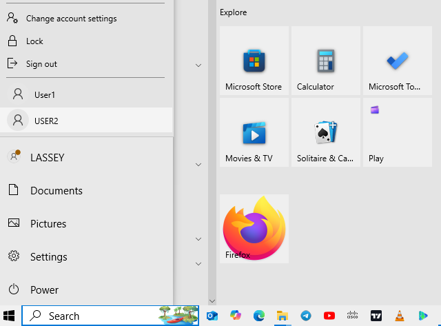

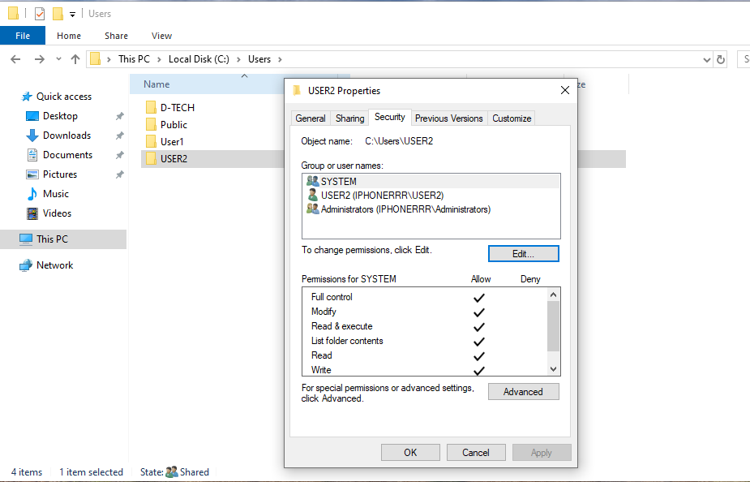

---

## Part 2: Reviewing User Account Properties

I opened Command prompt and used the command: `net user USER2`

This was done to check the group memberships for that user profile.
USER2 only belonged to the USERS group.

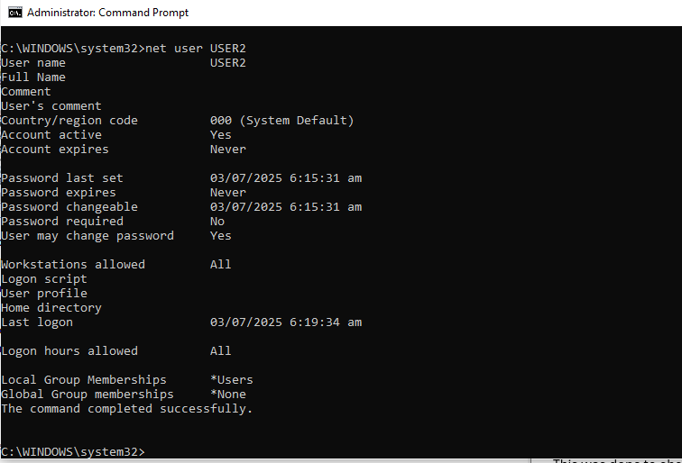

---

## Part 3: Modifying Local User Accounts

I went back to the control panel -> user accounts and modified User 2
from being a standard user to an administrator. I then checked via
command prompt again (`net user USER2`) and it showed two membership
groups -> ADMINISTRATOR and USERS. I then returned back to control panel
to delete the USER2 account permanently. See screenshots below..

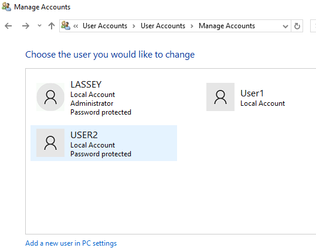

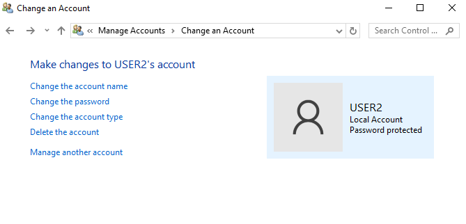

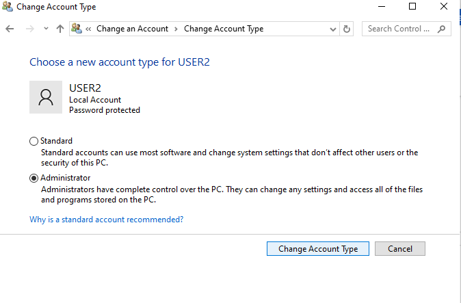

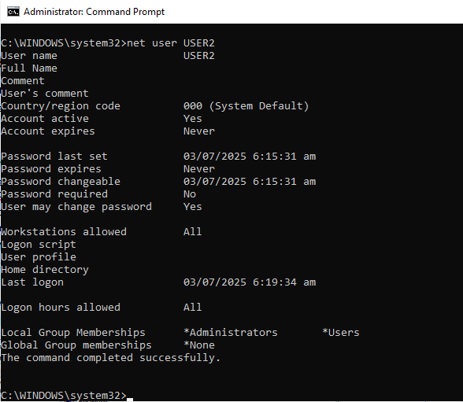

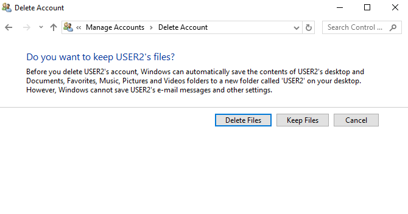

## Reflection
It's important to protect all user accounts with a strong password. Even
passphrases rather! A weak password can allow access from almost anyone
to steal data. One thing I took from this lab was the importance of
creating users with Standard privilages. The Standard User cannot
compromise the security of the computer or the privacy of other users.
