**Lab - Exploring Processes, Threads, Handles, and Windows Registry**

**Objectives**

In this lab, I explored the processes, threads, and handles using
Process Explorer in the SysInternals Suite. I also used the Windows
Registry to change a setting.

**Part 1:Exploring Processes**

In this part, I explore processes. Processes are programs or
applications in execution. I explored the processes using Process
Explorer in the Windows SysInternals Suite. I then started and observed
a new process.

After downloading the Sysinternals suite from my previous lab, I
navigated to the SysinternalsSuite folder with all the extracted files
and opened procexp.exe. I accepted the Process Explorer License
Agreement when I was prompted. The Process Explorer displays a list of
currently active processes as seen in the screenshot below.

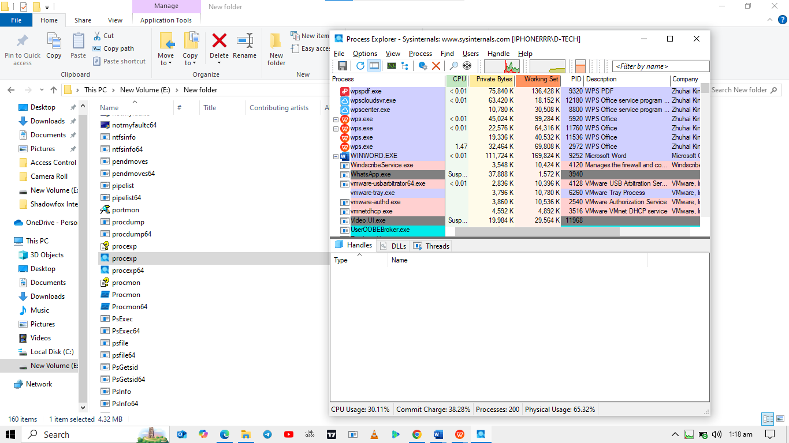{width="5.7625in"
height="3.2402777777777776in"}

To locate the web browser process, I dragged the **Find Window\'s
Process** icon into the opened web browser window. Chrome was used.

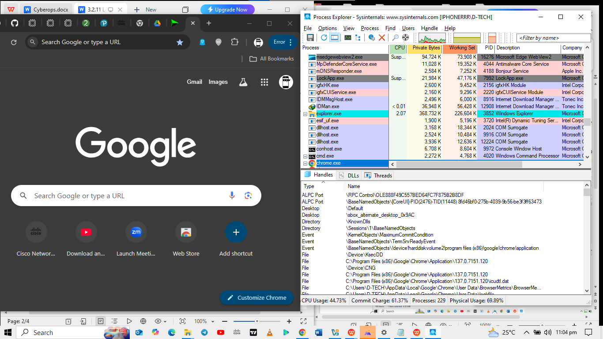{width="5.7625in"
height="3.2402777777777776in"}

The Chrome process was terminated in the Process Explorer by
right-clicking the selected process and selecting **Kill Process**. The
web browser window was closed afterwards.

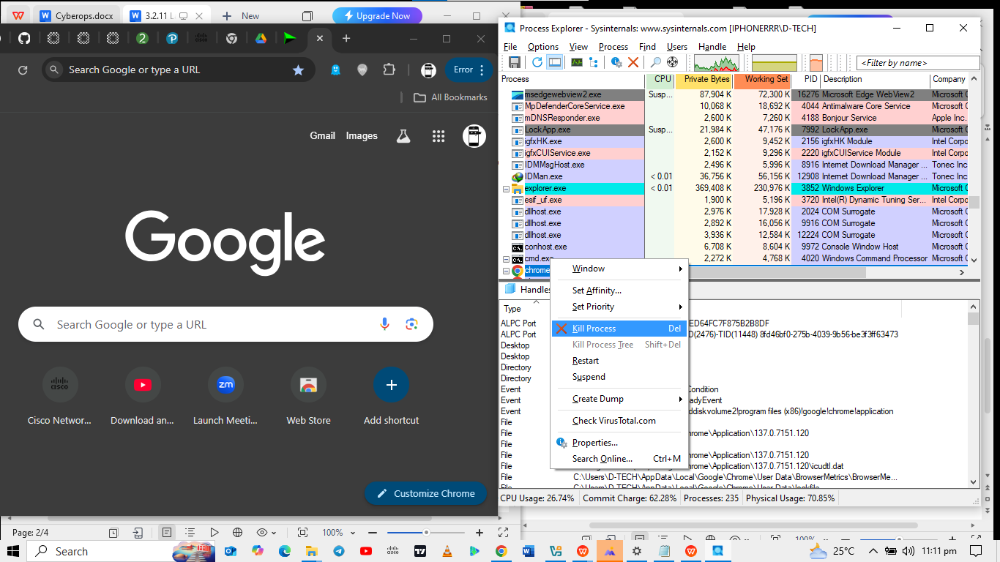{width="5.7625in"
height="3.2402777777777776in"}

I opened Command Prompt and dragged the **Find Window\'s Process** icon
into the Command Prompt window and located the highlighted Command
Prompt process in Process Explorer. The process for the Command Prompt
is **cmd.exe**. Its parent process is **explorer.exe** process. The
cmd.exe has a child process, **conhost.exe**.

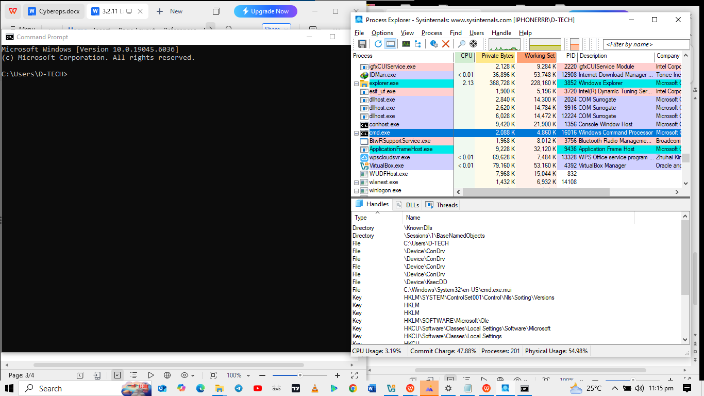{width="5.7625in"
height="3.2402777777777776in"}

I started a ping in cmd and observed a change in cpu usage for the
cmd.exe process during the ping.

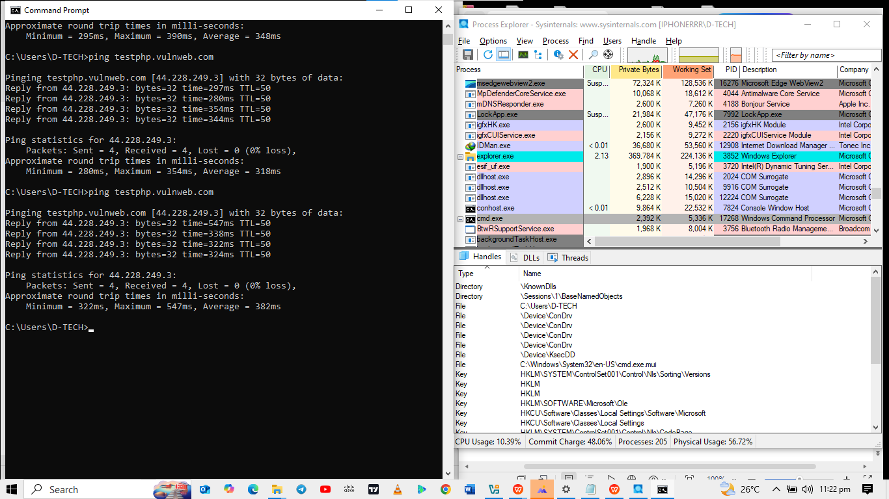{width="5.7625in"
height="3.2402777777777776in"}

As I reviewed the list of active processes, I found that the child
process **conhost.exe** may be suspicious. To check for malicious
content, I right-clicked **conhost.exe** and selected **Check
VirusTotal**. When prompted, I clicked **Yes** to agree to VirusTotal
Terms of Service.

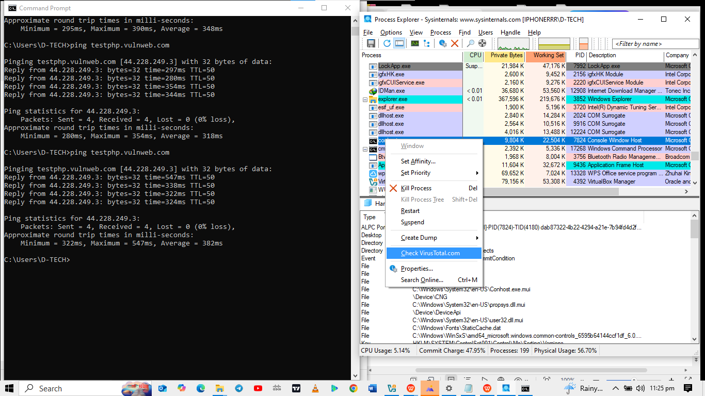{width="5.7625in"
height="3.2402777777777776in"}

I then expanded the Process Explorer windowand saw the VirusTotal
column. I clliced the link under the VirusTotal column. The link opens
in chrome with the results regarding the malicious content of
conhost.exe. No vender had flagged it. It is not malicious.

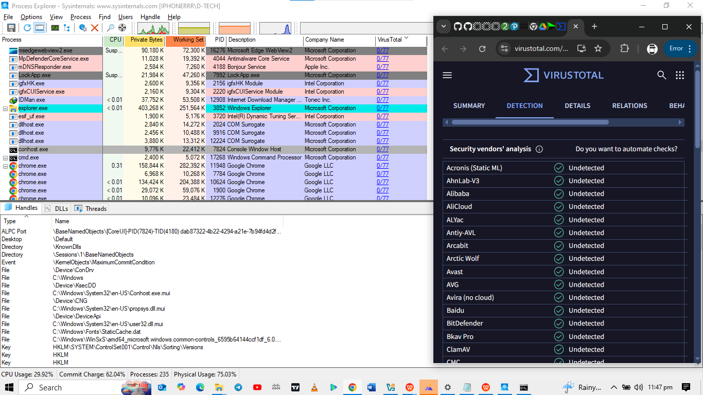{width="5.7625in"
height="3.2402777777777776in"}

I then killed the cmd.exe process and observed conhost.exe also
terminate through the Process Explorer.

## Part 2: Exploring Threads and Handles

In this part, I explored threads and handles. Processes have one or more
threads. A thread is a unit of execution in a process and a handle is an
abstract reference to memory blocks or objects managed by an operating
system. I used Process Explorer (procexp.exe) in Windows SysInternals
Suite to explore the threads and handles.

The Properties window for conhost.exe provides details such as thread
ID, start time, state, priority, kernel time, user time, context
switches, cycles, and ideal processor.

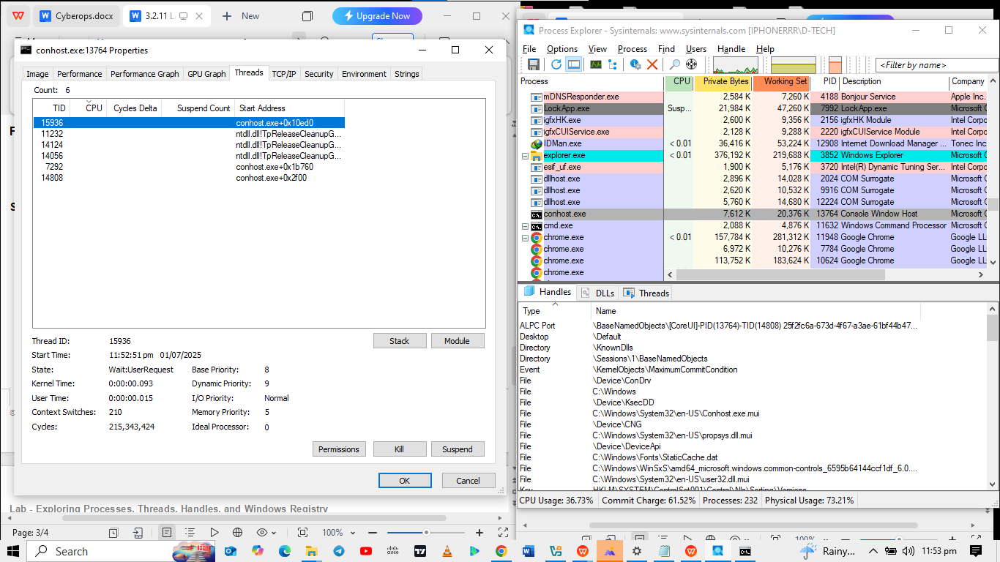{width="5.7625in"
height="3.2402777777777776in"}

In the Process Explorer, I clicked **View** \> select **Lower Pane
View** \> **Handles** to view the handles associated with the
conhost.exe process. The handles point to various system resources,
including ALPC ports, desktop, events, files, and kernel objects.

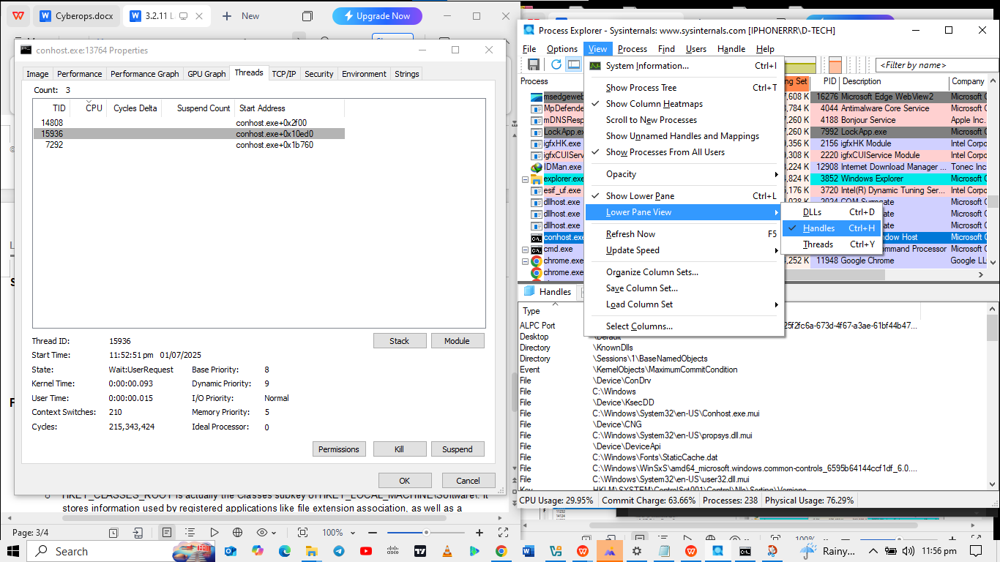{width="5.7625in"
height="3.2402777777777776in"}

## Part 3: Exploring Windows Registry

The Windows Registry is a hierarchical database that stores most of the
operating systems and desktop environment configuration settings.

To access the Windows Registry, I clicked Start \> Search for regedit
and select Registry Editor. Clicked **Yes** when asked to allow this app
to make changes.

The Registry Editor has five hives. These hives are at the top level of
the registry.

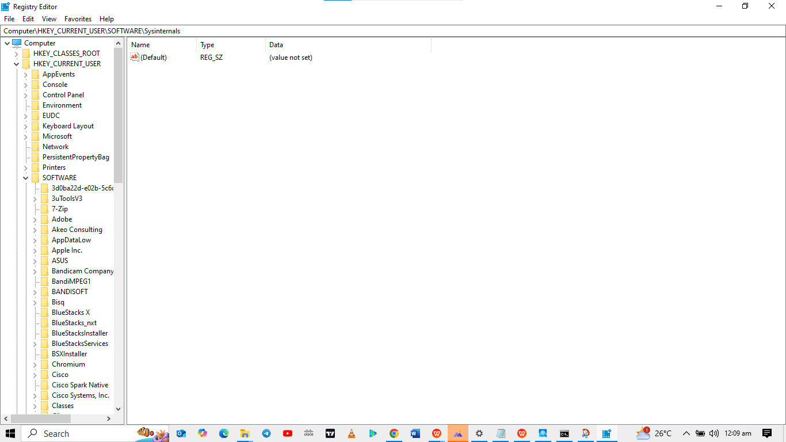{width="5.7625in"
height="3.2402777777777776in"}

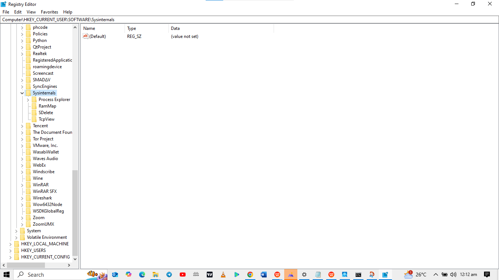{width="5.7625in"
height="3.2402777777777776in"}

-   oHKEY_CLASSES_ROOT is actually the Classes subkey of
    HKEY_LOCAL_MACHINE\\Software\\. It stores information used by
    registered applications like file extension association, as well as
    a programmatic identifier (ProgID), Class ID (CLSID), and Interface
    ID (IID) data.

-   oHKEY_CURRENT_USER contains the settings and configurations for the
    users who are currently logged in.

-   oHKEY_LOCAL_MACHINE stores configuration information specific to the
    local computer.

-   oHKEY_USERS contains the settings and configurations for all the
    users on the local computer. HKEY_CURRENT_USER is a subkey of
    HKEY_USERS.

-   oHKEY_CURRENT_CONFIG stores the hardware information that is used at
    bootup by the local computer.

In the previous lab, I had accepted the EULA for Process Explorer. I
navigated to the EulaAccepted registry key for Process Explorer by
clicking to select Process Explorer in HKEY_CURRENT_USER \> Software \>
Sysinternals \> Process Explorer. I scrolled down to locate the key
EulaAccepted. Currently, the value for the registry key EulaAccepted is
0x00000001(1).

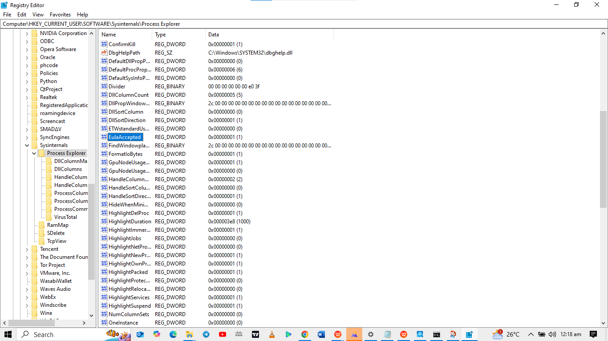{width="5.7625in"
height="3.2402777777777776in"}

I double-clicked EulaAccepted registry key. The value data is set to 1.
The value of 1 indicates that the EULA has been accepted by me.

{width="5.761805555555555in"
height="4.1090277777777775in"}

I changeed the 1 to 0 for Value data. The value of 0 indicates that the
EULA was not accepted and I clicked OK to continue.

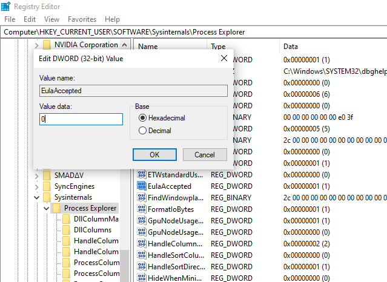{width="5.764583333333333in"
height="4.2034722222222225in"}

The screenshot below shows the value for this registry key in the Data
column after changing from 1 to 0.

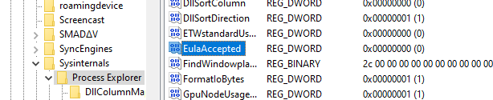{width="5.7625in"
height="1.1729166666666666in"}

I navigated to the folder where I downloaded SysInternals and tried
opening procexp.exe. Below is what I saw...

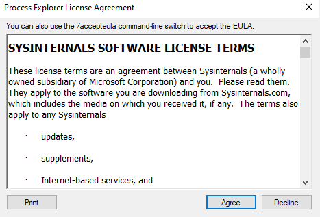{width="4.864583333333333in"
height="3.3020833333333335in"}
