# Lab - Using Windows PowerShell

## Objectives

The objective of the lab is to explore some of the functions of
PowerShell.

- Part 1: Access PowerShell console.
- Part 2: Explore Command Prompt and PowerShell commands.
- Part 3: Explore cmdlets.
- Part 4: Explore the netstat command using PowerShell.
- Part 5: Empty recycle bin using PowerShell.

## Scenario

PowerShell is a powerful automation tool. It is both a command console
and a scripting language. In this lab, I used the console to execute
some of the commands that are available in both the command prompt and
PowerShell. PowerShell also has functions that can create scripts to
automate tasks and work together with the Windows Operating System.

---

## Part 1: Access PowerShell console.

I opened both Powershell and Command Prompt through the start menu.

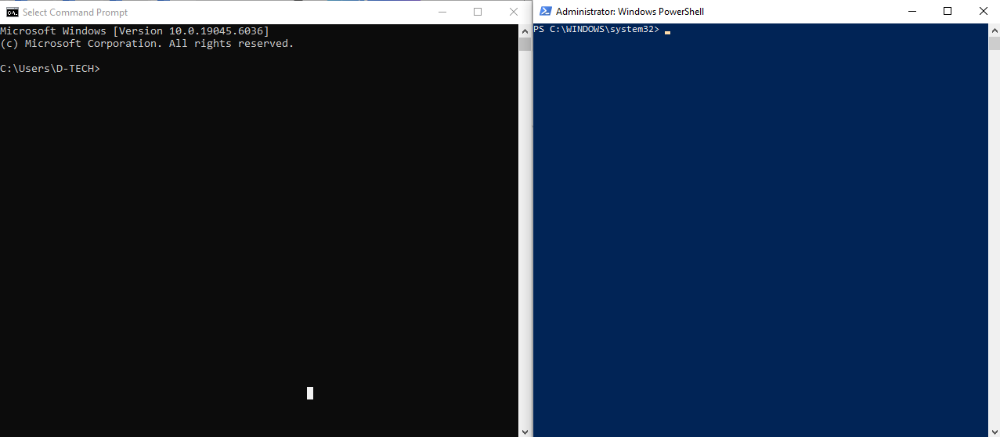

---

## Part 2: Explore Command Prompt and PowerShell commands.

I entered `dir` at the prompt in both windows. Both windows provided a
list of subdirectories and files, as well as information like type, file
size, date and time of last write. I tried pinging 8.8.8.8 and both
showed similar results.

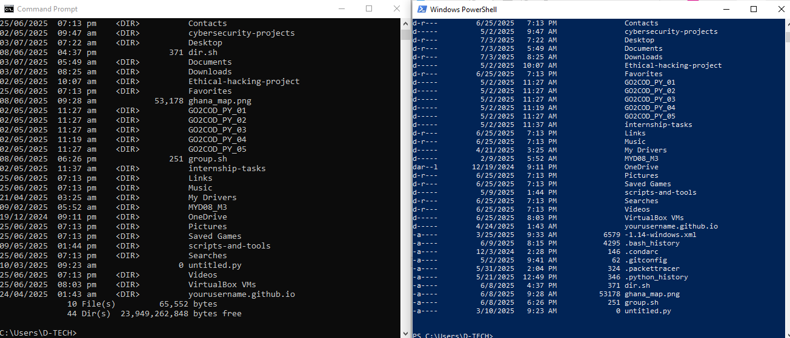

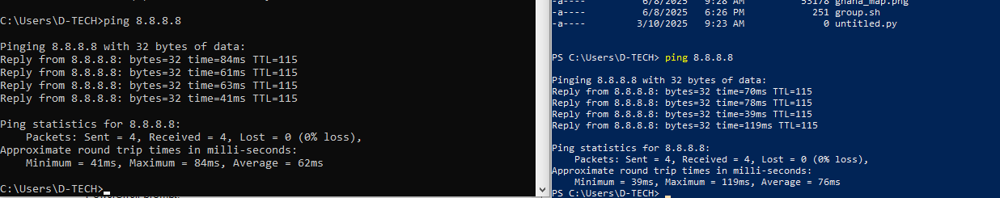

---

## Part 3: Explore cmdlets.

Got to know that, powershell commands, cmdlets, are constructed in the
form of `verb-noun` string. I entered Get-Alias dir at the powershell
prompt to list the subdirectories and files in a directory. The
powershell command for dir is Get-ChildItem.

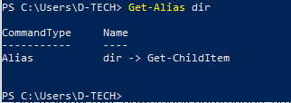

---

## Part 4: Explore the netstat command using PowerShell.

I entered `netstat -h` to see available options for the netstat
command.

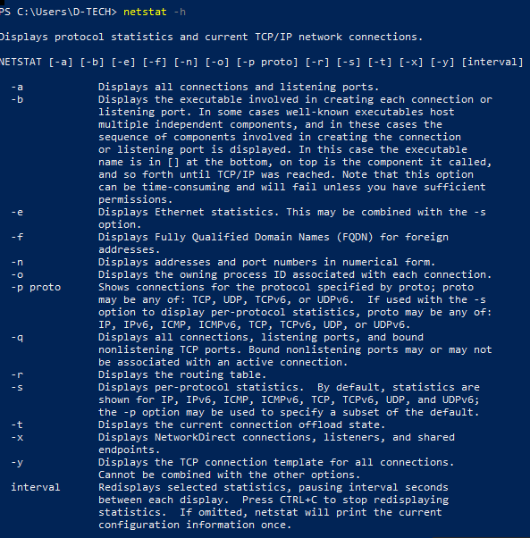

To display the routing table with the active routes, I entered `netstat
-r` at the prompt. As you can clearly see, the IPv4 gateway is
`72.20.10.1`

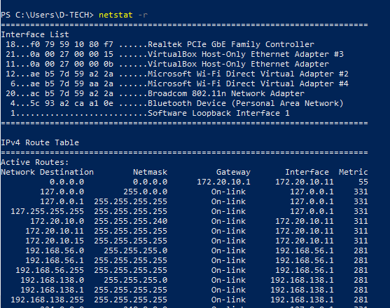

Then I opened a new Powershell with elevated privilages and entered the
command `netstat -abno` to display the processes associated with the
active TCP connections.

I took note of the PID 508, opened Task manager and navigated to the
details tab where I right-clicked that PID and clicked to view its
properties.

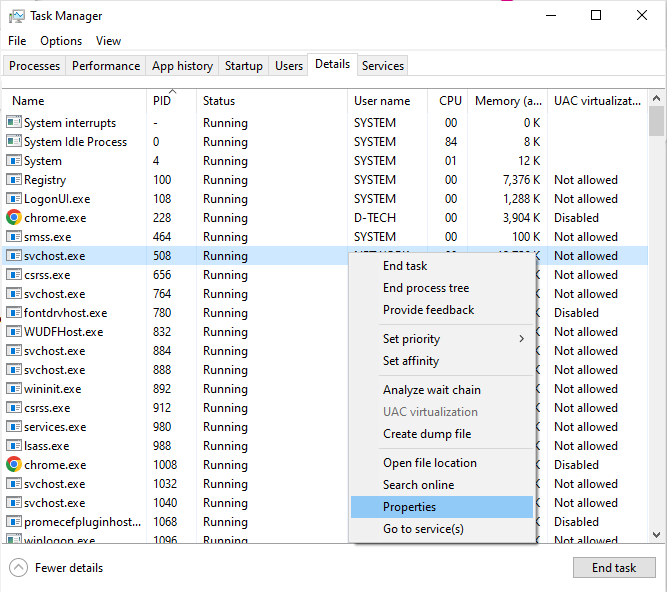

Details I got was that, PID 508 was associated with svchost.exe process.
The user for this process was NETWORK SERVICE and it was using about
12708K of memory. The properties tab showed its digital signature and
some other useful information.

---

## Part 5: Empty recycle bin using PowerShell.

PowerShell commands to simplify actions that would take multiple steps
to execute using Windows graphical desktop tools.

I opened my recycle bin to verify there were no files I needed to
restore and I went ahead to clear then using the powershell command
`clear-recyclebin`.

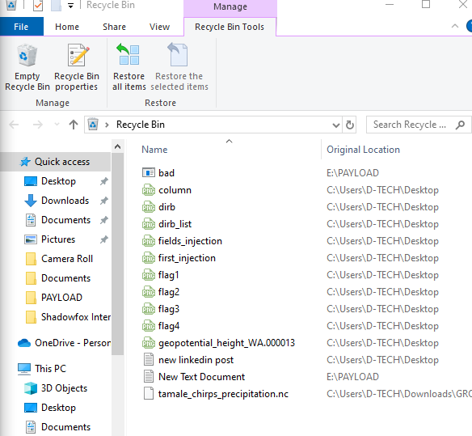

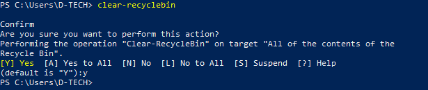

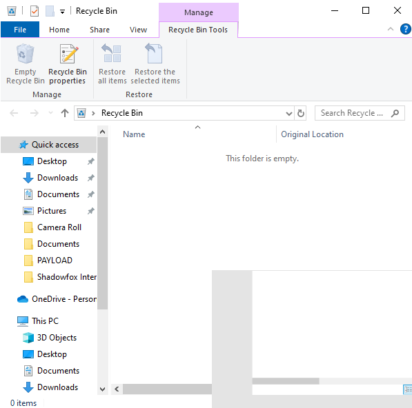

## Reflection

PowerShell was developed for task automation and configuration
management. Here are a few more commands to simplify tasks as a security
analyst.

-   Structured data types can be converted into different formats using
    PowerShell cmdlets; for example, from .txt to .csv. Some common
    **ConvertTo** commands in PowerShell are: **ConvertTo-Csv**,
    **ConvertTo-Html**, **ConvertTo-Json**, **ConvertTo-Xml**.

I tried ConvertTo-Markdown but didn't work. ExecutionPolicy was
restricted so I had to research on how to allow execution of scripts.

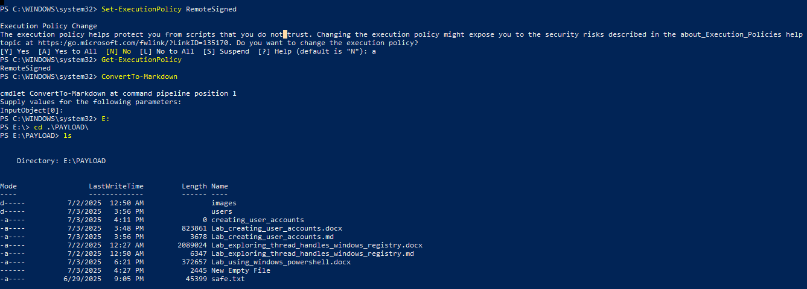

-   The command **Get-Content safe.txt** is to read the file,
    **safe.txt** which is saved in the current directory I'm working in.

-   The **Set-Content** command is to create and overwrite files and the
    **Add-Content** command to append content to an existing file.

-   The Test-NetConnection cmdlet allows me to test network connectivity
    on the LAN and WAN.

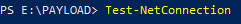

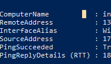
